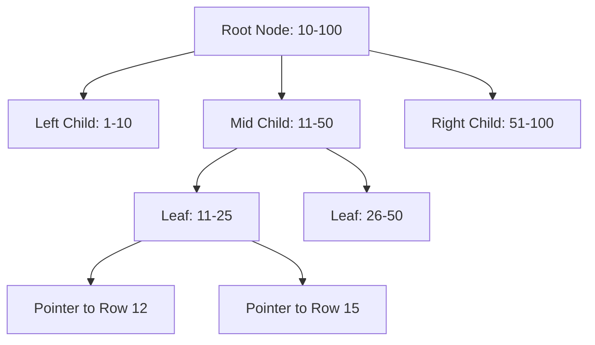

# 11 Database Indexing

## Why this topic matters
Imagine trying to find a specific word in a 1,000-page book. If you read page by page from the start, it takes forever (**Full Table Scan**). If you go to the "Index" at the back, find the word, and see the page number, you find it in seconds. 
Database Indexing is exactly that for your data. It is the most common way to optimize slow queries in interviews.

## Learning Objectives
- Understand what an Index is.
- Learn about the B-Tree (the most common index structure).
- Understand the trade-off: Read speed vs. Write speed.

## Intuition
Think of a **Phonebook**. 
A phonebook is indexed by **Name**. If you want to find "Zoya," you don't start at 'A' and read every name. You jump straight to the 'Z' section. 
But what if you wanted to find everyone who lives on "Main Street"? The phonebook isn't indexed by address, so you would have to read every single entry. To fix this, you'd need a *second* index (a separate list) sorted by address.

## Detailed Explanation

### What is an Index?
An index is a separate data structure (usually a B-Tree) that stores a small portion of your table's data (the indexed column) and a pointer to the full row in the main table.

### How it Works: The B-Tree
Most relational databases (MySQL, Postgres) use **B-Trees** (Balanced Trees).
1. The tree keeps the data sorted.
2. Instead of scanning $N$ rows, the database can find the row in $\log(N)$ time.

### Types of Indexes
- **Clustered Index**: This defines the physical order of data in the table. (e.g., the Primary Key). There can be only **one** per table.
- **Non-Clustered Index**: A separate list that points to the physical data. You can have **many** of these.

### The Trade-off: Read vs. Write
Indexing is not a "free" performance boost.

| Operation | Without Index | With Index | Why? |
| :--- | :--- | :--- | :--- |
| **Read (SELECT)** | Slow (Scan all) | Fast ($\log N$) | Directly jumps to data. |
| **Write (INSERT/UPDATE)** | Fast | Slower | Must update both the table AND the index tree. |
| **Storage** | Low | Higher | The index takes up extra disk space. |

## Real-world Example
**Amazon Order History**
When you go to "My Orders," Amazon doesn't search every order in their global database. They have an index on `user_id`. The query `SELECT * FROM orders WHERE user_id = 123` uses the index to find your specific orders instantly.

## Advantages
- Drastically reduces query time.
- Allows for efficient sorting (`ORDER BY`) and grouping (`GROUP BY`).

## Disadvantages
- Slows down `INSERT`, `UPDATE`, and `DELETE` operations.
- Consumes extra storage space.

## Common Interview Questions
- **What is Database Indexing?**
- **Explain the difference between a Clustered and Non-Clustered index.**
- **Why shouldn't we index every single column in a table?**
- **What is a Full Table Scan?**

### Interview Answer Tips
- Mention **Time Complexity**: "Indexing reduces the search time from $O(N)$ to $O(\log N)$."
- Use the **Phonebook analogy**; it's the clearest way to explain it.

## Common Mistakes
- Thinking indexes make *all* queries faster. (If the column has very low cardinality, like "Gender," an index might actually slow things down).
- Forgetting that indexes take up space.

## Summary
Indexing is like a "shortcut" for the database. It makes reading data incredibly fast but makes writing data slightly slower. Use it on columns that are frequently used in `WHERE` clauses.

## Practice Questions
1. If a table has 1 million rows, how many steps (roughly) does a B-Tree take to find a row?
2. Why does a Primary Key automatically create a Clustered Index?
3. You have a table `Users` and you frequently search by `Email`. Should you index the `Email` column? Why?
4. What happens to the index when you update a value in an indexed column?
5. In what scenario would you intentionally avoid using an index?

## Further Reading
- [[10 Database Basics]]
- [[12 Replication & Sharding]]

#system-design #placements #interview #database #indexing
