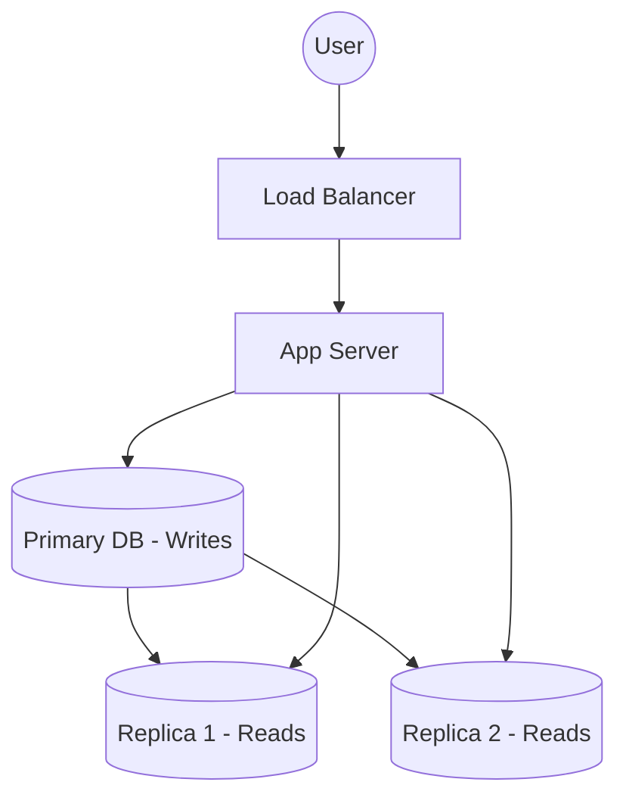
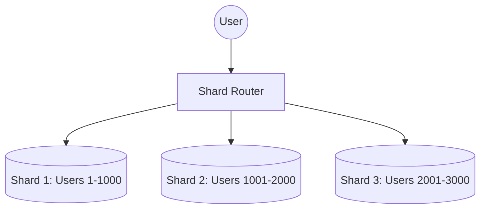

# 12 Replication & Sharding

## Why this topic matters
Once your database becomes too large or too busy for one server, you hit a "Wall." You can't just add more RAM (Vertical Scaling). You need to split the data or copy it. This is where **Replication** and **Sharding** come in.

## Learning Objectives
- Understand Replication (Copying data).
- Understand Sharding (Splitting data).
- Learn the difference between Master-Slave and Multi-Master replication.

## Intuition
Imagine a **Library**.
- **Replication**: The library is so popular that they make **three identical copies** of every book and put them in three different rooms. Now, 300 people can read the same book at once.
- **Sharding**: The library has too many books to fit in one building. They decide to put books A-M in **Building 1** and books N-Z in **Building 2**. Now, they have twice the storage space.

## Detailed Explanation

### 1. Database Replication
Replication is the process of copying data from one database server (the Primary/Leader) to one or more others (the Replicas/Followers).

**Types of Replication:**
- **Single-Leader (Master-Slave)**: All writes go to the Master. The Master copies the data to the Slaves. Reads can happen from any server.
  - *Use Case*: Read-heavy apps (like Twitter). Most people read tweets; few write them.
- **Multi-Leader**: Multiple servers can accept writes. They sync with each other.
  - *Use Case*: Systems spanning different continents.
- **Leaderless**: Any node can accept reads and writes (e.g., Cassandra).

### 2. Database Sharding (Horizontal Partitioning)
Sharding is the process of breaking up a large database into smaller, more manageable chunks called **Shards**. Each shard is stored on a separate server.

**How to Shard? (Sharding Keys)**
You must pick a "Shard Key" to decide where the data goes.
- **Range Based**: Shard 1 (Users A-M), Shard 2 (Users N-Z). (Problem: Hotspots—more people have names starting with 'S' than 'X').
- **Hash Based**: `Shard = hash(user_id) % number_of_shards`. This distributes data evenly.

### Comparison Table
| Feature | Replication | Sharding |
| :--- | :--- | :--- |
| **Goal** | High Availability & Read Speed | Storage Capacity & Write Speed |
| **Data** | Same data on all servers | Different data on each server |
| **Failure** | If one dies, others have the copy | If one dies, a portion of data is lost |
| **Complexity** | Medium | High |

## Real-world Example
**Facebook**
- **Replication**: Your profile data is replicated across data centers globally so that a user in Japan and a user in USA both see your profile quickly.
- **Sharding**: With billions of users, Facebook cannot store all profiles on one machine. They shard user data by `user_id`.

## Advantages
- **Replication**: No single point of failure; reads are lightning fast.
- **Sharding**: Can handle practically infinite amounts of data.

## Disadvantages
- **Replication**: "Replication Lag"—the slave might be a few milliseconds behind the master.
- **Sharding**: Complex queries. If you need to join data from Shard 1 and Shard 2, it's very slow.

## Common Interview Questions
- **What is the difference between Replication and Sharding?**
- **What is a 'Hotspot' in sharding and how do you fix it?**
- **What is Master-Slave replication?**
- **Why is sharding harder to implement than replication?**

### Interview Answer Tips
- Use the **Library analogy**.
- When discussing sharding, always mention the **Shard Key**. The choice of the key is the most important part of the design.

## Common Mistakes
- Thinking Replication increases storage space. (It doesn't; it just copies the same space).
- Thinking Sharding is just "splitting a table." (It's splitting data across *physical servers*).

## Summary
Replication is for **redundancy and read-speed** (copies). Sharding is for **capacity and write-speed** (splitting). Together, they allow a database to scale to millions of users.

## Practice Questions
1. If your app has 99% reads and 1% writes, would you prioritize replication or sharding?
2. What happens to a Master-Slave system if the Master server crashes?
3. You are sharding by "Country." Why might this lead to a "Hotspot"?
4. Explain "Eventual Consistency" in the context of replication.
5. Can you shard a database and also replicate each shard? (Answer: Yes, this is how most big systems work).

## Further Reading
- [[03 Scalability]]
- [[04 Availability & Reliability]]
- [[10 Database Basics]]
- [[13 Consistent Hashing]]

#system-design #placements #interview #database #replication #sharding
