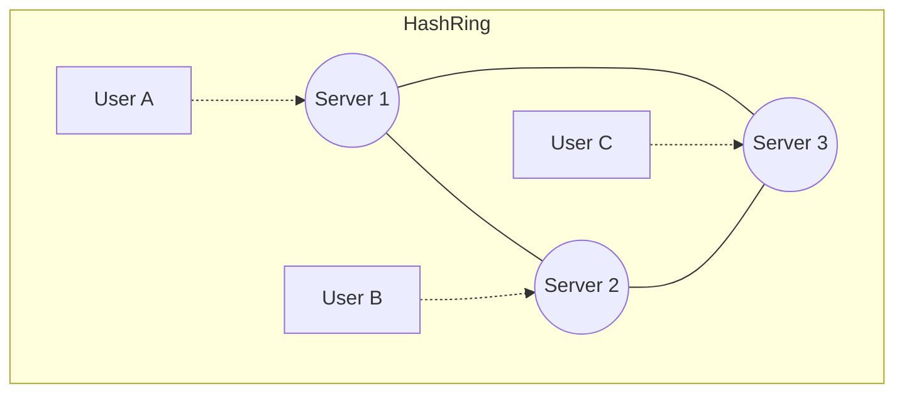

# 13 Consistent Hashing

## Why this topic matters
When you use Sharding or a Distributed Cache (like Redis), you use a hash function to decide which server gets the data: `Server = hash(key) % N`. 
But what happens if you add a new server (N becomes N+1)? **Every single key in your system will map to a different server**, causing a "Cache Storm" where all your cached data becomes useless instantly. Consistent Hashing solves this.

## Learning Objectives
- Understand the problem with traditional hashing (`mod N`).
- Learn how the "Hash Ring" works.
- Understand the role of "Virtual Nodes."

## Intuition
Imagine a **Pizza**.
- **Traditional Hashing**: You divide the pizza into $N$ equal slices. You assign users to slices. If you add a new person, you have to re-slice the *entire* pizza into $N+1$ pieces. Everyone has to move to a new slice.
- **Consistent Hashing**: You imagine the pizza is a **Circle (Ring)**. You place servers at random spots on the ring. A user is also placed on the ring. The user simply walks **clockwise** until they hit the first server.
If you add a new server, it just takes a small "slice" of the ring from its neighbor. Most users stay exactly where they were.

## Detailed Explanation

### The Traditional Hashing Problem
Formula: `server = hash(key) % N`
If $N=3$, and you add a 4th server ($N=4$), the result of the modulo change for almost every key. 
**Result**: You have to move 90-100% of your data to new servers. This crashes your system.

### How Consistent Hashing Works
1. **The Ring**: Imagine a hash space from $0$ to $2^{32}-1$ wrapped into a circle.
2. **Server Placement**: Servers are hashed and placed on the ring.
3. **Key Placement**: The request (key) is hashed and placed on the ring.
4. **The Rule**: Move **clockwise** from the key's position until you find the first server. That server handles the request.

### Improving Balance: Virtual Nodes
What if Server 1 and Server 2 are placed very close to each other, but Server 3 is far away? Server 3 will end up handling 80% of the traffic.
**The Solution**: Instead of placing a server once, we place it **100 times** (Virtual Nodes) at different spots on the ring.
This ensures that if a server is added or removed, the load is redistributed **perfectly evenly** across all other servers.

## Real-world Example
**Amazon DynamoDB / Apache Cassandra**
These databases use consistent hashing to distribute data across thousands of nodes. When they add a new server to the cluster, they don't need to move all the data; they only move a small fraction from the neighboring nodes.

## Advantages
- **Minimal Data Movement**: Only $K/N$ keys need to be moved when a server is added/removed.
- **Scalability**: You can scale your cache/DB cluster up or down without a system-wide outage.

## Disadvantages
- **Complexity**: Much harder to implement than simple modulo hashing.
- **Overhead**: Managing virtual nodes requires more memory/logic.

## Common Interview Questions
- **What is Consistent Hashing and why is it used?**
- **What happens to the data when a server is removed in Consistent Hashing?**
- **What are Virtual Nodes and why are they necessary?**
- **Compare `hash(key) % N` with Consistent Hashing.**

### Interview Answer Tips
- Use the **Pizza/Ring analogy**.
- Clearly state that the goal is to **minimize data movement** during rescaling.

## Common Mistakes
- Forgetting to explain *why* `mod N` is bad.
- Thinking Consistent Hashing is only for databases. (It's used in any distributed system, including Load Balancers and Caches).

## Summary
Consistent Hashing maps both servers and data onto a circular ring. This ensures that when the number of servers changes, only a small fraction of the data needs to be relocated, preventing system crashes during scaling.

## Practice Questions
1. If you have 4 servers and add 1 more, roughly what percentage of keys need to be moved using consistent hashing?
2. Why does a "hotspot" occur without virtual nodes?
3. If a server crashes, where does its data go in a consistent hashing ring?
4. How does the "clockwise" rule simplify the lookup process?
5. Can you use consistent hashing for a single-server system? Why or why not?

## Further Reading
- [[03 Scalability]]
- [[09 Caching]]
- [[12 Replication & Sharding]]

#system-design #placements #interview #distributed-systems #hashing
