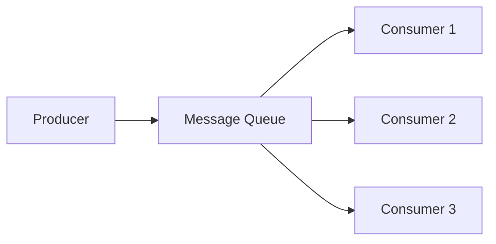

# 14 Message Queues

## Why this topic matters
In a simple system, Server A calls Server B and waits for a response. But what if Server B is slow? Or what if Server B crashes? Server A will also crash or hang. 
**Message Queues (MQ)** introduce "Asynchronous Communication," allowing systems to be decoupled and resilient.

## Learning Objectives
- Understand Synchronous vs. Asynchronous communication.
- Learn the Producer-Consumer pattern.
- Identify common use cases for Message Queues.

## Intuition
Imagine a **Pizza Restaurant**.
- **Synchronous (No Queue)**: You call the restaurant and stay on the phone while the chef makes the pizza. You can't do anything else, and the chef is stressed because you are waiting. If the chef drops the pizza, you both panic on the phone.
- **Asynchronous (With Queue)**: You place your order via an app. The app puts your order into a **Queue (Ticket System)**. You hang up and watch TV. The chef takes tickets from the queue one by one and makes the pizza. When it's done, the delivery guy brings it to you.
Even if the chef is slow, your "Order App" doesn't crash; it just tells you "Your order is being prepared."

## Detailed Explanation

### Synchronous vs. Asynchronous
- **Synchronous (Sync)**: Request $\rightarrow$ Wait $\rightarrow$ Response. (e.g., a standard REST API call).
- **Asynchronous (Async)**: Request $\rightarrow$ "I've got it!" $\rightarrow$ Process later $\rightarrow$ Notify when done.

### The Producer-Consumer Pattern

1. **Producer**: The part of the system that creates the message (e.g., a user clicking "Sign Up").
2. **Queue**: A temporary storage (buffer) that holds the message (e.g., RabbitMQ, Kafka).
3. **Consumer**: The part of the system that processes the message (e.g., a service that sends the Welcome Email).

### Why use a Message Queue?
1. **Decoupling**: The Producer doesn't need to know how the Consumer works.
2. **Load Smoothing (Buffering)**: If you get 1 million requests in 1 second, the queue holds them so the Consumer can process them at its own pace without crashing.
3. **Resilience**: If the Consumer crashes, the messages stay in the queue. Once the Consumer restarts, it picks up where it left off.

## Real-world Example
**Uber Ride Request**
When you click "Request Ride":
1. Uber doesn't find a driver *immediately* while you stare at a loading spinner.
2. The request is put into a **Message Queue**.
3. A **Matching Service** (Consumer) picks up the request and searches for nearby drivers.
4. Once a driver is found, you get a notification.
This prevents the app from freezing if the matching logic takes a few seconds.

## Advantages
- **Fault Tolerance**: One part of the system can fail without bringing down the rest.
- **Scalability**: You can add more Consumers to process the queue faster.
- **Better User Experience**: Users don't have to wait for long background tasks to finish.

## Disadvantages
- **Complexity**: You now have to manage a Queue server (like RabbitMQ).
- **Eventual Consistency**: The user doesn't get an immediate result; they get a "Request Received" message.

## Common Interview Questions
- **What is a Message Queue and why is it used?**
- **Explain the difference between Synchronous and Asynchronous communication.**
- **What is "Decoupling" in system design?**
- **Give a real-world example where a Message Queue is necessary.**

### Interview Answer Tips
- Mention **"Load Smoothing"** or **"Buffering"**. This shows you understand how MQs handle traffic spikes.
- Clearly explain that MQs move tasks from the "critical path" (the part the user waits for) to the "background."

## Common Mistakes
- Using an MQ for everything. (If the user *needs* an immediate answer—like "Is this password correct?"—do NOT use an MQ).
- Thinking the MQ is just a database. (MQs are designed for fast flow, not long-term storage).

## Summary
A Message Queue is a "buffer" that allows different parts of a system to communicate without waiting for each other. It provides resilience, decoupling, and the ability to handle massive traffic spikes.

## Practice Questions
1. You are building a system to generate PDF reports (which takes 30 seconds). Would you use a Sync or Async call? Why?
2. What happens to the messages in a queue if all Consumers crash?
3. How does a Message Queue help in "smoothing" a traffic spike?
4. Contrast a Message Queue with a Database.
5. In a "Payment System," which parts should be Sync and which should be Async?

## Further Reading
- [[05 Latency vs Throughput]]
- [[16 CDN]]
- [[20 HLD Process]]

#system-design #placements #interview #async #message-queue
