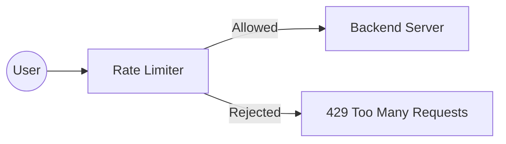

# 15 Rate Limiting

## Why this topic matters
In the real world, systems are attacked by bots or overwhelmed by "noisy neighbors" (users who send too many requests). Without Rate Limiting, one malicious user can crash your entire server, denying service to everyone else. This is known as a **DoS (Denial of Service)** attack.

## Learning Objectives
- Understand what Rate Limiting is.
- Learn common Rate Limiting algorithms.
- Identify where to implement Rate Limiting in a system.

## Intuition
Imagine a **Nightclub**.
The club has a maximum capacity of 100 people. To prevent a stampede and keep the club safe, there is a **Bouncer** at the door.
- The bouncer says: *"Only 5 people can enter every 1 minute."*
- If a group of 20 people tries to rush in at once, the bouncer stops 15 of them and says, *"Wait your turn; come back in a few minutes."*
The bouncer is the **Rate Limiter**. He ensures the club (the server) doesn't get overwhelmed and crash.

## Detailed Explanation

### What is Rate Limiting?
Rate Limiting is the process of limiting the number of requests a user can make to a service within a specific time window (e.g., "100 requests per hour").

### Common Rate Limiting Algorithms
1. **Fixed Window Counter**: 
   - Divide time into fixed blocks (e.g., 1:00 to 1:01). 
   - Allow 10 requests per block. 
   - *Problem*: A user could send 10 requests at 1:00:59 and 10 more at 1:01:01, effectively sending 20 requests in 2 seconds.
2. **Sliding Window Log**:
   - Keep a timestamp of every single request. 
   - When a new request comes, delete timestamps older than 1 minute and count the remaining.
   - *Problem*: Consumes a lot of memory to store every timestamp.
3. **Token Bucket**:
   - A "bucket" holds tokens. Tokens are added at a constant rate (e.g., 1 token every second).
   - Every request costs 1 token. If the bucket is empty, the request is rejected.
   - *Benefit*: Allows for "bursts" of traffic (if the bucket is full, the user can send 10 requests at once).
4. **Leaky Bucket**:
   - Requests enter a bucket and "leak" out at a constant rate to be processed.
   - If the bucket overflows, requests are dropped.
   - *Benefit*: Ensures a perfectly smooth flow of requests to the server.

### Where to put the Rate Limiter?
- **Client-Side**: Not reliable (users can bypass it).
- **API Gateway / Reverse Proxy**: The most common place. It catches the request before it even hits your application server.
- **Application Level**: Good for fine-grained control (e.g., "Premium users get 1000 requests, Free users get 10").

## Real-world Example
**Twitter/X API**
Twitter allows developers to use their API, but they have strict limits. For example, you might be allowed to post 100 tweets per day. If you try to post 101, the API returns an error: `HTTP 429 Too Many Requests`.

## Advantages
- **Prevents Abuse**: Stops bots and scrapers from stealing data.
- **Security**: Mitigates DoS and Brute-Force attacks.
- **Stability**: Ensures the system stays performant for all users.

## Disadvantages
- **User Frustration**: Legitimate users might get blocked if the limits are too strict.
- **Complexity**: Requires a fast storage system (like **Redis**) to keep track of counts for millions of users.

## Common Interview Questions
- **What is Rate Limiting and why is it needed?**
- **Explain the Token Bucket algorithm.**
- **What is the HTTP status code for a rate-limited request?** (Answer: 429).
- **How would you implement a rate limiter for millions of users?** (Answer: Use Redis to store counts).

### Interview Answer Tips
- Mention **Redis**. Because rate limiting happens on every single request, you cannot use a slow SQL database to store the counters; you must use a fast in-memory store.
- Mention the **429 status code**. It shows you know the HTTP protocol.

## Common Mistakes
- Suggesting a "Fixed Window" without mentioning its "edge case" (the burst at the window boundary).
- Thinking Rate Limiting is the same as Load Balancing. (LB distributes traffic; RL rejects traffic).

## Summary
Rate Limiting is the "Bouncer" of your system. It protects your servers from being overwhelmed by limiting how many requests a user can make, ensuring stability and security.

## Practice Questions
1. Which algorithm is better for allowing "bursts" of traffic: Token Bucket or Leaky Bucket?
2. Why is Redis the preferred choice for implementing a rate limiter?
3. You are designing a "Free Tier" vs "Paid Tier" API. How would you use rate limiting to encourage users to upgrade?
4. What is the difference between Rate Limiting and Throttling?
5. If you use a distributed system with 5 API Gateways, how do you ensure the rate limit is consistent across all of them?

## Further Reading
- [[08 Reverse Proxy]]
- [[09 Caching]]
- [[16 CDN]]

#system-design #placements #interview #security #rate-limiting
