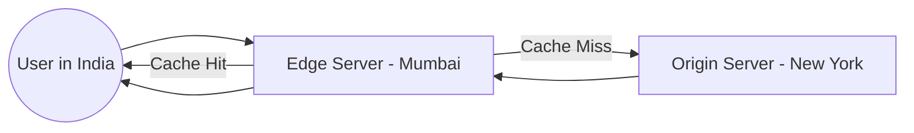

# 16 CDN (Content Delivery Network)

## Why this topic matters
Images, videos, and CSS files are "heavy." If a user in India has to fetch a 5MB image from a server in New York, the page will load slowly, and the user will leave. A CDN solves this by bringing the content physically closer to the user.

## Learning Objectives
- Understand what a CDN is.
- Learn how "Edge Locations" work.
- Differentiate between Static and Dynamic content caching.

## Intuition
Imagine you want to buy a specific brand of **Soda**.
- **Without a CDN**: There is only one factory in the world (The Origin Server). Every time you want a soda, you have to drive 1,000 miles to the factory. It's slow and expensive.
- **With a CDN**: The factory sends thousands of crates of soda to local **Convenience Stores** (Edge Locations) in every city. Now, you just walk 2 blocks to your local store. The soda is the same, but you get it in 2 minutes instead of 2 days.

## Detailed Explanation

### What is a CDN?
A Content Delivery Network (CDN) is a geographically distributed group of servers (called Edge Servers or Points of Presence - PoPs) that work together to provide fast delivery of Internet content.

### How it Works
1. **The Origin**: This is your main server where the original version of your website lives.
2. **Edge Locations**: These are servers scattered across the globe.
3. **The Process**:
   - User requests `image.jpg`.
   - The request goes to the **nearest Edge Server**.
   - If the Edge Server has the image (**Cache Hit**), it returns it immediately.
   - If not (**Cache Miss**), the Edge Server fetches it from the Origin, saves a copy, and then gives it to the user.

### Static vs. Dynamic Content
- **Static Content**: Images, JS, CSS, Videos. These are the same for everyone. CDNs love these; they are cached forever (or until updated).
- **Dynamic Content**: Your "Profile Page" or "Bank Balance." This changes for every user. CDNs usually don't cache this, but they can use **Dynamic Site Acceleration** to optimize the path back to the origin.

## Real-world Example
**Netflix**
Netflix doesn't stream every movie from a central hub in California. They have "Open Connect" appliances (their own CDN) inside the data centers of local Internet Service Providers (ISPs). When you press play, the movie is likely coming from a server just a few miles away from your house.

## Advantages
- **$\downarrow$ Latency**: Content loads almost instantly.
- **$\uparrow$ Throughput**: The Origin server is not overwhelmed by millions of requests for the same image.
- **DDoS Protection**: CDNs can absorb massive traffic spikes, protecting your origin server from crashing.

## Disadvantages
- **Cost**: CDNs charge based on the amount of data transferred.
- **Stale Content**: If you update an image on your server, the CDN might still serve the old one until the cache expires.

## Common Interview Questions
- **What is a CDN and how does it work?**
- **What is the difference between a CDN and a Cache?** (Answer: A CDN is essentially a *geographically distributed* cache).
- **How do you handle "stale" content in a CDN?** (Answer: Cache Purging or using versioned URLs like `style.v2.css`).

### Interview Answer Tips
- Mention **"Edge Locations"** and **"Points of Presence (PoP)"**.
- Explain that CDNs are primarily for **Static Assets**.

## Common Mistakes
- Thinking CDNs cache everything. (Remind the interviewer that personalized data isn't cached).
- Confusing CDNs with Load Balancers. (LBs distribute load; CDNs reduce distance).

## Summary
A CDN is a network of servers that caches static content near the user. It reduces the distance data has to travel, which slashes latency and reduces the load on the main server.

## Practice Questions
1. If you are building a private internal tool used only in one office, do you need a CDN? Why?
2. What is a "Cache Purge" in a CDN?
3. Explain the flow of a request for a cached image vs. a non-cached image.
4. How does a CDN help during a viral marketing campaign?
5. Which is faster: a Load Balancer or a CDN? (Trick question: they do different things).

## Further Reading
- [[09 Caching]]
- [[08 Reverse Proxy]]
- [[05 Latency vs Throughput]]

#system-design #placements #interview #networking #cdn
