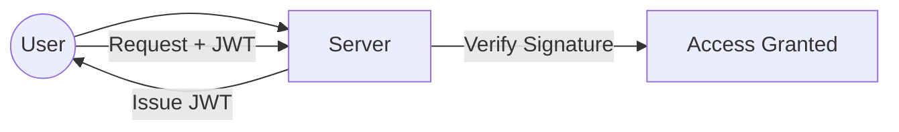

# 18 Authentication & Authorization

## Why this topic matters
Almost every system needs to know *who* the user is and *what* they are allowed to do. Mixing up Authentication and Authorization is a common mistake in fresher interviews. Getting this right shows you care about security.

## Learning Objectives
- Differentiate between Authentication (AuthN) and Authorization (AuthZ).
- Understand Session-based vs. Token-based (JWT) authentication.
- Learn the basics of OAuth2.

## Intuition
Imagine you are entering a **Corporate Office**.
1. **Authentication**: You show your **ID Card** at the front desk. The security guard checks your photo and says, *"Yes, you are indeed John Doe."* $\rightarrow$ You are now **Authenticated**.
2. **Authorization**: You try to enter the **Server Room**. The guard stops you and says, *"You are John Doe, but you are a Designer, not an IT Admin. You are not allowed in here."* $\rightarrow$ You are **Not Authorized**.

Authentication is about **Identity**. Authorization is about **Permissions**.

## Detailed Explanation

### 1. Authentication (AuthN)
The process of verifying who a user is.
- **Common Methods**: 
  - Passwords (hashed!).
  - Multi-Factor Authentication (MFA/OTP).
  - Biometrics (Fingerprint/FaceID).

### 2. Authorization (AuthZ)
The process of verifying what an authenticated user can do.
- **RBAC (Role-Based Access Control)**: Assigning permissions to roles (e.g., `Admin`, `Editor`, `Viewer`).
- **ABAC (Attribute-Based Access Control)**: Permissions based on attributes (e.g., "Can edit if they are the owner of the post").

### 3. How to maintain the "Logged In" state?
HTTP is stateless. The server forgets who you are the moment the request ends. We use two main ways to remember users:

#### A. Session-based (Stateful)
- User logs in $\rightarrow$ Server creates a **Session ID** $\rightarrow$ Stores it in DB/Redis $\rightarrow$ Sends it to user as a **Cookie**.
- Every request includes the Cookie. Server looks up the ID in the DB.
- **Pros**: Easy to revoke (just delete the session from DB).
- **Cons**: Hard to scale horizontally (every server needs access to the session DB).

#### B. Token-based (Stateless / JWT)
- User logs in $\rightarrow$ Server creates a **JWT (JSON Web Token)** $\rightarrow$ Signs it with a secret key $\rightarrow$ Sends it to user.
- The token *contains* the user data (e.g., `userId: 123, role: admin`).
- Server doesn't store anything. It just verifies the signature.
- **Pros**: Extremely scalable (no DB lookup needed).
- **Cons**: Hard to revoke (once issued, a token is valid until it expires).

## Real-world Example
**Google Account**
- **Authentication**: You enter your email and password.
- **Authorization**: You can read your own Gmail, but you cannot read the Gmail of another user.

## Advantages
- **Security**: Ensures data privacy.
- **Audit**: You can track who did what in the system.

## Disadvantages
- **Latency**: Adding an auth check to every single API call adds a few milliseconds.
- **Complexity**: Implementing a secure OAuth2 flow is difficult.

## Common Interview Questions
- **What is the difference between Authentication and Authorization?**
- **How does a JWT work?**
- **What is a Session Cookie?**
- **Which is more scalable: Session-based or Token-based auth? Why?**

### Interview Answer Tips
- Mention **Hashing**. Never say "I will store passwords in the database." Say "I will store the **salted hash** of the password."
- Mention **HTTPS**. Auth is useless if tokens are sent over plain HTTP where they can be stolen.

## Common Mistakes
- Using the terms interchangeably.
- Forgetting to mention token expiration (TTL).

## Summary
Authentication verifies identity; Authorization verifies permissions. While sessions are easier to manage, JWTs are the standard for modern, scalable distributed systems.

## Practice Questions
1. If a user's account is stolen, why is it harder to stop the attacker using JWTs than using Sessions?
2. Where should you store a JWT on the frontend? (Local Storage vs. HttpOnly Cookie).
3. Design a simple RBAC system for a "Company Portal" with 3 roles.
4. What is "Salt" in password hashing?
5. Explain OAuth2 in one sentence.

## Further Reading
- [[17 API Design & REST]]
- [[19 Microservices vs Monolith]]

#system-design #placements #interview #security #auth
