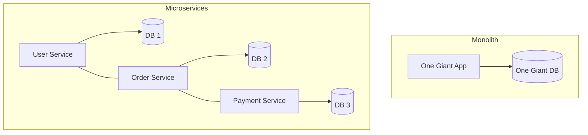

# 19 Microservices vs Monolith

## Why this topic matters
As a fresher, you will likely enter a company that uses either a massive legacy Monolith or a modern Microservices architecture. Interviewers want to know if you understand the trade-offs between these two. They aren't looking for a "correct" answer, but for your ability to reason through the pros and cons.

## Learning Objectives
- Define Monolithic and Microservices architectures.
- Understand the transition from one to the other.
- Learn the challenges of Microservices (The "Distributed Systems Tax").

## Intuition
Imagine you are running a **Small Bakery**.
- **Monolith**: You are the only employee. You bake the cake, decorate it, take the payment, and clean the shop. You do everything. It's simple, and you don't have to talk to anyone to get things done. But if you get sick, the whole shop closes.
- **Microservices**: You hire four specialists. One person only bakes, one only decorates, one only handles money, and one only cleans. Now, you can produce 10x more cakes. If the cleaner is sick, you can still bake and sell cakes. However, you now have to spend all your time coordinating between the four people so they don't bump into each other.

## Detailed Explanation

### 1. Monolithic Architecture
A monolith is a single, unified unit. All the business logic, database access, and UI are bundled into one codebase and deployed as one file (e.g., a single `.jar` or `.war` file).

**Pros:**
- **Simple Development**: Easy to set up and test.
- **Fast Communication**: Functions call each other directly in memory.
- **Simple Deployment**: Just upload one file to one server.

**Cons:**
- **Scaling Issues**: You have to scale the *entire* app, even if only one feature (like "Payment") is slow.
- **Deployment Risk**: One tiny bug in the "Footer" can crash the entire application.
- **Tech Lock-in**: You must use one language/framework for the whole project.

### 2. Microservices Architecture
A system is split into small, independent services. Each service handles one specific business function (e.g., User Service, Order Service, Payment Service) and has its **own database**.

**Pros:**
- **Independent Scaling**: If "Payment" is slow, you only add more servers to the Payment Service.
- **Fault Isolation**: If the "Recommendation Service" crashes, users can still buy products.
- **Tech Flexibility**: You can write the User Service in Java and the AI Service in Python.

**Cons:**
- **Operational Complexity**: You now have 20 servers to manage instead of 1.
- **Network Latency**: Services talk over HTTP/RPC, which is slower than in-memory calls.
- **Data Consistency**: Since every service has its own DB, keeping data in sync is very hard (leads to [[06 CAP Theorem]]).

## Real-world Example
**Uber**
Uber started as a **Monolith**. It was easy to build the first version of the app. But as they added "UberEats," "UberFreight," and "UberPool," the codebase became too huge for any one engineer to understand. They spent years breaking the monolith into thousands of **Microservices**.

## Advantages
- Allows large teams (100+ engineers) to work on different features without stepping on each other's toes.
- Enables "Continuous Deployment" (updating one feature without restarting the whole app).

## Disadvantages
- Huge overhead in infrastructure (Kubernetes, API Gateways, Service Mesh).
- Debugging becomes a nightmare (you have to trace a request across 5 different servers).

## Common Interview Questions
- **What is the difference between Monolith and Microservices?**
- **When should you NOT use Microservices?** (Answer: For small teams or early-stage startups).
- **How do Microservices communicate with each other?** (Answer: REST APIs, gRPC, or [[14 Message Queues]]).

### Interview Answer Tips
- **The "Golden Rule"**: Don't start with Microservices. Start with a "Modular Monolith" and split it only when the pain of the monolith outweighs the complexity of microservices.
- Mention **"Bounded Context"** (each service should have a clear, single responsibility).

## Common Mistakes
- Saying "Microservices are always better." (They are not; they are a tool for scale, not a default).
- Suggesting a shared database for microservices. (This is a "Distributed Monolith" and is an anti-pattern).

## Summary
Monoliths are simple and fast for small apps. Microservices are complex and expensive but essential for massive, multi-team organizations that need independent scaling and fault isolation.

## Practice Questions
1. You are a solo developer building a prototype for a college project. Which architecture do you choose? Why?
2. If a system has a "Payment Service" and a "User Service," and the Payment Service goes down, what happens in a Monolith vs. Microservices?
3. Why does a Microservices architecture increase network latency?
4. What is a "Distributed Monolith"?
5. How does a Load Balancer fit into a Microservices architecture?

## Further Reading
- [[03 Scalability]]
- [[07 Load Balancer]]
- [[14 Message Queues]]
- [[17 API Design & REST]]

#system-design #placements #interview #architecture #microservices
