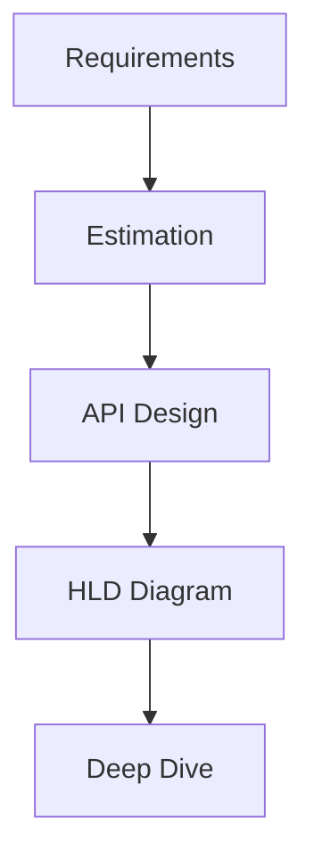

# 20 High-Level Design (HLD) Process

## Why this topic matters
In an interview, you are often given a vague prompt: *"Design a system like TinyURL"* or *"Design a News Feed."* The interviewer isn't just looking for the final diagram; they are testing your **thought process**. Following a structured framework prevents you from panicking and ensures you cover all bases.

## Learning Objectives
- Learn a step-by-step framework for HLD interviews.
- Understand how to move from requirements to a final architecture.
- Learn how to handle "trade-off" discussions.

## Intuition
Imagine you are an **Architect** hired to build a bridge.
You don't just start pouring concrete. 
1. You ask: *"How many cars will cross? Is it for pedestrians or trucks?"* (**Requirements**)
2. You estimate: *"We need to handle 10,000 cars per hour."* (**Constraints**)
3. You sketch: *"A suspension bridge would work here."* (**High-Level Diagram**)
4. You refine: *"We need steel cables of X thickness to handle the wind."* (**Deep Dive**)
If you skip step 1, you might build a pedestrian bridge for 18-wheeler trucks, and it will collapse.

## Detailed Explanation

### The 5-Step HLD Framework
When the clock starts, follow this exact sequence:

#### Step 1: Clarify Requirements (5-10 mins)
Never start drawing immediately. Ask questions to define the scope.
- **Functional**: "Can users edit their posts? Do we need a search feature?"
- **Non-Functional**: "Does it need to be highly available? Is low latency critical?"
- **Scale**: "How many Daily Active Users (DAU)? What is the Read/Write ratio?"

#### Step 2: Back-of-the-Envelope Estimation (Optional, 5 mins)
Estimate the scale to justify your design choices.
- **Storage**: "1 million users $\times$ 1 photo/day $\times$ 1MB = 1TB/day."
- **Throughput**: "100 million requests / 86,400 seconds $\approx$ 1,100 requests per second."
- *Tip*: If you don't do this, the interviewer might ask: *"Why do you need a NoSQL DB?"* Your answer should be: *"Because we are storing 1TB of unstructured data daily."*

#### Step 3: API Design (5 mins)
Define the "Contract." Write down the endpoints.
- `POST /v1/shorten` (Input: longURL $\rightarrow$ Output: shortURL)
- `GET /v1/{shortURL}` (Input: shortURL $\rightarrow$ Output: longURL)

#### Step 4: High-Level Diagram (15-20 mins)
Draw the "Boxes and Arrows."
1. **Client** $\rightarrow$ **Load Balancer**.
2. **Load Balancer** $\rightarrow$ **Web Servers**.
3. **Web Servers** $\rightarrow$ **Cache/Database**.
4. Add components as needed (e.g., **Message Queue** for async tasks, **CDN** for images).

#### Step 5: Deep Dive & Trade-offs (10-15 mins)
This is where the "Staff Engineer" level comes in. The interviewer will challenge your design.
- *"What happens if the DB crashes?"* $\rightarrow$ Talk about [[12 Replication & Sharding]].
- *"How do we handle a traffic spike?"* $\rightarrow$ Talk about [[03 Scalability]] and [[07 Load Balancer]].
- *"The latency is too high."* $\rightarrow$ Talk about [[09 Caching]] and [[16 CDN]].

## Real-world Example
**Designing a URL Shortener (TinyURL)**
1. **Reqs**: Shorten URL, Redirect to long URL.
2. **Scale**: 100M URLs/month.
3. **API**: `POST /shorten`, `GET /{id}`.
4. **HLD**: User $\rightarrow$ LB $\rightarrow$ App Server $\rightarrow$ NoSQL DB (for fast lookup).
5. **Deep Dive**: Use a **Hash function** to generate IDs. Use **Consistent Hashing** to distribute keys across multiple DB shards. Use a **Cache** for the most popular links.

## Advantages
- Prevents "Blank Page Syndrome."
- Shows the interviewer that you are a structured thinker.
- Ensures you don't miss critical Non-Functional requirements.

## Disadvantages
- If you spend too long on Step 1 and 2, you won't have time to draw the diagram. Be mindful of the clock.

## Common Interview Questions
- **"Design WhatsApp/Netflix/Uber."** (These are just applications of this framework).
- **"How would you approach a system design problem?"** (Explain this 5-step process).

### Interview Answer Tips
- **Think Out Loud**: The interviewer cares more about *how* you got to the answer than the answer itself.
- **Be Flexible**: If the interviewer says, *"Assume the database is slow,"* don't defend your design. Say, *"In that case, I would introduce a cache here to reduce the load."*

## Common Mistakes
- **Jumping to the Diagram**: Starting with "I'll use Kafka and MongoDB" without knowing what the app does.
- **Over-complicating**: Adding a CDN and Message Queue for a system that only has 100 users.
- **Ignoring the DB**: Forgetting to mention what the data looks like or where it's stored.

## Summary
HLD is a conversation, not a test. By following the "Requirements $\rightarrow$ API $\rightarrow$ Diagram $\rightarrow$ Deep Dive" flow, you demonstrate a professional engineering approach to solving ambiguous problems.

## Practice Questions
1. Practice the 5-step framework for "Designing a Pastebin."
2. How do you handle a situation where the interviewer keeps changing the requirements mid-way?
3. Why is "Back-of-the-envelope estimation" useful for choosing a database?
4. What is the most important part of Step 1?
5. If you have only 20 minutes for the whole interview, which steps would you compress?

## Further Reading
- [[02 Functional vs Non Functional Requirements]]
- [[17 API Design & REST]]
- [[19 Microservices vs Monolith]]

#system-design #placements #interview #hld #process
