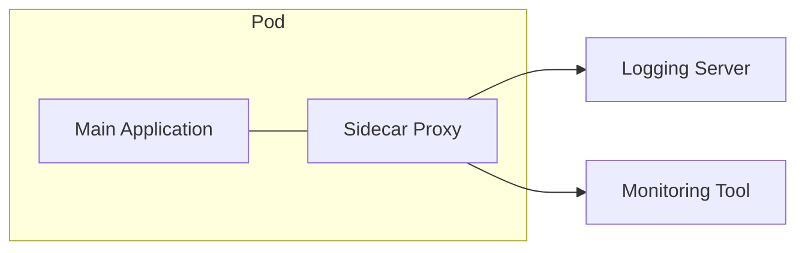

# 21 Common Design Patterns in System Design

## Why this topic matters
Design patterns are "proven solutions to recurring problems." In a system design interview, mentioning a specific pattern (like "Fan-out" or "Sidecar") signals to the interviewer that you have studied industry standards and aren't just guessing.

## Learning Objectives
- Understand the difference between GoF (Low-Level) and System Design (High-Level) patterns.
- Learn key architectural patterns: Fan-out, CQRS, and Sidecar.
- Know when to apply these patterns to solve specific scale problems.

## Intuition
Imagine you are organizing a **Large Wedding**.
- **Fan-out**: You have one "Head Coordinator" who doesn't do everything. Instead, they send a message to 5 "Assistant Coordinators" (Food, Music, Decor, Guests, Lighting). Each assistant handles their area in parallel. One request $\rightarrow$ Many actions.
- **CQRS (Command Query Responsibility Segregation)**: You have one person who only **takes orders** (the Order Taker) and a completely different person who **answers questions** about the menu (the Informer). The person taking orders is focused on speed and accuracy of entry; the informer is focused on fast retrieval of information.
- **Sidecar**: Imagine a professional "Assistant" who follows a lead singer everywhere. The singer just sings (Core Logic), while the assistant handles the water, the microphone, and the lighting (Cross-cutting concerns).

## Detailed Explanation

### 1. Fan-Out Pattern
Fan-out is used when a single action needs to trigger multiple downstream processes.
- **Scenario**: A user posts a tweet. 
- **Process**: The "Tweet Service" writes to the DB and then "fans out" the tweet to the timelines of 10,000 followers.
- **Implementation**: Usually done via a **Message Queue** ([[14 Message Queues]]).

### 2. CQRS (Command Query Responsibility Segregation)
CQRS splits the "Write" path (Commands) from the "Read" path (Queries).
- **Command**: Create, Update, Delete. Optimized for consistency.
- **Query**: Read. Optimized for speed.
- **Why?**: In most apps, reads are $100\times$ more frequent than writes. By separating them, you can scale the "Read Database" (using Replicas) independently of the "Write Database."

### 3. Sidecar Pattern
A separate process/container that runs alongside the main application to handle helper tasks.
- **Common Sidecar Tasks**: Logging, Monitoring, Security (mTLS), and Configuration.
- **Analogy**: Like a plugin for your server. The app doesn't need to know *how* to log to a cloud server; it just writes to the sidecar, and the sidecar handles the shipping.

## Real-world Example
**Netflix**
Netflix uses the **Fan-out** pattern for notifications. When a new episode of "Stranger Things" drops, a single event is fanned out to millions of users' push notification services across different devices and time zones.

## Advantages
- **Performance**: Parallel processing (Fan-out) and optimized reads (CQRS).
- **Modularity**: Sidecars keep the core business logic clean.
- **Scalability**: You can scale the "Read" side of your app without touching the "Write" side.

## Disadvantages
- **Complexity**: More moving parts to debug.
- **Consistency**: In CQRS, there is often a delay before a "Write" is visible in the "Read" database (Eventual Consistency).

## Common Interview Questions
- **What is the Fan-out pattern and where would you use it?**
- **Explain CQRS. Why separate reads and writes?**
- **What is a Sidecar pattern and how does it help in Microservices?**

### Interview Answer Tips
- Don't over-use these. Only suggest a pattern when a specific problem arises. 
- Example: *"Since this system is very read-heavy, I would consider CQRS to scale the read-path independently."*

## Common Mistakes
- Confusing these with GoF patterns (like Singleton or Factory). These are **Architectural Patterns**, not **Coding Patterns**.
- Implementing CQRS for a simple app. (It's massive overkill for a To-Do list).

## Summary
Design patterns provide a common language for engineers. Fan-out handles parallel tasks, CQRS optimizes read/write paths, and Sidecars separate core logic from infrastructure tasks.

## Practice Questions
1. In a "Like" system (Instagram), would you use Fan-out or CQRS to update the count?
2. Why is a Sidecar better than adding logging code directly into the App?
3. If you use CQRS, how do you ensure the Read DB eventually catches up with the Write DB?
4. Describe a scenario where Fan-out could lead to a "System Crash" (The Celebrity Problem).
5. Which pattern is most useful for implementing a "Service Mesh" (like Istio)?

## Further Reading
- [[14 Message Queue]]
- [[19 Microservices vs Monolith]]
- [[12 Replication & Sharding]]

#system-design #placements #interview #design-patterns #architecture
