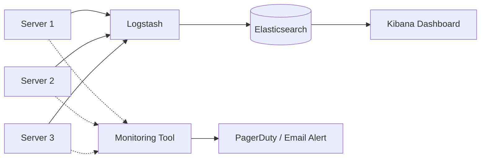

# 22 Logging & Monitoring

## Why this topic matters
In a local project, you use `console.log()` or `print()` to find bugs. In a production system with 10 servers and 1 million users, that is impossible. You cannot SSH into 10 servers to read text files. You need a centralized way to know if your system is healthy or dying.

## Learning Objectives
- Understand the difference between Logging and Monitoring.
- Learn about Centralized Logging.
- Understand key metrics: Health Checks, Heartbeats, and Alerts.

## Intuition
Imagine you are the **Manager of a Hospital**.
- **Logging**: This is the **Patient's Medical Record**. It is a detailed history of every single thing that happened: *"At 2:00 PM, Patient A had a fever. At 2:05 PM, Nurse B gave medicine."* It's used to figure out *why* something went wrong after the fact.
- **Monitoring**: This is the **Heart Rate Monitor** next to the bed. It doesn't tell you the history; it tells you *right now* if the patient's heart is beating. If the heart stops, an alarm goes off.

Logging is for **Investigation**. Monitoring is for **Detection**.

## Detailed Explanation

### 1. Centralized Logging
Since microservices run on many servers, we send all logs to one central place.
- **The ELK Stack (Industry Standard)**:
  - **Elasticsearch**: The search engine that stores and indexes the logs.
  - **Logstash**: The "Pipe" that collects logs from servers and sends them to Elasticsearch.
  - **Kibana**: The Dashboard where you can search for "Error 500" across all servers.

### 2. Monitoring & Metrics
Monitoring tracks the "Vitals" of your system.
- **Key Metrics to Track**:
  - **CPU/RAM Usage**: Is the server overloaded?
  - **Request Rate (Throughput)**: How many users are hitting the API?
  - **Error Rate**: What % of requests are returning 500 errors?
  - **Latency (P99)**: What is the response time for the slowest 1% of users?

### 3. Health Checks & Heartbeats
- **Health Check**: The Load Balancer asks the server, *"Are you okay?"* The server responds with `200 OK`. If it doesn't, the LB stops sending traffic.
- **Heartbeat**: A server sends a signal every 5 seconds to a monitor: *"I'm still alive!"* If the signal stops, the monitor triggers an alert.

## Real-world Example
**Amazon**
When Amazon has a "glitch" where prices are wrong, they don't guess where it happened. They go to their central logging dashboard, search for the `order_id`, and see exactly which microservice caused the error, what the input was, and why it failed.

## Advantages
- **Faster Debugging**: Find the root cause in seconds instead of hours.
- **Proactive Fixes**: Fix a server that is at 90% RAM *before* it crashes.
- **SLA Compliance**: Prove to your boss/client that the system was "up" 99.9% of the time.

## Disadvantages
- **Storage Cost**: Logs take up a massive amount of disk space.
- **Performance Hit**: Writing logs to a file or network takes a small amount of CPU/IO.

## Common Interview Questions
- **What is the difference between Logging and Monitoring?**
- **What is Centralized Logging and why is it needed in Microservices?**
- **What are "Health Checks" and who performs them?**
- **What is the ELK stack?**

### Interview Answer Tips
- Mention **"P99 Latency"**. Instead of saying "Average latency," say "P99 latency" (the 99th percentile). This shows you understand that averages hide the experience of the most frustrated users.
- Mention **Alerting**. Monitoring is useless if no one is woken up when the system crashes.

## Common Mistakes
- Thinking that `System.out.println` is a logging strategy.
- Forgetting that logs should not contain sensitive data (like passwords or credit card numbers).

## Summary
Monitoring tells you *that* something is wrong (Heart Rate Monitor), and Logging tells you *why* it happened (Medical Record). Together, they allow you to keep a large-scale system stable and debuggable.

## Practice Questions
1. If a server is crashing every 2 hours, but the CPU and RAM look fine, how would you use logs to find the problem?
2. Why is "Average Latency" often a lying metric?
3. What happens if the Centralized Logging server itself crashes?
4. Describe the flow of a log message from a Java app to a Kibana dashboard.
5. What is a "Heartbeat" in a distributed system?

## Further Reading
- [[04 Availability & Reliability]]
- [[07 Load Balancer]]
- [[19 Microservices vs Monolith]]

#system-design #placements #interview #monitoring #logging #devops
