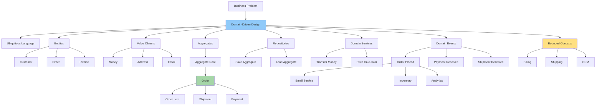
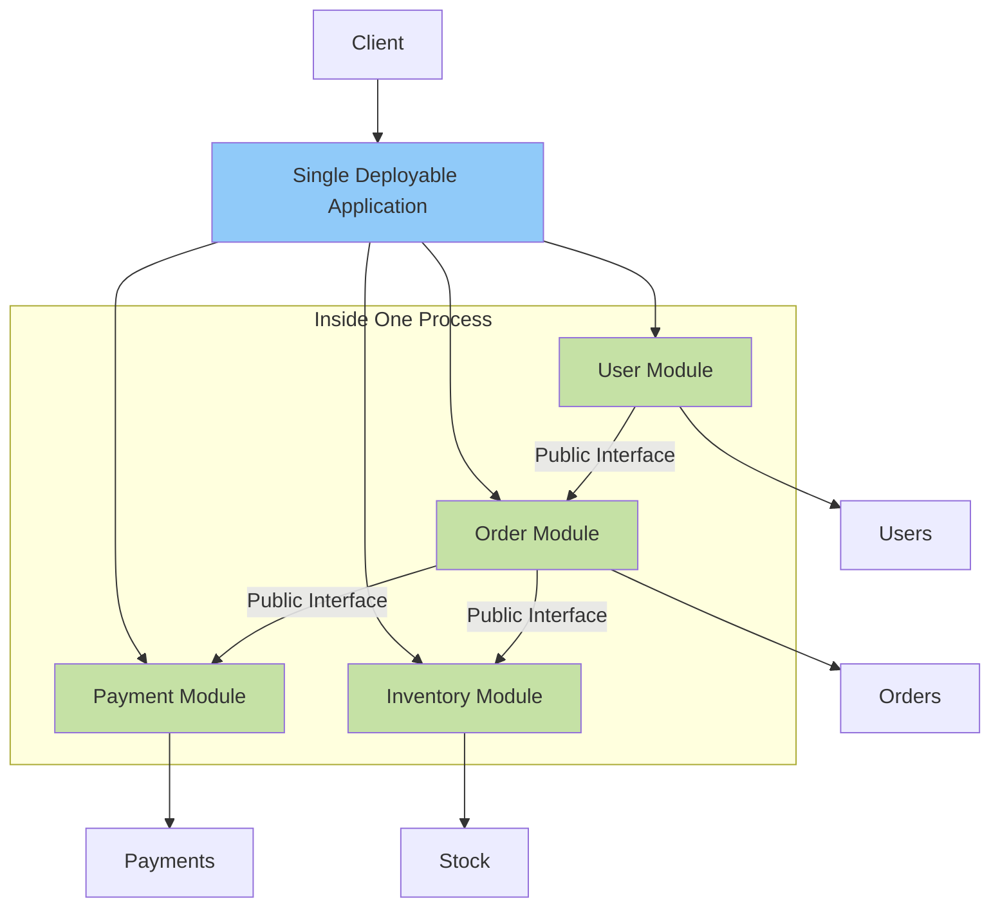
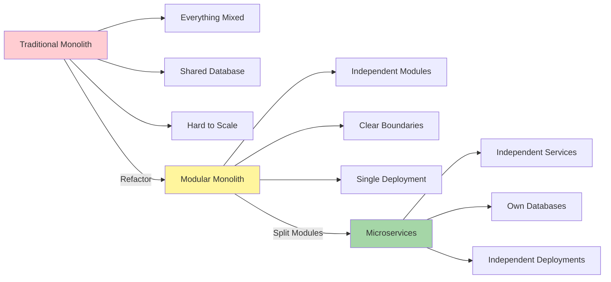
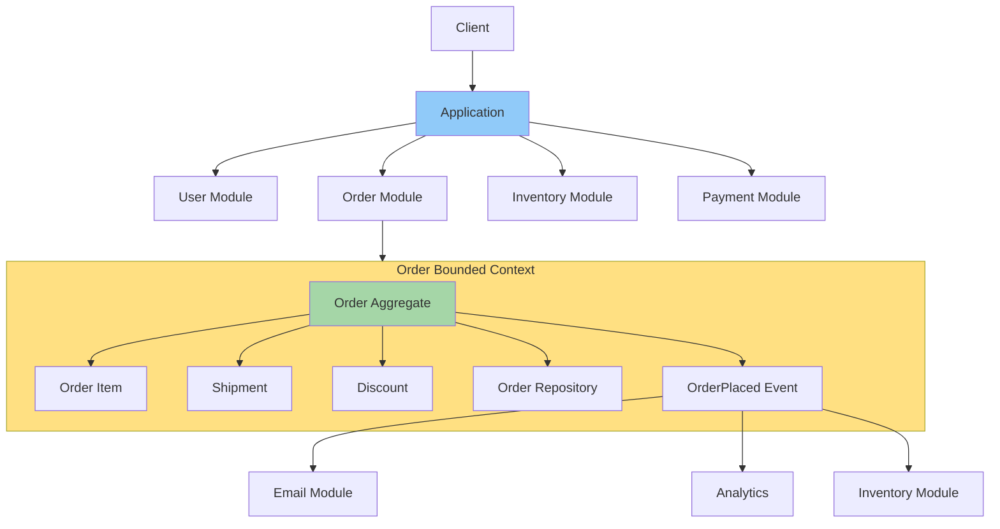

# 1. Domain-Driven Design (DDD)

```mermaid
flowchart TD

    A["Business Problem"] --> B["Domain-Driven Design"]

    B --> C["Ubiquitous Language"]
    B --> D["Entities"]
    B --> E["Value Objects"]
    B --> F["Aggregates"]
    B --> G["Repositories"]
    B --> H["Domain Services"]
    B --> I["Domain Events"]
    B --> J["Bounded Contexts"]

    D --> D1["Customer"]
    D --> D2["Order"]
    D --> D3["Invoice"]

    E --> E1["Money"]
    E --> E2["Address"]
    E --> E3["Email"]

    F --> F1["Aggregate Root"]
    F1 --> F2["Order"]
    F2 --> F3["Order Item"]
    F2 --> F4["Shipment"]
    F2 --> F5["Payment"]

    G --> G1["Save Aggregate"]
    G --> G2["Load Aggregate"]

    H --> H1["Transfer Money"]
    H --> H2["Price Calculator"]

    I --> I1["Order Placed"]
    I --> I2["Payment Received"]
    I --> I3["Shipment Delivered"]

    J --> J1["Billing"]
    J --> J2["Shipping"]
    J --> J3["CRM"]

    I1 --> X["Email Service"]
    I1 --> Y["Inventory"]
    I1 --> Z["Analytics"]

    style B fill:#90CAF9
    style F2 fill:#A5D6A7
    style J fill:#FFE082
```

---

# 2. Modular Monolith

```mermaid
flowchart TD

    Client["Client"] --> App["Single Deployable Application"]

    App --> User["User Module"]
    App --> Order["Order Module"]
    App --> Payment["Payment Module"]
    App --> Inventory["Inventory Module"]

    User --> DB1["Users"]
    Order --> DB2["Orders"]
    Payment --> DB3["Payments"]
    Inventory --> DB4["Stock"]

    Order -->|"Public Interface"| Payment
    Order -->|"Public Interface"| Inventory
    User -->|"Public Interface"| Order

    subgraph "Inside One Process"
        User
        Order
        Payment
        Inventory
    end

    style App fill:#90CAF9
    style User fill:#C5E1A5
    style Order fill:#C5E1A5
    style Payment fill:#C5E1A5
    style Inventory fill:#C5E1A5
```

---

# 3. Traditional Monolith vs Modular Monolith vs Microservices

```mermaid
flowchart LR

A["Traditional Monolith"]
A --> A1["Everything Mixed"]
A --> A2["Shared Database"]
A --> A3["Hard to Scale"]

B["Modular Monolith"]
B --> B1["Independent Modules"]
B --> B2["Clear Boundaries"]
B --> B3["Single Deployment"]

C["Microservices"]
C --> C1["Independent Services"]
C --> C2["Own Databases"]
C --> C3["Independent Deployments"]

A -->|"Refactor"| B
B -->|"Split Modules"| C

style A fill:#FFCDD2
style B fill:#FFF59D
style C fill:#A5D6A7
```

---

# 4. DDD + Modular Monolith Together

```mermaid
flowchart TD

    Client --> API["Application"]

    API --> User["User Module"]
    API --> Order["Order Module"]
    API --> Inventory["Inventory Module"]
    API --> Payment["Payment Module"]

    subgraph OrderDomain["Order Bounded Context"]

        OrderAggregate["Order Aggregate"]

        OrderAggregate --> Item["Order Item"]
        OrderAggregate --> Shipment["Shipment"]
        OrderAggregate --> Discount["Discount"]

        Repo["Order Repository"]
        Event["OrderPlaced Event"]

        OrderAggregate --> Repo
        OrderAggregate --> Event
    end

    Order --> OrderDomain

    Event --> Email["Email Module"]
    Event --> Analytics["Analytics"]
    Event --> Stock["Inventory Module"]

    style OrderAggregate fill:#A5D6A7
    style OrderDomain fill:#FFE082
    style API fill:#90CAF9
```

