---
tags:
  - System-Design
  - FAANG
  - Architecture
  - Distributed-Systems
  - Interview-Preparation
  - MOC
aliases:
  - System Design Index
  - FAANG System Design
  - SD Index
---

# 🏗️ System Design Patterns — FAANG Interview Master Index

> **Navigation hub** for comprehensive System Design patterns covering all major FAANG interview categories. Each pattern includes problem statement, requirements, architecture, data models, trade-offs, and solutions.

---

## 📚 Table of Contents

```dataviewjs
const pages = dv.pages('"System Design"').where(p => p.file.name === "System_Design_Index");
if (pages.length) {
  const content = await dv.io.load(pages[0].file.path);
  const headings = content.match(/^#{2,4}\s+(.+)$/gm) || [];
  for (const h of headings) {
    const level = h.match(/^#+/)[0].length;
    const text = h.replace(/^#+\s+/, '').replace(/[🏗️📚🎯🔑💡⚡🔥💎🚀📝📌⚠️✅❌🔗🔍📖💡]/g, '').trim();
    const anchor = text.toLowerCase().replace(/[^\w]+/g, '-').replace(/-+/g, '-').replace(/^-|-$/g, '');
    dv.paragraph(`${'  '.repeat(level-2)}- [[System_Design_Index#${anchor}|${text}]]`);
  }
}
```

---

## 🗂️ Pattern Categories

| # | Category | File | Key Systems |
|---|----------|------|-------------|
| **1** | [Social Media & Communication](#-social-media--communication) | `patterns/social-media.md` | Twitter, Instagram, WhatsApp, Slack, Discord, Reddit |
| **2** | [Storage & Databases](#-storage--databases) | `patterns/storage-databases.md` | Dropbox, S3, Google Photos, Distributed FS, KV Store |
| **3** | [Search & Recommendation](#-search--recommendation) | `patterns/search-recommendation.md` | Google Search, Elasticsearch, Autocomplete, RecSys |
| **4** | [Video & Streaming](#-video--streaming) | `patterns/video-streaming.md` | YouTube, Netflix, Spotify, Twitch, CDN, Transcoding |
| **5** | [Messaging & Notifications](#-messaging--notifications) | `patterns/messaging-notifications.md` | Notification Service, Push, Email, Kafka, Pub/Sub |
| **6** | [Ride Sharing & Maps](#-ride-sharing--maps) | `patterns/ride-sharing-maps.md` | Uber, Google Maps, ETA, Food Delivery |
| **7** | [E-commerce](#-e-commerce) | `patterns/ecommerce.md` | Amazon, Cart, Checkout, Payment, Flash Sale |
| **8** | [Cloud Infrastructure](#-cloud-infrastructure) | `patterns/cloud-infrastructure.md` | K8s, API Gateway, Service Mesh, Load Balancer |
| **9** | [Distributed Systems](#-distributed-systems) | `patterns/distributed-systems.md` | Consensus, Rate Limiter, Locks, Scheduler |
| **10** | [Caching](#-caching) | `patterns/caching.md` | Redis, Memcached, Invalidation, Multi-level |
| **11** | [Data Processing](#-data-processing) | `patterns/data-processing.md` | Log Aggregation, Analytics, Stream/Batch, ETL |
| **12** | [Security](#-security) | `patterns/security.md` | Auth, OAuth, SSO, Fraud Detection, Rate Limiting |
| **13** | [ML Systems](#-ml-systems) | `patterns/ml-systems.md` | Feature Store, Model Serving, Vector DB, RAG |

---

## 🎯 Interview Level Mapping

| Level | Focus | Patterns |
|-------|-------|----------|
| **L3/L4 (Junior)** | Single system design, basic scaling | URL Shortener, Pastebin, Chat, Parking Lot |
| **L4/L5 (Mid)** | Distributed systems, trade-offs | Twitter, Instagram, Notification Service, Rate Limiter |
| **L5/L6 (Senior)** | Large-scale, multi-region, ML systems | YouTube, Netflix, Uber, Recommendation Engine, Feature Store |
| **L6+ (Staff)** | Platform design, org-wide impact | Kubernetes, Feature Platform, ML Training Infrastructure |

---

## 📋 Each Pattern File Contains

```mermaid
graph TD
    A[Pattern File] --> B[Problem Statement]
    A --> C[Requirements]
    C --> C1[Functional]
    C --> C2[Non-Functional]
    A --> D[High-Level Architecture]
    D --> D1[Mermaid Diagram]
    D --> D2[Component Breakdown]
    A --> E[Data Modeling]
    E --> E1[Schema Design]
    E --> E2[SQL vs NoSQL]
    A --> F[Key Components]
    F --> F1[Load Balancer]
    F --> F2[Cache Strategy]
    F --> F3[Database Selection]
    F --> F4[Message Queue]
    F --> F5[CDN]
    A --> G[Trade-offs & Decisions]
    G --> G1[CAP Theorem]
    G --> G2[Consistency vs Latency]
    G --> G3[Cost vs Performance]
    A --> H[Scalability Strategies]
    H --> H1[Sharding]
    H --> H2[Replication]
    H --> H3[Partitioning]
    A --> I[Failure Handling]
    I --> I1[Fault Tolerance]
    I --> I2[Retries + DLQ]
    I --> I3[Circuit Breaker]
    A --> J[Monitoring & Observability]
    A --> K[Variations by Level]
    A --> L[Common Pitfalls]
```



---

## 🚀 Quick Start Guide

### For L3/L4 Interviews (3-4 weeks)
```
Week 1: Core Building Blocks
  → Load Balancer, Caching, Database Basics, Replication/Sharding
  
Week 2: Fundamental Patterns
  → URL Shortener, Chat System, Pastebin, Key-Value Store
  
Week 3: Social Media & Messaging
  → Twitter, Instagram Feed, WhatsApp, Notification Service
  
Week 4: Mock Interviews
  → Practice with timer, focus on trade-offs
```

### For L5/L6 Interviews (5-6 weeks)
```
Week 1-2: Advanced Distributed Systems
  → CAP/PACELC, Consensus (Raft), Distributed Locks, Rate Limiting
  
Week 3: Large-Scale Systems
  → YouTube, Netflix, Uber, Google Maps, Search
  
Week 4: ML & Data Platforms
  → Feature Store, Model Serving, Recommendation Engine, Vector DB
  
Week 5: Platform & Infrastructure
  → K8s, API Gateway, Service Mesh, CI/CD Platform
  
Week 6: Mock Interviews + Deep Dives
  → Focus on novel scenarios, organizational trade-offs
```

---

## 🔗 Cross-References to Existing Notes

```dataview
LIST
FROM "System Design"
WHERE file.name != "System_Design_Index" AND file.name != "README"
SORT file.name ASC
```

---

## 📖 Study Resources

| Resource | Best For |
|----------|----------|
| `[[System Design/07 Load Balancer]]` | LB algorithms, health checks |
| `[[System Design/09 Caching]]` | Cache patterns, eviction, invalidation |
| `[[System Design/12 Replication & Sharding]]` | DB scaling strategies |
| `[[System Design/06 CAP Theorem]]` | CAP trade-offs, PACELC |
| `[[System Design/14 Message Queues]]` | Async patterns, Kafka, RabbitMQ |
| `[[System Design/13 Consistent Hashing]]` | Sharding, load distribution |
| `[[System Design/21 Common Design Patterns]]` | Fan-out, CQRS, Sidecar |
| `[[System Design/20 HLD Process]]` | Interview process framework |
| `[[System Design/23 Interview Strategy]]` | Tips, common mistakes |

---

## ✅ Quick Reference Card

```
╔═══════════════════════════════════════════════════════════════════╗
║                 SYSTEM DESIGN DECISION MATRIX                   ║
╠═══════════════════════════════════════════════════════════════════╣
║ Requirement          │ Choose This          │ Avoid This         ║
╠═══════════════════════════════════════════════════════════════════╣
║ Strong consistency   │ CP (MongoDB, Redis)  │ AP (Cassandra)     ║
║ High availability    │ AP (Cassandra, Dynamo)│ CP (HBase)        ║
║ Read-heavy           │ Read Replicas + Cache│ Single Primary     ║
║ Write-heavy          │ Sharding + Async MQ  │ Single Primary     ║
║ Low latency reads    │ Redis + CDN          │ Disk-based DB      ║
║ Geo-distributed      │ Multi-region + CRDTs │ Single region      ║
║ Exact once           │ Idempotency + TX     │ At-least-once      ║
║ Ordered processing   │ Partitioned Kafka    │ Unordered Queue    ║
║ Real-time            │ WebSocket + Redis    │ Polling            ║
║ Blob storage         │ S3 + CDN             │ Database BLOB      ║
╚═══════════════════════════════════════════════════════════════════╝
```

---

## 🏷️ Tags

```yaml
tags:
  - System-Design
  - FAANG
  - Architecture
  - Distributed-Systems
  - Interview-Preparation
  - MOC
  - Scalability
  - Distributed-Systems
```