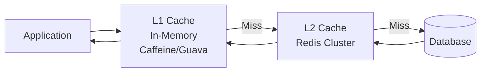

---
tags:
  - System-Design
  - FAANG
  - Caching
  - Redis
  - Memcached
  - Cache-Invalidation
  - Multi-Level-Cache
aliases:
  - Caching Patterns
  - Cache Design
  - Redis Patterns
---

# 🚀 Caching Patterns

> **FAANG Questions:** Design Redis, Design Memcached, Design Distributed Cache, Design Cache Invalidation, Design Cache Aside Pattern, Design Multi-Level Cache

---

## 🎯 Pattern 1: Cache-Aside (Lazy Loading) — Most Common Pattern

### Problem Statement
Implement the most fundamental caching pattern where application manages cache: check cache first, on miss fetch from DB, populate cache, return data.

### Implementation

```python
class CacheAside:
    def __init__(self, redis, db, ttl=300):
        self.redis = redis
        self.db = db
        self.ttl = ttl
    
    async def get(self, key):
        # 1. Check cache
        cached = await self.redis.get(key)
        if cached:
            return json.loads(cached), True  # Cache hit
        
        # 2. Cache miss: fetch from DB
        data = await self.db.get(key)
        if not data:
            return None, False
        
        # 3. Populate cache
        await self.redis.setex(key, self.ttl, json.dumps(data))
        return data, False  # Cache miss
    
    async def set(self, key, value, ttl=None):
        await self.redis.setex(key, ttl or self.ttl, json.dumps(value))
        # Also update DB (write-through) or rely on separate write path
    
    async def invalidate(self, key):
        await self.redis.delete(key)

# Problem: Cache Stampede (Thundering Herd)
# Solution: Probabilistic Early Expiration / Mutex

class CacheAsideWithMutex:
    async def get(self, key):
        # 1. Try cache
        cached = await self.redis.get(key)
        if cached:
            return json.loads(cached), True
        
        # 2. Try to acquire mutex for recomputation
        mutex_key = f"mutex:{key}"
        acquired = await self.redis.set(mutex_key, "1", nx=True, ex=10)
        
        if acquired:
            try:
                # 3. We won the mutex: fetch from DB
                data = await self.db.get(key)
                if data:
                    await self.redis.setex(key, self.ttl, json.dumps(data))
                return data, False
            finally:
                await self.redis.delete(mutex_key)
        else:
            # 4. Wait for other request to populate cache
            for _ in range(50):  # Wait up to 500ms
                await asyncio.sleep(0.01)
                cached = await self.redis.get(key)
                if cached:
                    return json.loads(cached), True
            
            # Fallback: read from DB directly
            return await self.db.get(key), False
```

---

## 🎯 Pattern 2: Write-Through / Write-Behind

### Write-Through (Strong Consistency)

```python
class WriteThroughCache:
    async def set(self, key, value):
        # 1. Write to DB first
        await self.db.set(key, value)
        
        # 2. Update cache
        await self.redis.setex(key, self.ttl, json.dumps(value))
        
        return True

    async def delete(self, key):
        # 1. Delete from DB
        await self.db.delete(key)
        
        # 2. Invalidate cache
        await self.redis.delete(key)
```

### Write-Behind (Write-Back) — High Write Throughput

```python
class WriteBehindCache:
    def __init__(self, redis, db, flush_interval=5, batch_size=100):
        self.redis = redis
        self.db = db
        self.flush_interval = flush_interval
        self.batch_size = batch_size
        self.write_queue = asyncio.Queue()
        self.running = True
    
    async def set(self, key, value):
        # 1. Write to cache immediately
        await self.redis.setex(key, self.ttl, json.dumps(value))
        
        # 2. Queue for async DB write
        await self.write_queue.put(("set", key, value))
    
    async def delete(self, key):
        await self.redis.delete(key)
        await self.write_queue.put(("delete", key, None))
    
    async def flush_worker(self):
        batch = []
        while self.running:
            try:
                item = await asyncio.wait_for(
                    self.write_queue.get(), 
                    timeout=self.flush_interval
                )
                batch.append(item)
                
                # Collect batch
                while len(batch) < self.batch_size:
                    try:
                        item = self.write_queue.get_nowait()
                        batch.append(item)
                    except asyncio.QueueEmpty:
                        break
                
                # Batch write to DB
                await self.flush_batch(batch)
                batch.clear()
                
            except asyncio.TimeoutError:
                if batch:
                    await self.flush_batch(batch)
                    batch.clear()
    
    async def flush_batch(self, batch):
        # Group by operation type
        sets = [(k, v) for op, k, v in batch if op == "set"]
        deletes = [k for op, k, v in batch if op == "delete"]
        
        # Batch execute
        if sets:
            await self.db.batch_set(sets)
        if deletes:
            await self.db.batch_delete(deletes)
```

---

## 🎯 Pattern 3: Cache Invalidation Strategies

### Strategies Comparison

| Strategy | Consistency | Complexity | Use Case |
|----------|-------------|------------|----------|
| **TTL Expiration** | Eventual | Low | Non-critical data |
| **Explicit Invalidation** | Strong | Medium | Critical data |
| **Write-Through Invalidation** | Strong | Medium | Write-heavy |
| **Pub/Sub Invalidation** | Strong | High | Multi-instance |
| **Version/Tag Based** | Strong | Medium | Complex dependencies |

### Implementation: Pub/Sub Invalidation

```python
class CacheInvalidationPubSub:
    def __init__(self, redis):
        self.redis = redis
        self.pubsub = redis.pubsub()
    
    async def invalidate(self, key, tags=None):
        # 1. Delete from local cache
        await self.redis.delete(key)
        
        # 2. Publish invalidation event
        event = {"key": key, "tags": tags or [], "timestamp": time.time()}
        await self.redis.publish("cache:invalidate", json.dumps(event))
    
    async def invalidate_by_tag(self, tag):
        await self.redis.publish("cache:invalidate", json.dumps({
            "tag": tag, "timestamp": time.time()
        }))
    
    async def listen_invalidations(self):
        await self.pubsub.subscribe("cache:invalidate")
        async for message in self.pubsub.listen():
            if message["type"] == "message":
                event = json.loads(message["data"])
                if "key" in event:
                    await self.redis.delete(event["key"])
                elif "tag" in event:
                    # Invalidate all keys with this tag
                    keys = await self.redis.smembers(f"tag:{event['tag']}")
                    if keys:
                        await self.redis.delete(*keys)

# Tag-based Invalidation (for related data)
class TaggedCache:
    async def set(self, key, value, tags=None):
        await self.redis.setex(key, self.ttl, json.dumps(value))
        if tags:
            for tag in tags:
                await self.redis.sadd(f"tag:{tag}", key)
    
    async def invalidate_tag(self, tag):
        keys = await self.redis.smembers(f"tag:{tag}")
        if keys:
            await self.redis.delete(*keys)
        await self.redis.delete(f"tag:{tag}")
```

---

## 🎯 Pattern 4: Multi-Level Cache (L1 + L2)

### Architecture: **L1 (Local) + L2 (Distributed)**



### Implementation

```python
class MultiLevelCache:
    def __init__(self, l1_cache, l2_redis, db, l1_ttl=60, l2_ttl=300):
        self.l1 = l1_cache  # Local cache (e.g., Caffeine, dict with TTL)
        self.l2 = l2_redis  # Redis
        self.db = db
        self.l1_ttl = l1_ttl
        self.l2_ttl = l2_ttl
    
    async def get(self, key):
        # 1. Check L1 (local, fastest)
        value = self.l1.get(key)
        if value is not None:
            return value, "L1_HIT"
        
        # 2. Check L2 (Redis)
        value = await self.l2.get(key)
        if value:
            # Promote to L1
            self.l1.set(key, value, self.l1_ttl)
            return json.loads(value), "L2_HIT"
        
        # 3. Fetch from DB
        value = await self.db.get(key)
        if value:
            # Populate both levels
            await self.l2.setex(key, self.l2_ttl, json.dumps(value))
            self.l1.set(key, value, self.l1_ttl)
            return value, "DB_HIT"
        
        return None, "MISS"
    
    async def set(self, key, value):
        # Write to both levels
        self.l1.set(key, value, self.l1_ttl)
        await self.l2.setex(key, self.l2_ttl, json.dumps(value))
    
    async def invalidate(self, key):
        self.l1.invalidate(key)
        await self.l2.delete(key)

# L1 Implementation (Thread-safe, with TTL)
class LocalCache:
    def __init__(self, max_size=10000):
        self.cache = {}
        self.expiry = {}
        self.lock = asyncio.Lock()
        self.max_size = max_size
    
    def get(self, key):
        with self.lock:
            if key in self.cache:
                if self.expiry[key] > time.time():
                    return self.cache[key]
                else:
                    del self.cache[key]
                    del self.expiry[key]
        return None
    
    def set(self, key, value, ttl):
        with self.lock:
            # LRU eviction if needed
            if len(self.cache) >= self.max_size:
                oldest = min(self.expiry, key=self.expiry.get)
                del self.cache[oldest]
                del self.expiry[oldest]
            
            self.cache[key] = value
            self.expiry[key] = time.time() + ttl
    
    def invalidate(self, key):
        with self.lock:
            self.cache.pop(key, None)
            self.expiry.pop(key, None)
```

---

## 🎯 Pattern 5: Redis Internals & Optimization

### Data Structures & Use Cases

| Structure | Use Case | Commands |
|-----------|----------|----------|
| **String** | Simple values, counters | GET, SET, INCR |
| **Hash** | Objects, user profiles | HGET, HSET, HGETALL |
| **List** | Queues, recent items | LPUSH, LRANGE |
| **Set** | Unique items, tags | SADD, SMEMBERS |
| **Sorted Set** | Leaderboards, rate limiting | ZADD, ZRANGE |
| **Stream** | Event streaming, logs | XADD, XREAD |
| **Bitmap** | Bloom filters, active users | SETBIT, BITCOUNT |
| **HyperLogLog** | Cardinality estimation | PFADD, PFCOUNT |
| **Geo** | Location-based | GEOADD, GEORADIUS |

### Pipeline & Lua Scripting

```python
# Pipeline for batch operations
async def batch_get(redis, keys):
    pipe = redis.pipeline()
    for key in keys:
        pipe.get(key)
    return await pipe.execute()

# Lua Script for Atomic Operations (Rate Limiting)
RATE_LIMIT_SCRIPT = """
local key = KEYS[1]
local limit = tonumber(ARGV[1])
local window = tonumber(ARGV[2])
local now = tonumber(ARGV[3])

local current = redis.call('ZRANGEBYSCORE', key, now - window, now)
if #current >= limit then
    return 0
end

redis.call('ZADD', key, now, now .. '-' .. math.random())
redis.call('EXPIRE', key, window + 1)
return 1
"""

# Redis Cluster Key Distribution
def get_slot(key):
    """Redis Cluster uses CRC16(key) % 16384"""
    return crc16(key) % 16384

# Hot Key Mitigation
class HotKeyMitigation:
    def __init__(self, redis, threshold=1000):
        self.redis = redis
        self.threshold = threshold
        self.local_cache = LocalCache(max_size=1000)
    
    async def get(self, key):
        # Check local cache first for hot keys
        local = self.local_cache.get(key)
        if local is not None:
            return local
        
        # Check access count
        count = await self.redis.incr(f"hot:{key}")
        if count == 1:
            await self.redis.expire(f"hot:{key}", 60)
        
        if count > self.threshold:
            # Promote to local cache
            value = await self.redis.get(key)
            if value:
                self.local_cache.set(key, value, 300)
                return value
        
        return await self.redis.get(key)
```

---

## 🎯 Pattern 6: Cache Warming & Precomputation

```python
class CacheWarmer:
    def __init__(self, cache, db, scheduler):
        self.cache = cache
        self.db = db
        self.scheduler = scheduler
    
    async def warm_popular_items(self):
        # Pre-compute and cache popular items
        popular = await self.db.get_popular_products(limit=10000)
        for product in popular:
            await self.cache.set(f"product:{product.id}", product)
    
    async def warm_user_sessions(self):
        # Pre-load active user data
        active_users = await self.db.get_active_users(hours=1)
        for user in active_users:
            await self.cache.set(f"user:{user.id}", user)
    
    def schedule_warming(self):
        # Run every 5 minutes
        self.scheduler.add_job(self.warm_popular_items, 'interval', minutes=5)
        self.scheduler.add_job(self.warm_user_sessions, 'interval', minutes=10)
```

---

## 📊 Comparison Matrix

| Pattern | Consistency | Write Latency | Read Latency | Complexity |
|---------|-------------|---------------|--------------|------------|
| **Cache-Aside** | Eventual | Low (DB) | Low (cache hit) | Low |
| **Write-Through** | Strong | High (DB + Cache) | Low | Medium |
| **Write-Behind** | Eventual | Low (Cache) | Low | High |
| **Multi-Level** | Eventual | Low | Lowest (L1) | High |
| **Refresh-Ahead** | Eventual | Background | Low | Medium |

---

## 🎯 Common Interview Questions

| Question | Key Points |
|----------|------------|
| **How to prevent cache stampede?** | Mutex, probabilistic early expiration, request coalescing |
| **How to handle cache invalidation?** | TTL, explicit invalidation, pub/sub, versioning, tags |
| **How does Redis handle persistence?** | RDB (snapshots), AOF (append-only log), hybrid |
| **How does Redis Cluster work?** | 16384 hash slots, master-replica, gossip protocol |
| **How to handle hot keys?** | Local cache, request coalescing, key splitting |
| **Difference between Redis and Memcached?** | Redis: data structures, persistence, replication; Memcached: simpler, multi-threaded |
| **How to implement distributed cache invalidation?** | Pub/sub, versioning, tags, cache version in key |
| **Design a rate limiter using Redis** | Sorted set (sliding window) or Lua script (token bucket) |

---

## 🏷️ Tags

```yaml
tags:
  - System-Design
  - FAANG
  - Caching
  - Redis
  - Memcached
  - Cache-Invalidation
  - Multi-Level-Cache
  - Cache-Aside
  - Write-Through
  - Write-Behind
```