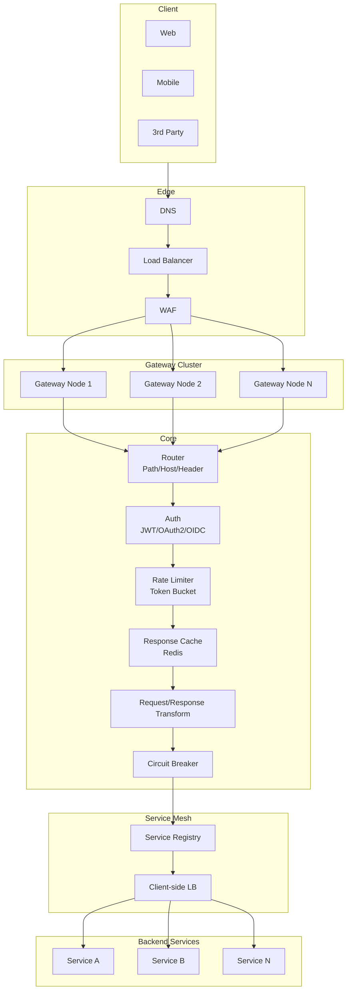
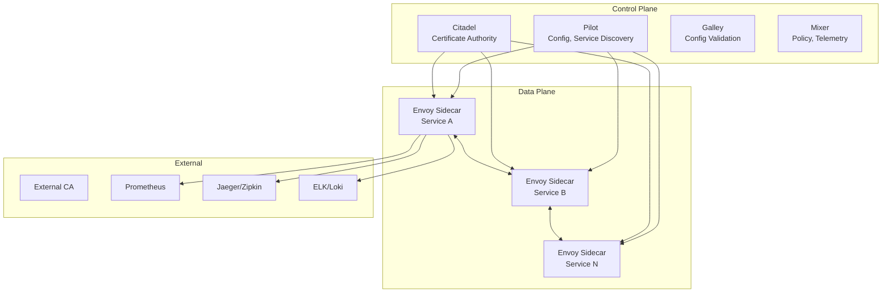
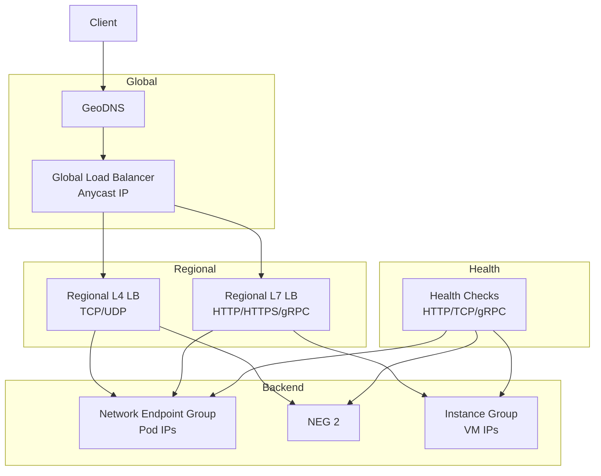
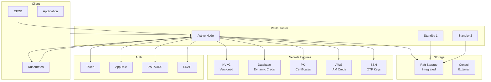

---
tags:
  - System-Design
  - FAANG
  - Cloud-Infrastructure
  - Kubernetes
  - Service-Mesh
  - API-Gateway
  - Microservices
aliases:
  - Cloud Infrastructure Patterns
  - Kubernetes Design
  - Service Mesh Design
---

# ☁️ Cloud Infrastructure Patterns

> **FAANG Questions:** Design Kubernetes, Design Docker Registry, Design Load Balancer, Design API Gateway, Design Service Discovery, Design Configuration Service, Design Secret Management, Design Monitoring System, Design Logging Platform, Design Metrics Collection

---

## 🎯 Pattern 1: Kubernetes — Container Orchestration Platform

### Problem Statement
Design a container orchestration platform managing thousands of nodes, tens of thousands of pods, with self-healing, auto-scaling, service discovery, rolling updates, and multi-tenancy.

### Requirements Clarification

| Functional | Non-Functional |
|------------|----------------|
| Pod scheduling & lifecycle | Latency: API < 100ms |
| Service discovery & load balancing | Availability: 99.95% (control plane) |
| Auto-scaling (HPA, VPA, Cluster Autoscaler) | Scalability: 5000 nodes, 150K pods |
| Rolling updates & rollbacks | Consistency: Eventual for data plane |
| Config & secret management | Security: RBAC, Network Policies |
| Persistent volumes | Upgrade: Zero-downtime |
| Multi-tenancy (namespaces, quotas) | Cost efficiency |

### High-Level Architecture

```mermaid
graph TB
    subgraph Control Plane
        API[API Server<br/>etcd]
        Scheduler[Scheduler]
        ControllerMgr[Controller Manager]
        CloudCtrl[Cloud Controller Manager]
    end
    
    subgraph Data Plane (Worker Nodes)
        Node1[Node 1<br/>Kubelet, kube-proxy, CRI]
        Node2[Node 2<br/>Kubelet, kube-proxy, CRI]
        NodeN[Node N<br/>Kubelet, kube-proxy, CRI]
    end
    
    subgraph Add-ons
        CNI[CNI Plugin<br/>Calico/Cilium/Flannel]
        CSI[CSI Driver<br/>Storage]
        DNS[CoreDNS]
        Ingress[Ingress Controller<br/>NGINX/Traefik]
        Metrics[Metrics Server<br/>Prometheus Adapter]
    end
    
    subgraph External
        etcd[(etcd Cluster<br/>3-5 nodes)]
        Registry[Container Registry]
        Cloud[Cloud Provider API]
    end
    
    API --> etcd
    API --> Scheduler
    API --> ControllerMgr
    API --> CloudCtrl
    
    Scheduler --> API
    ControllerMgr --> API
    CloudCtrl --> Cloud
    
    API --> Node1
    API --> Node2
    API --> NodeN
    
    Node1 --> CNI
    Node1 --> CSI
    Node2 --> CNI
    Node2 --> CSI
    
    CNI --> Node1
    CNI --> Node2
    CSI --> Node1
    CSI --> Node2
```

### Key Components

| Component | Responsibility |
|-----------|----------------|
| **API Server** | REST/gRPC frontend, authentication, authorization, admission control |
| **etcd** | Consistent key-value store (Raft), stores all cluster state |
| **Scheduler** | Assigns pods to nodes based on resources, affinity, taints/tolerations |
| **Controller Manager** | Runs controllers (ReplicaSet, Deployment, Service, Node, PV/PVC) |
| **Kubelet** | Node agent, manages pod lifecycle, reports status |
| **kube-proxy** | Service load balancing (iptables/IPVS) |
| **Container Runtime** | containerd, CRI-O, Docker (via CRI) |

### Scheduling Algorithm

```python
# Kubernetes Scheduling Framework
class KubeScheduler:
    def __init__(self):
        self.plugins = {
            "queue_sort": PrioritySortPlugin(),
            "pre_filter": NodeNamePlugin(), PodFitsResourcesPlugin(),
            "filter": NodeAffinityPlugin(), TaintTolerationPlugin(),
            "score": NodeResourcesBalancedAllocation(), ImageLocalityPlugin(),
            "reserve": DefaultReservePlugin(),
            "permit": DefaultPermitPlugin(),
            "pre_bind": DefaultPreBindPlugin(),
            "bind": DefaultBindPlugin(),
            "post_bind": DefaultPostBindPlugin(),
        }
    
    def schedule(self, pod):
        # 1. Queue Sort: Priority
        pods = self.queue_sort(pods)
        
        for pod in pods:
            # 2. PreFilter: Basic checks
            if not self.pre_filter(pod): continue
            
            # 3. Filter: Find feasible nodes
            feasible_nodes = self.filter(pod, all_nodes)
            if not feasible_nodes: 
                pod.status = "Unschedulable"
                continue
            
            # 4. Score: Rank feasible nodes
            scored_nodes = self.score(pod, feasible_nodes)
            
            # 5. Select best node
            best_node = max(scored_nodes, key=lambda x: x.score)
            
            # 6. Permit: Wait for permit (if needed)
            self.permit(pod, best_node)
            
            # 7. PreBind: Pre-bind operations
            self.pre_bind(pod, best_node)
            
            # 7. Bind: Create binding
            self.bind(pod, best_node)
            
            # 8. PostBind: Post-bind operations
            self.post_bind(pod, best_node)

# Priority-based Queue Sort
def priority_sort(pods):
    # Priority classes: system-cluster-critical > system-node-critical > high > default > low
    return sorted(pods, key=lambda p: (-p.priority, p.creation_timestamp))

# Resource-based Filtering
def filter_node_resources(pod, node):
    requested = pod.resource_requests
    allocatable = node.allocatable
    for resource in ["cpu", "memory", "ephemeral-storage"]:
        if requested[resource] > allocatable[resource]:
            return False
    return True
```

### Controllers

```python
# Deployment Controller (Rolling Update)
class DeploymentController:
    def reconcile(self, deployment):
        # 1. Get current ReplicaSet
        current_rs = self.get_replica_set(deployment, deployment.status.replicas)
        
        # 2. Calculate desired replicas
        desired = deployment.spec.replicas
        
        # 3. Rolling update strategy
        if deployment.spec.strategy.type == "RollingUpdate":
            max_surge = deployment.spec.strategy.rolling_update.max_surge
            max_unavailable = deployment.spec.strategy.rolling_update.max_unavailable
            
            # Create new ReplicaSet with new pod template
            new_rs = self.create_replica_set(deployment, new_template)
            
            # Scale up new, scale down old
            self.scale_replica_sets(current_rs, new_rs, desired, max_surge, max_unavailable)
        
        # 4. Update status
        self.update_status(deployment, new_rs)

# Horizontal Pod Autoscaler (HPA)
class HorizontalPodAutoscaler:
    def reconcile(self, hpa):
        # 1. Get metrics
        metrics = self.metrics_client.get_metrics(hpa.scale_target_ref)
        
        # 2. Calculate desired replicas
        current_replicas = hpa.scale_target_ref.replicas
        current_metric = metrics[hpa.spec.metrics[0].resource.name]
        target_metric = hpa.spec.metrics[0].resource.target.average_value
        
        desired_replicas = ceil(current_replicas * current_metric / target_metric)
        
        # 3. Apply min/max bounds
        desired_replicas = clamp(desired_replicas, hpa.spec.min_replicas, hpa.spec.max_replicas)
        
        # 4. Scale
        if desired_replicas != current_replicas:
            self.scale(hpa.scale_target_ref, desired_replicas)
```

---

## 🎯 Pattern 2: API Gateway — Entry Point for Microservices

### Problem Statement
Design an API gateway handling 100K+ RPS, authentication, rate limiting, routing, transformation, caching, and observability for microservices.

### Architecture



### Key Features

```python
# API Gateway Core
class APIGateway:
    def __init__(self):
        self.router = Router()
        self.middlewares = [
            AuthenticationMiddleware(),
            RateLimitMiddleware(),
            CacheMiddleware(),
            TransformationMiddleware(),
            CircuitBreakerMiddleware(),
            LoggingMiddleware(),
            MetricsMiddleware(),
        ]
    
    async def handle(self, request):
        # 1. Route matching
        route = self.router.match(request.path, request.method)
        if not route:
            return Response(404, "Not Found")
        
        # 2. Execute middleware chain
        for middleware in self.middlewares:
            response = await middleware.process(request, route)
            if response:
                return response
        
        # 3. Forward to upstream
        upstream = self.select_upstream(route)
        return await self.proxy_request(request, upstream)

# Authentication Middleware (JWT/OAuth2)
class AuthenticationMiddleware:
    async def process(self, request, route):
        if not route.auth_required:
            return None
        
        # 1. Extract token
        token = self.extract_token(request)
        if not token:
            return Response(401, "Missing token")
        
        # 2. Validate JWT
        try:
            claims = jwt.decode(token, public_key, algorithms=["RS256"])
        except jwt.InvalidTokenError:
            return Response(401, "Invalid token")
        
        # 3. Check scopes
        if not self.check_scopes(claims, route.required_scopes):
            return Response(403, "Insufficient scope")
        
        # 4. Attach user info
        request.user = claims
        return None

# Rate Limiting Middleware
class RateLimitMiddleware:
    def __init__(self, redis):
        self.limiter = DistributedRateLimiter(redis)
    
    async def process(self, request, route):
        if not route.rate_limit:
            return None
        
        identifier = self.get_identifier(request, route)
        allowed, remaining = await self.limiter.check_rate_limit(
            identifier, 
            limit=route.rate_limit.requests,
            window=route.rate_limit.window_seconds,
            algorithm="sliding_window"
        )
        
        if not allowed:
            return Response(
                429, "Rate limit exceeded",
                headers=rate_limit_headers(route.rate_limit.requests, 0, time.time() + route.rate_limit.window_seconds)
            )
        
        # Add rate limit headers
        request.rate_limit_headers = rate_limit_headers(
            route.rate_limit.requests, remaining, time.time() + route.rate_limit.window_seconds
        )
        return None
```

---

## 🎯 Pattern 3: Service Mesh — Istio/Linkerd Style

### Problem Statement
Design a service mesh providing traffic management, security (mTLS), observability, and resilience for microservices without application code changes.

### Architecture



### Key Features

| Feature | Implementation |
|---------|----------------|
| **Traffic Management** | VirtualService, DestinationRule, Gateway, ServiceEntry |
| **Security (mTLS)** | Citadel CA, SDS (Secret Discovery Service), PeerAuthentication |
| **Observability** | Access logs, metrics (Prometheus), distributed tracing |
| **Resilience** | Retries, timeouts, circuit breakers, fault injection |
| **Authorization** | AuthorizationPolicy (RBAC, JWT, custom) |

### mTLS Implementation

```python
# mTLS Certificate Rotation (Citadel/SDS)
class CertificateManager:
    def __init__(self, ca_client, sds_server):
        self.ca = ca_client
        self.sds = sds_server
    
    async def rotate_certificates(self, workload_identity):
        # 1. Generate CSR
        private_key = generate_private_key()
        csr = generate_csr(private_key, workload_identity)
        
        # 2. Request certificate from CA
        cert = await self.ca.sign_csr(csr, ttl=24*time.Hour)
        
        # 3. Push to SDS
        await self.sds.push_certificate(workload_identity, cert, private_key)
        
        # 4. Schedule next rotation (80% of TTL)
        asyncio.create_task(self.schedule_rotation(workload_identity, cert.not_after * 0.8))

# Sidecar Configuration (Envoy)
# mTLS config is pushed via SDS, not static config
```

---

## 🎯 Pattern 4: Load Balancer — Distributed Load Balancing

### Problem Statement
Design a distributed load balancer handling 1M+ RPS, L4/L7 balancing, health checks, TLS termination, and global traffic management.

### Architecture: **L4 + L7 Hybrid (Google Cloud Load Balancing / AWS ALB/NLB)**



### Algorithms

```python
# Load Balancing Algorithms
class LoadBalancer:
    def __init__(self, algorithm="least_request"):
        self.algorithm = algorithm
    
    def select_backend(self, backends, request):
        if self.algorithm == "round_robin":
            return self.round_robin(backends)
        elif self.algorithm == "least_request":
            return self.least_request(backends)
        elif self.algorithm == "least_connections":
            return self.least_connections(backends)
        elif self.algorithm == "consistent_hash":
            return self.consistent_hash(backends, request)
        elif self.algorithm == "weighted_round_robin":
            return self.weighted_round_robin(backends)

# Maglev Consistent Hashing (Google's L4 LB)
class MaglevHash:
    def __init__(self, backends, table_size=65537):
        self.table = self.build_table(backends, table_size)
    
    def build_table(self, backends, M):
        # Each backend gets multiple entries in permutation table
        table = [None] * M
        for i, backend in enumerate(backends):
            # Two hash functions per backend
            offset = hash1(backend.id) % M
            skip = hash2(backend.id) % (M - 1) + 1
            
            for j in range(M):
                idx = (offset + j * skip) % M
                if table[idx] is None:
                    table[idx] = backend
                    break
        return table
    
    def lookup(self, flow_hash):
        return self.table[flow_hash % len(self.table)]

# L7: Least Request with O(1) using Ring
class LeastRequestBalancer:
    def __init__(self, backends):
        self.ring = SortedDict()  # request_count -> set(backends)
        for b in backends:
            self.ring.setdefault(b.active_requests, set()).add(b)
    
    def select(self):
        min_count = self.ring.keys()[0]
        backend = next(iter(self.ring[min_count]))
        backend.active_requests += 1
        self.update_ring(backend, min_count, min_count + 1)
        return backend
```

---

## 🎯 Pattern 5: Secret Management — Vault/Sealed Secrets

### Problem Statement
Design a secret management system providing encryption, dynamic secrets, lease management, audit logging, and GitOps integration.

### Architecture: **HashiCorp Vault Style**



### Kubernetes Integration (Sealed Secrets / External Secrets)

```yaml
# SealedSecret (Bitnami) - Encrypt secrets for GitOps
apiVersion: bitnami.com/v1alpha1
kind: SealedSecret
metadata:
  name: my-secret
  namespace: default
spec:
  encryptedData:
    password: AgBy3iH...  # Encrypted with cluster public key
    api-key: AgBy3iH...
---
# ExternalSecret (External Secrets Operator) - Sync from Vault
apiVersion: external-secrets.io/v1beta1
kind: ExternalSecret
metadata:
  name: db-credentials
spec:
  refreshInterval: 1h
  secretStoreRef:
    name: vault-backend
    kind: ClusterSecretStore
  target:
    name: db-secret
    creationPolicy: Owner
  data:
    - secretKey: username
      remoteRef:
        key: database/creds/readonly
        property: username
    - secretKey: password
      remoteRef:
        key: database/creds/readonly
        property: password
```

```python
# Dynamic Database Credentials (Vault Database Secrets Engine)
class DynamicDBCredentials:
    def __init__(self, vault_client):
        self.vault = vault_client
    
    async def get_credentials(self, role_name, ttl="1h"):
        # 1. Request credentials from Vault
        response = await self.vault.read(f"database/creds/{role_name}")
        
        # 2. Return credentials with lease info
        return {
            "username": response["data"]["username"],
            "password": response["data"]["password"],
            "lease_id": response["lease_id"],
            "lease_duration": response["lease_duration"],
            "renewable": response["renewable"]
        }
    
    async def renew_lease(self, lease_id, increment="1h"):
        await self.vault.write(f"sys/leases/renew", {
            "lease_id": lease_id,
            "increment": increment
        })
    
    async def revoke_lease(self, lease_id):
        await self.vault.write(f"sys/leases/revoke", {"lease_id": lease_id})
```

---

## 📊 Comparison Matrix

| System | Scale | Key Feature | Use Case |
|--------|-------|-------------|----------|
| **Kubernetes** | 5K nodes | Self-healing, scheduling | Container orchestration |
| **API Gateway (Kong/Envoy)** | 100K RPS | Auth, rate limit, transform | Microservices entry |
| **Service Mesh (Istio)** | 10K services | mTLS, traffic mgmt | Security, observability |
| **Load Balancer (Maglev)** | 1M+ RPS | L4/L7, anycast | Global traffic |
| **Vault** | 10K secrets/sec | Dynamic secrets, lease | Secret management |

---

## 🎯 Common Interview Questions

| Question | Key Points |
|----------|------------|
| **How does Kubernetes scheduler work?** | Queue sort → Filter → Score → Permit → Bind, extensible via plugins |
| **How does Kubernetes handle pod failures?** | Kubelet detects → Controller Manager creates replacement → Scheduler assigns |
| **How does Service Mesh mTLS work?** | Citadel CA issues certs → SDS pushes to sidecars → Envoy enforces |
| **How does API Gateway handle rate limiting?** | Token bucket / sliding window in Redis, Lua scripts for atomicity |
| **How does Maglev consistent hashing work?** | Permutation table with offset/skip, O(1) lookup, minimal disruption |
| **Design a secret management system** | Encryption at rest, dynamic secrets, lease/renewal, audit, GitOps |
| **How does Kubernetes rolling update work?** | New ReplicaSet → Scale up new → Scale down old → MaxSurge/MaxUnavailable |
| **How does HPA calculate replicas?** | current * (current_metric / target_metric), with stabilization window |

---

## 🏷️ Tags

```yaml
tags:
  - System-Design
  - FAANG
  - Cloud-Infrastructure
  - Kubernetes
  - Service-Mesh
  - API-Gateway
  - Load-Balancer
  - Secret-Management
  - Microservices
```