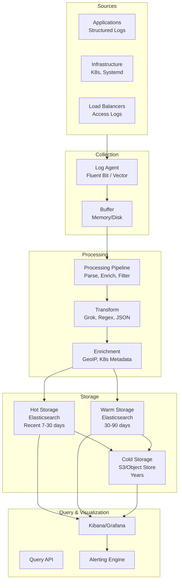
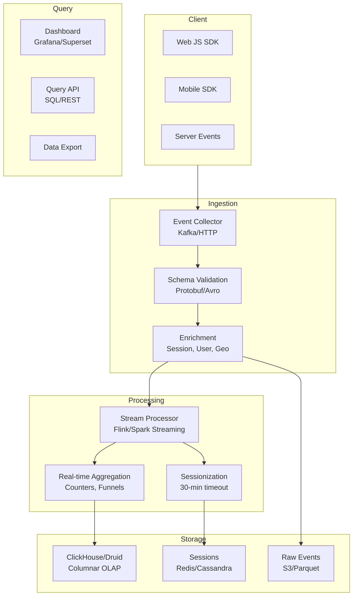
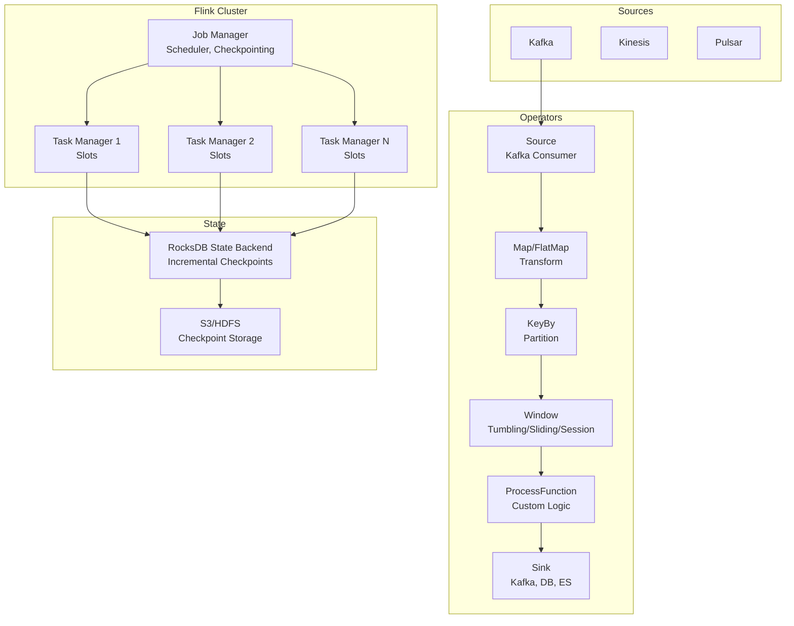
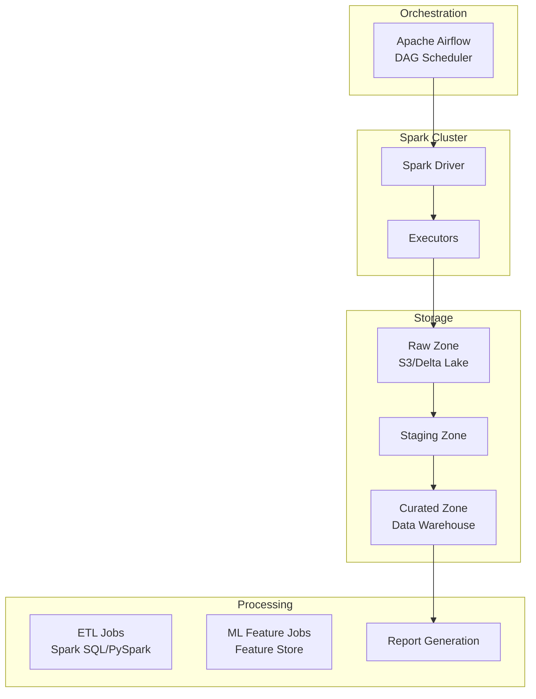
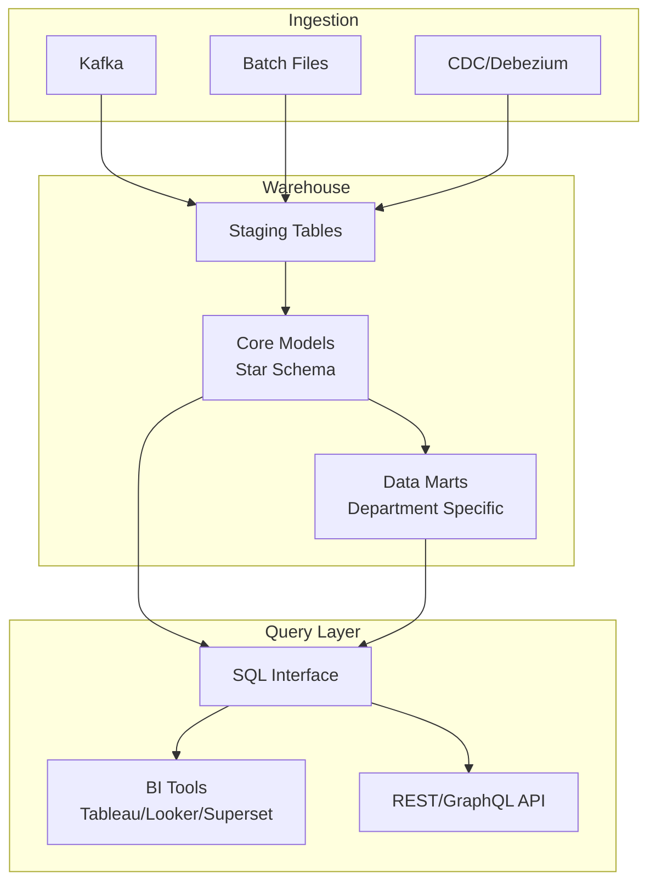

---
tags:
  - System-Design
  - FAANG
  - Data-Processing
  - Analytics
  - Stream-Processing
  - Batch-Processing
  - ETL
  - Time-Series
aliases:
  - Data Processing Patterns
  - Analytics Pipeline
  - Stream Processing
---

# 📊 Data Processing Patterns

> **FAANG Questions:** Design Log Aggregation, Design Analytics Pipeline, Design Click Tracking, Design Data Warehouse, Design Stream Processing, Design Batch Processing, Design ETL Pipeline, Design Event Processing, Design Time Series Database

---

## 🎯 Pattern 1: Log Aggregation & Observability (ELK/EFK Stack)

### Problem Statement
Design a log aggregation system collecting, processing, and visualizing logs from thousands of services. Handle 10TB+ logs/day, real-time search, alerting, and retention.

### Architecture



### Log Pipeline (Vector/Fluent Bit)

```toml
# Vector Configuration (vector.toml)
[sources.kubernetes_logs]
type = "kubernetes_logs"

[transforms.parse_logs]
type = "remap"
inputs = ["kubernetes_logs"]
source = '''
. = parse_json!(.message) ?? .
. = . | merge({
  "level": .level ?? "info",
  "service": .kubernetes.container_name,
  "trace_id": .trace_id,
  "span_id": .span_id
})
'''

[transforms.enrich]
type = "remap"
inputs = ["parse_logs"]
source = '''
.geoip = geoip_lookup(.client_ip) ?? {}
.k8s = k8s_metadata(.kubernetes.pod_uid) ?? {}
'''

[sinks.elasticsearch]
type = "elasticsearch"
inputs = ["enrich"]
endpoints = ["https://es-cluster:9200"]
index = "logs-{{ strftime(now(), \"%Y-%m-%d\") }}"
healthcheck = true
```

---

## 🎯 Pattern 2: Click Tracking & Event Analytics

### Problem Statement
Design a click/event tracking system for user behavior analytics. Billions of events/day, real-time dashboards, funnel analysis, A/B testing.

### Architecture



### Event Schema (Protobuf)

```protobuf
syntax = "proto3";

message Event {
  string event_id = 1;           // UUID
  string event_name = 2;         // page_view, click, purchase
  int64 timestamp = 3;           // Unix ms
  User user = 4;
  Session session = 5;
  Device device = 6;
  map<string, string> properties = 7;  // Custom properties
  Context context = 8;
}

message User {
  string user_id = 1;
  bool anonymous = 2;
  map<string, string> traits = 3;  // email, plan, etc.
}

message Session {
  string session_id = 1;
  int64 start_time = 2;
  int32 sequence = 3;  // Event number in session
}

message Device {
  string type = 1;        // mobile, desktop, tablet
  string os = 2;          // iOS, Android, Windows
  string browser = 3;     // Chrome, Safari
  string app_version = 4;
}
```

### Funnel Analysis (SQL)

```sql
-- Funnel: Homepage → Product → Cart → Purchase
WITH funnel_steps AS (
  SELECT 
    user_id,
    MIN(CASE WHEN event_name = 'page_view' AND properties['page'] = 'home' THEN timestamp END) AS step1,
    MIN(CASE WHEN event_name = 'page_view' AND properties['page'] = 'product' THEN timestamp END) AS step2,
    MIN(CASE WHEN event_name = 'add_to_cart' THEN timestamp END) AS step3,
    MIN(CASE WHEN event_name = 'purchase' THEN timestamp END) AS step4
  FROM events
  WHERE timestamp >= NOW() - INTERVAL '7 DAYS'
  GROUP BY user_id
)
SELECT 
  COUNT(*) AS total_users,
  COUNT(step1) AS step1_homepage,
  COUNT(step2) AS step2_product,
  COUNT(step3) AS step3_cart,
  COUNT(step4) AS step4_purchase,
  ROUND(COUNT(step2) * 100.0 / COUNT(step1), 2) AS step1_to_2,
  ROUND(COUNT(step3) * 100.0 / COUNT(step2), 2) AS step2_to_3,
  ROUND(COUNT(step4) * 100.0 / COUNT(step3), 2) AS step3_to_4
FROM funnel_steps;
```

---

## 🎯 Pattern 3: Stream Processing (Flink/Spark Streaming)

### Problem Statement
Design a stream processing platform for real-time ETL, aggregations, joins, windowing, and exactly-once processing. Millions of events/sec.

### Architecture: **Apache Flink**



### Flink Job Example

```java
// Flink Streaming Job (Java/Scala)
public class AnalyticsJob {
    public static void main(String[] args) throws Exception {
        StreamExecutionEnvironment env = StreamExecutionEnvironment.getExecutionEnvironment();
        
        // Enable checkpointing (exactly-once)
        env.enableCheckpointing(60_000);  // Every 60s
        env.getCheckpointConfig().setMinPauseBetweenCheckpoints(10_000);
        env.getCheckpointConfig().setCheckpointTimeout(600_000);
        env.getCheckpointConfig().setTolerableCheckpointFailureNumber(3);
        env.setStateBackend(new RocksDBStateBackend("s3://bucket/checkpoints"));
        
        // Source: Kafka
        DataStream<Event> events = env.addSource(new KafkaSource<Event>()
            .setBootstrapServers("kafka:9092")
            .setTopics("events")
            .setGroupId("analytics-job")
            .setDeserializer(new EventDeserializationSchema())
            .build());
        
        // Watermark for event-time processing
        WatermarkStrategy<Event> watermark = WatermarkStrategy
            .<Event>forBoundedOutOfOrderness(Duration.ofSeconds(10))
            .withTimestampAssigner((event, ts) -> event.getTimestamp());
        
        // Transform & KeyBy
        KeyedStream<Event, String> keyed = events
            .assignTimestampsAndWatermarks(watermark)
            .map(new EventTransformer())
            .keyBy(Event::getUserId);
        
        // Tumbling Window (5 min)
        DataStream<AggregatedMetrics> windowed = keyed
            .window(TumblingEventTimeWindows.of(Time.minutes(5)))
            .aggregate(new MetricsAggregator());
        
        // Session Window (30 min gap)
        DataStream<Session> sessions = keyed
            .window(EventTimeSessionWindows.withGap(Time.minutes(30)))
            .process(new SessionProcessor());
        
        // Sink to Kafka + ClickHouse
        windowed.addSink(new ClickHouseSink<>());
        sessions.addSink(new KafkaSink<>());
        
        env.execute("Analytics Pipeline");
    }
}
```

### Window Types

| Window Type | Use Case | Trigger |
|-------------|----------|---------|
| **Tumbling** | Fixed intervals (5 min) | Time |
| **Sliding** | Overlapping (10 min window, 5 min slide) | Time |
| **Session** | Activity-based (30 min gap) | Inactivity |
| **Global** | All elements | Custom |
| **Count** | N elements | Count |

---

## 🎯 Pattern 4: Batch Processing (Spark/Batch ETL)

### Problem Statement
Design a batch processing system for large-scale data transformation, ML feature generation, daily reports, and data warehouse loading.

### Architecture: **Spark + Airflow**



### Spark ETL Job (PySpark)

```python
# Daily ETL Pipeline
from pyspark.sql import SparkSession
from pyspark.sql.functions import *

spark = SparkSession.builder \
    .appName("DailyETL") \
    .config("spark.sql.adaptive.enabled", "true") \
    .config("spark.sql.adaptive.coalescePartitions.enabled", "true") \
    .getOrCreate()

def run_daily_etl(date_str):
    # 1. Read raw events
    events = spark.read.parquet(f"s3://bucket/raw/events/date={date_str}")
    
    # 2. Data quality checks
    events = events.filter(col("event_id").isNotNull()) \
                   .filter(col("timestamp").isNotNull()) \
                   .dropDuplicates(["event_id"])
    
    # 3. Enrich with dimensions
    users = spark.read.parquet("s3://warehouse/dim_users")
    events = events.join(users, "user_id", "left")
    
    # 4. Aggregate facts
    daily_metrics = events.groupBy("date", "event_name", "country") \
        .agg(
            count("*").alias("event_count"),
            countDistinct("user_id").alias("unique_users"),
            sum("revenue").alias("total_revenue"),
            approx_count_distinct("session_id").alias("sessions")
        )
    
    # 5. Write to curated zone (partitioned)
    daily_metrics.write \
        .mode("overwrite") \
        .partitionBy("date") \
        .parquet("s3://warehouse/fact_daily_metrics")
    
    # 4. Update materialized views
    spark.sql("""
        REFRESH TABLE analytics.daily_dashboard
    """)

# Incremental Processing with Delta Lake
def incremental_etl(last_processed_timestamp):
    # Read only new data using Change Data Feed
    new_events = spark.read.format("delta") \
        .option("startingTimestamp", last_processed_timestamp) \
        .table("raw.events")
    
    # Merge into fact table (upsert)
    fact_table = DeltaTable.forPath(spark, "s3://warehouse/fact_events")
    fact_table.alias("target").merge(
        new_events.alias("source"),
        "target.event_id = source.event_id"
    ).whenMatchedUpdateAll() \
     .whenNotMatchedInsertAll() \
     .execute()
```

---

## 🎯 Pattern 5: Data Warehouse & OLAP (ClickHouse/Snowflake/BigQuery)

### Architecture: **Columnar OLAP**



### ClickHouse Schema (Analytics)

```sql
-- Fact table: Events (MergeTree engine)
CREATE TABLE events (
    event_id UUID,
    event_name String,
    user_id UUID,
    session_id UUID,
    timestamp DateTime64(3),
    date Date ALIAS toDate(timestamp),
    country String,
    device_type String,
    properties Map(String, String),
    revenue Float64
) ENGINE = MergeTree()
PARTITION BY toYYYYMM(date)
ORDER BY (date, event_name, user_id)
TTL date + INTERVAL 2 YEAR
SETTINGS index_granularity = 8192;

-- Materialized view for daily aggregates
CREATE MATERIALIZED VIEW daily_metrics
ENGINE = SummingMergeTree()
PARTITION BY toYYYYMM(date)
ORDER BY (date, event_name, country)
AS SELECT
    toDate(timestamp) as date,
    event_name,
    country,
    count() as event_count,
    uniqExact(user_id) as unique_users,
    sum(revenue) as total_revenue
FROM events
GROUP BY date, event_name, country;

-- Query: Top products by revenue (last 30 days)
SELECT 
    properties['product_id'] as product_id,
    sum(revenue) as total_revenue,
    uniqExact(user_id) as buyers
FROM events
WHERE timestamp >= now() - INTERVAL 30 DAY
  AND event_name = 'purchase'
GROUP BY product_id
ORDER BY total_revenue DESC
LIMIT 20;
```

---

## 🎯 Pattern 6: Time Series Database (InfluxDB/TimescaleDB/Prometheus)

### Problem Statement
Design a time-series database for metrics, IoT sensor data, monitoring. High write throughput, efficient compression, retention policies.

### Architecture: **TimescaleDB (PostgreSQL Extension)**

```sql
-- Create hypertable (automatic partitioning by time)
CREATE TABLE metrics (
    time        TIMESTAMPTZ       NOT NULL,
    host        TEXT              NOT NULL,
    metric_name TEXT              NOT NULL,
    value       DOUBLE PRECISION  NOT NULL,
    tags        JSONB
);

SELECT create_hypertable('metrics', 'time', 
    chunk_time_interval => INTERVAL '1 day',
    if_not_exists => TRUE
);

-- Compression policy (older than 7 days)
ALTER TABLE metrics SET (
    timescaledb.compress,
    timescaledb.compress_segmentby = 'host, metric_name'
);

SELECT add_compression_policy('metrics', INTERVAL '7 days');

-- Continuous aggregate (1-min rollup)
CREATE MATERIALIZED VIEW metrics_1m
WITH (timescaledb.continuous) AS
SELECT 
    time_bucket('1 minute', time) AS bucket,
    host,
    metric_name,
    AVG(value) AS avg_value,
    MAX(value) AS max_value,
    MIN(value) AS min_value,
    COUNT(*) AS count
FROM metrics
GROUP BY bucket, host, metric_name;

-- Retention policy (drop raw after 30 days, aggregates after 2 years)
SELECT add_retention_policy('metrics', INTERVAL '30 days');
SELECT add_retention_policy('metrics_1m', INTERVAL '2 years');
```

---

## 📊 Comparison Matrix

| System | Type | Latency | Throughput | Query | Best For |
|--------|------|---------|------------|-------|----------|
| **Flink** | Stream | ~ms | 1M+/sec | SQL/DSL | Real-time ETL, CEP |
| **Spark Streaming** | Micro-batch | ~100ms | 500K/sec | SQL/DSL | ETL, ML pipelines |
| **Spark Batch** | Batch | ~min | PB scale | SQL | Data warehouse, ML |
| **ClickHouse** | OLAP | ~ms | 1M+ rows/sec | SQL | Analytics, dashboards |
| **Druid** | OLAP | ~ms | 1M+ events/sec | SQL | Real-time analytics |
| **TimescaleDB** | TSDB | ~ms | 100K+/sec | SQL | Metrics, IoT |
| **InfluxDB** | TSDB | ~ms | 1M+/sec | Flux/SQL | Monitoring, IoT |
| **Snowflake** | Cloud DW | ~sec | Elastic | SQL | Enterprise analytics |

---

## 🎯 Common Interview Questions

| Question | Key Points |
|----------|------------|
| **How does Flink achieve exactly-once?** | Checkpointing (Chandy-Lamport), RocksDB state backend, two-phase commit sinks |
| **How does Spark handle stragglers?** | Speculative execution, dynamic allocation, adaptive query execution |
| **How does ClickHouse achieve fast queries?** | Columnar storage, vectorized execution, MergeTree, compression, skip indexes |
| **Difference between Flink and Spark Streaming?** | Flink: true streaming, event-time, low latency; Spark: micro-batch, higher latency |
| **How does Kafka handle backpressure in Flink?** | Flink's credit-based flow control, unaligned checkpoints |
| **Design a real-time analytics dashboard** | Kafka → Flink → ClickHouse → Grafana |
| **How to handle late-arriving data in stream processing?** | Watermarks, allowed lateness, side outputs |
| **Design an ETL pipeline for data warehouse** | Airflow → Spark → Delta Lake → Star Schema → BI |

---

## 🏷️ Tags

```yaml
tags:
  - System-Design
  - FAANG
  - Data-Processing
  - Analytics
  - Stream-Processing
  - Batch-Processing
  - ETL
  - Time-Series
  - Data-Warehouse
  - OLAP
```