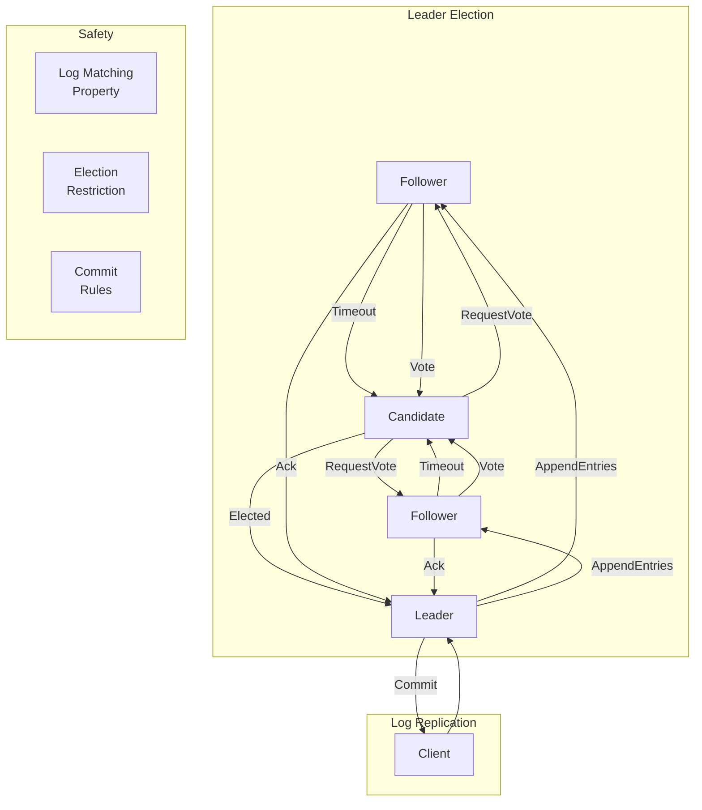
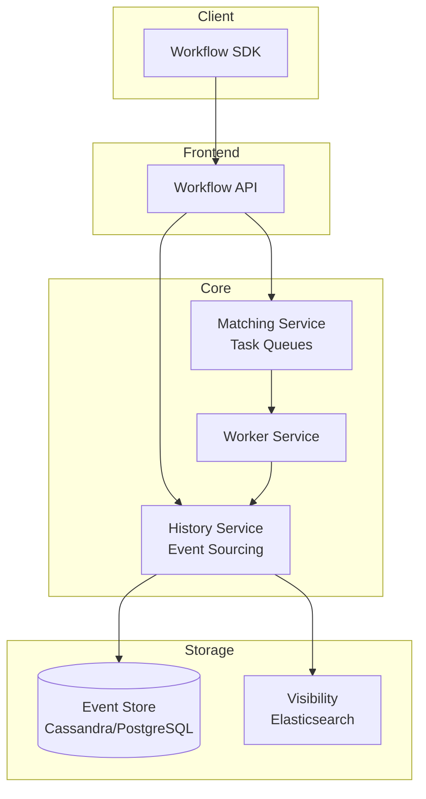

---
tags:
  - System-Design
  - FAANG
  - Distributed-Systems
  - Consensus
  - Rate-Limiter
  - Distributed-Locks
  - Scheduler
  - Workflow
aliases:
  - Distributed Systems Patterns
  - Consensus Patterns
  - Rate Limiting
  - Distributed Locks
---

# ⚙️ Distributed Systems Patterns

> **FAANG Questions:** Design Distributed Lock Service, Design Leader Election, Design Consensus System, Design Distributed Queue, Design Rate Limiter, Design Distributed Scheduler, Design Cron Service, Design Job Queue, Design Workflow Engine, Design Lease Management

---

## 🎯 Pattern 1: Distributed Consensus — Raft / Paxos

### Problem Statement
Design a consensus algorithm for replicated state machines. Handle leader election, log replication, safety, and liveness in the presence of failures. Used in etcd, Consul, CockroachDB, TiKV.

### Raft Consensus Algorithm



### Raft Implementation

```python
# Raft Node States
class RaftState(Enum):
    FOLLOWER = "follower"
    CANDIDATE = "candidate"
    LEADER = "leader"

class RaftNode:
    def __init__(self, node_id, cluster_nodes):
        self.node_id = node_id
        self.cluster = cluster_nodes
        self.state = RaftState.FOLLOWER
        self.current_term = 0
        self.voted_for = None
        self.log = []  # List of {term, index, command}
        self.commit_index = 0
        self.last_applied = 0
        
        # Leader-specific
        self.next_index = {}  # For each follower: next log index to send
        self.match_index = {}  # For each follower: highest replicated index
        
        # Timing
        self.election_timeout = random.uniform(150, 300)  # ms
        self.heartbeat_interval = 50  # ms
        self.last_contact = time.time()
    
    # ===== Leader Election =====
    async def run_election_timer(self):
        while True:
            await asyncio.sleep(self.election_timeout / 1000)
            if time.time() - self.last_contact > self.election_timeout / 1000:
                await self.become_candidate()
    
    async def become_candidate(self):
        self.state = RaftState.CANDIDATE
        self.current_term += 1
        self.voted_for = self.node_id
        self.last_contact = time.time()
        
        # Request votes from all other nodes
        votes = 1  # Vote for self
        for node in self.cluster:
            if node != self.node_id:
                vote = await self.request_vote(node)
                if vote:
                    votes += 1
        
        if votes > len(self.cluster) // 2:
            await self.become_leader()
        else:
            self.state = RaftState.FOLLOWER
    
    async def request_vote(self, node_id):
        # Send RequestVote RPC
        # Node grants vote if:
        # 1. term >= candidate's term
        # 2. voted_for is null or candidate_id
        # 3. candidate's log is at least as up-to-date
        pass
    
    def is_log_up_to_date(self, candidate_last_term, candidate_last_index):
        # Raft Election Restriction
        last_entry = self.log[-1] if self.log else {"term": 0, "index": 0}
        if candidate_last_term != last_entry["term"]:
            return candidate_last_term > last_entry["term"]
        return candidate_last_index >= last_entry["index"]
    
    async def become_leader(self):
        self.state = RaftState.LEADER
        # Initialize next_index and match_index for each follower
        last_index = len(self.log)
        for node in self.cluster:
            if node != self.node_id:
                self.next_index[node] = last_index + 1
                self.match_index[node] = 0
        # Send initial heartbeats
        await self.send_heartbeats()
    
    # ===== Log Replication =====
    async def append_entries(self, leader_id, term, prev_log_index, prev_log_term, entries, leader_commit):
        # Follower logic
        if term < self.current_term:
            return {"term": self.current_term, "success": False}
        
        self.state = RaftState.FOLLOWER
        self.current_term = term
        self.last_contact = time.time()
        
        # 1. Check log consistency
        if prev_log_index > 0:
            if len(self.log) < prev_log_index:
                return {"term": self.current_term, "success": False}
            if self.log[prev_log_index - 1]["term"] != prev_log_term:
                return {"term": self.current_term, "success": False}
        
        # 2. Append new entries (overwrite conflicts)
        self.log = self.log[:prev_log_index] + entries
        
        # 3. Update commit index
        if leader_commit > self.commit_index:
            self.commit_index = min(leader_commit, len(self.log) - 1)
            await self.apply_committed()
        
        return {"term": self.current_term, "success": True}
    
    async def replicate_log(self):
        # Leader: send AppendEntries to all followers
        for follower in self.cluster:
            if follower == self.node_id:
                continue
            await self.send_append_entries(follower)
    
    async def send_append_entries(self, follower_id):
        next_idx = self.next_index[follower_id]
        prev_idx = next_idx - 1
        prev_term = self.log[prev_idx - 1]["term"] if prev_idx > 0 else 0
        entries = self.log[next_idx - 1:]
        
        response = await self.send_rpc(follower_id, "AppendEntries", {
            "term": self.current_term,
            "leader_id": self.node_id,
            "prev_log_index": prev_idx,
            "prev_log_term": prev_term,
            "entries": entries,
            "leader_commit": self.commit_index
        })
        
        if response["success"]:
            self.next_index[follower_id] = len(self.log) + 1
            self.match_index[follower_id] = len(self.log)
            # Update commit index
            self.update_commit_index()
        else:
            # Decrement next_index and retry
            self.next_index[follower_id] = max(1, self.next_index[follower_id] - 1)
    
    def update_commit_index(self):
        # Find largest N where majority have match_index >= N
        # and log[N].term == current_term
        for n in range(len(self.log), self.commit_index, -1):
            if self.log[n - 1]["term"] == self.current_term:
                count = sum(1 for m in self.match_index.values() if m >= n) + 1  # +1 for leader
                if count > len(self.cluster) // 2:
                    self.commit_index = n
                    break
    
    async def apply_committed(self):
        while self.last_applied < self.commit_index:
            self.last_applied += 1
            command = self.log[self.last_applied - 1]["command"]
            await self.state_machine.apply(command)


# ===== Multi-Paxos (Alternative) =====
class MultiPaxos:
    """
    Multi-Paxos optimizes Paxos for repeated consensus:
    1. Elect a distinguished proposer (leader)
    2. Leader skips Phase 1 for subsequent proposals
    3. Only Phase 2 (Accept) needed for each command
    """
    
    def __init__(self, node_id, acceptors):
        self.node_id = node_id
        self.acceptors = acceptors
        self.proposal_number = 0
        self.accepted_proposals = {}  # slot -> (proposal_num, value)
    
    async def propose(self, slot, value):
        if self.is_leader():
            # Skip Phase 1, go directly to Phase 2
            self.proposal_number += 1
            return await self.accept(slot, self.proposal_number, value)
        else:
            # Forward to leader
            return await self.forward_to_leader(slot, value)
    
    async def accept(self, slot, proposal_num, value):
        # Phase 2: Send Accept to majority
        promises = 0
        for acceptor in self.acceptors:
            response = await self.send_accept(acceptor, slot, proposal_num, value)
            if response:
                promises += 1
        
        if promises > len(self.acceptors) // 2:
            # Chosen!
            await self.learn(slot, value)
            return True
        return False
```

---

## 🎯 Pattern 2: Leader Election — Zookeeper / etcd Style

### Problem Statement
Design a leader election service for distributed systems. Used for: master election, singleton services, partitioned workloads.

### Implementation Patterns

```python
# 1. ZooKeeper-based Leader Election
class ZKLeaderElection:
    def __init__(self, zk_client, election_path, node_id):
        self.zk = zk_client
        self.path = election_path
        self.node_id = node_id
        self.is_leader = False
    
    async def elect(self):
        # Create ephemeral sequential node
        my_node = await self.zk.create(
            f"{self.path}/candidate_",
            self.node_id.encode(),
            ephemeral=True,
            sequence=True
        )
        my_seq = int(my_node.split("_")[-1])
        
        # Watch for changes
        await self.watch_election(my_seq)
    
    async def watch_election(self, my_seq):
        while True:
            children = await self.zk.get_children(self.path)
            children.sort(key=lambda x: int(x.split("_")[-1]))
            
            if children[0] == f"candidate_{my_seq:010d}":
                # I am the leader!
                if not self.is_leader:
                    self.is_leader = True
                    await self.on_become_leader()
            else:
                if self.is_leader:
                    self.is_leader = False
                    await self.on_lose_leadership()
                
                # Watch the node before me
                my_index = children.index(f"candidate_{my_seq:010d}")
                if my_index > 0:
                    predecessor = children[my_index - 1]
                    await self.zk.exists(f"{self.path}/{predecessor}", watch=self.on_predecessor_deleted)
            
            await asyncio.sleep(1)
    
    async def on_predecessor_deleted(self, event):
        # Predecessor died, re-check election
        await self.watch_election(self.my_seq)

# 2. etcd-based Leader Election (Lease-based)
class EtcdLeaderElection:
    def __init__(self, etcd_client, election_name, node_id, ttl=10):
        self.etcd = etcd_client
        self.key = f"/election/{election_name}/leader"
        self.node_id = node_id
        self.lease_id = None
        self.ttl = ttl
    
    async def campaign(self):
        while True:
            # Try to acquire leadership
            success, lease = await self.etcd.lease_keep_alive(self.ttl)
            if success:
                # Try to put key with lease
                acquired = await self.etcd.put_if_not_exists(self.key, self.node_id, lease)
                if acquired:
                    self.lease_id = lease
                    return True
            await asyncio.sleep(1)
    
    async def resign(self):
        if self.lease_id:
            await self.etcd.lease_revoke(self.lease_id)
            self.lease_id = None

# 3. Redis-based Leader Election (Simple)
class RedisLeaderElection:
    def __init__(self, redis, election_name, node_id, ttl=10):
        self.redis = redis
        self.key = f"election:{election_name}"
        self.node_id = node_id
        self.ttl = ttl
    
    async def try_acquire(self):
        # SET with NX and EX for atomic acquire
        return await self.redis.set(self.key, self.node_id, nx=True, ex=self.ttl)
    
    async def renew(self):
        # Only renew if we're the leader
        lua_renew = """
        if redis.call('GET', KEYS[1]) == ARGV[1] then
            return redis.call('EXPIRE', KEYS[1], ARGV[2])
        else
            return 0
        end
        """
        return await self.redis.eval(lua_renew, 1, self.key, self.node_id, self.ttl)
    
    async def is_leader(self):
        return await self.redis.get(self.key) == self.node_id
```

---

## 🎯 Pattern 3: Distributed Locks — Redlock / etcd

### Problem Statement
Design a distributed locking mechanism for mutual exclusion across multiple nodes. Handle: lock acquisition, renewal, expiration, fairness, and deadlock prevention.

### Redlock Algorithm (Redis)

```python
class Redlock:
    def __init__(self, redis_instances, quorum=None):
        self.redis = redis_instances
        self.quorum = quorum or (len(redis_instances) // 2 + 1)
    
    async def lock(self, resource, ttl=10000, retry_count=3, retry_delay=200):
        """
        Redlock Algorithm:
        1. Get current time
        2. Try to acquire lock in all N instances sequentially
        3. Count successes, measure elapsed time
        4. If successes >= quorum AND elapsed < ttl: LOCK ACQUIRED
        5. Else: unlock all instances, retry
        """
        for attempt in range(retry_count):
            start = time.time() * 1000
            lock_value = str(uuid.uuid4())
            acquired = 0
            
            for redis in self.redis:
                if await self._acquire_single(redis, resource, lock_value, ttl):
                    acquired += 1
            
            elapsed = time.time() * 1000 - start
            validity = ttl - elapsed
            
            if acquired >= self.quorum and validity > 0:
                return Lock(resource, lock_value, validity)
            
            # Failed: unlock all
            await self._unlock_all(resource, lock_value)
            await asyncio.sleep(retry_delay / 1000 * random.uniform(0.5, 1.5))
        
        raise LockAcquisitionFailed()
    
    async def _acquire_single(self, redis, resource, value, ttl):
        return await redis.set(f"lock:{resource}", value, nx=True, px=ttl)
    
    async def _unlock_all(self, resource, value):
        lua_unlock = """
        if redis.call("GET", KEYS[1]) == ARGV[1] then
            return redis.call("DEL", KEYS[1])
        else
            return 0
        end
        """
        for redis in self.redis:
            await redis.eval(lua_unlock, 1, f"lock:{resource}", lock_value)
    
    async def extend(self, lock, ttl):
        # Extend lock on majority
        for redis in self.redis:
            await redis.pexpire(f"lock:{lock.resource}", ttl)


class Lock:
    def __init__(self, resource, value, validity_ms):
        self.resource = resource
        self.value = value
        self.validity = validity_ms
    
    @property
    def is_valid(self):
        return self.validity > 0
```

### etcd-based Distributed Lock

```python
class EtcdLock:
    def __init__(self, etcd_client, lock_name, ttl=10):
        self.etcd = etcd_client
        self.lock_name = lock_name
        self.ttl = ttl
        self.lock_key = f"/locks/{lock_name}"
        self.lease_id = None
    
    async def acquire(self, blocking=True, timeout=None):
        while True:
            # Try to create lock with lease
            success, lease = await self.etcd.lease_keep_alive(self.ttl)
            if not success:
                await asyncio.sleep(0.1)
                continue
            
            acquired = await self.etcd.put_if_not_exists(
                self.lock_key, "locked", lease
            )
            if acquired:
                self.lease_id = lease
                return True
            
            if not blocking:
                return False
            
            # Watch for lock release
            await self.etcd.watch(self.lock_key)
            await asyncio.sleep(0.1)
    
    def release(self):
        if self.lease_id:
            self.etcd.lease_revoke(self.lease_id)
            self.lease_id = None
```

---

## 🎯 Pattern 4: Distributed Rate Limiter (Already covered in messaging-notifications.md)

### Key Implementation (Recap)

```python
# See messaging-notifications.md for full implementation
# Key algorithms: Token Bucket, Sliding Window Log, Sliding Window Counter
# Distributed using Redis Cluster with Lua scripts for atomicity
```

---

## 🎯 Pattern 5: Distributed Scheduler / Cron Service

### Problem Statement
Design a distributed cron/scheduler service for running jobs at specific times or intervals across a cluster. Handle: exactly-once execution, leader election, job persistence, retries.

### Architecture

```mermaid
graph TB
    subgraph API
        API[Scheduler API]
    end
    
    subgraph Scheduler Cluster
        Leader[Leader Scheduler]
        Follower1[Follower 1]
        Follower2[Follower 2]
    end
    
    subgraph Storage
        Jobs[(Job Store<br/>etcd/PostgreSQL)]
        Lock[Leader Lock<br/>etcd]
        History[(Execution History)]
    end
    
    subgraph Execution
        Workers[Worker Pool]
        Queue[Job Queue<br/>Redis/Kafka]
    end
    
    API --> Jobs
    API --> Leader
    
    Leader --> Lock
    Leader --> Jobs
    Leader --> Queue
    
    Follower1 --> Lock
    Follower2 --> Lock
    
    Queue --> Workers
    Workers --> History
```

```python
class DistributedScheduler:
    def __init__(self, etcd, redis, worker_pool):
        self.etcd = etcd
        self.redis = redis
        self.workers = worker_pool
        self.is_leader = False
    
    async def start(self):
        # 1. Leader election
        await self.elect_leader()
        
        if self.is_leader:
            asyncio.create_task(self.schedule_loop())
    
    async def elect_leader(self):
        # Use etcd lease for leadership
        while True:
            success = await self.etcd.put_if_not_exists(
                "/scheduler/leader", 
                self.node_id, 
                lease_id=await self.etcd.lease_grant(10)
            )
            if success:
                self.is_leader = True
                break
            await asyncio.sleep(1)
    
    async def schedule_loop(self):
        while self.is_leader:
            # 1. Scan for due jobs
            due_jobs = await self.get_due_jobs()
            
            for job in due_jobs:
                # 2. Check if already scheduled (idempotency)
                scheduled = await self.redis.set(
                    f"job:scheduled:{job.id}:{job.next_run}",
                    "1", nx=True, ex=3600
                )
                if not scheduled:
                    continue  # Already scheduled by another leader
                
                # 3. Enqueue for execution
                await self.enqueue_job(job)
                
                # 4. Update next run time
                await self.update_next_run(job)
            
            await asyncio.sleep(1)  # Check every second
    
    async def enqueue_job(self, job):
        await self.redis.lpush("job:queue", json.dumps({
            "job_id": job.id,
            "payload": job.payload,
            "scheduled_at": time.time(),
            "attempt": 0
        }))

# Job Worker
class JobWorker:
    async def process(self):
        while True:
            _, job_data = await self.redis.brpop("job:queue")
            job = json.loads(job_data)
            
            try:
                await self.execute_job(job)
                await self.record_success(job)
            except Exception as e:
                await self.handle_failure(job, e)
```

---

## 🎯 Pattern 6: Workflow Engine — Temporal / Cadence Style

### Problem Statement
Design a durable workflow execution engine supporting long-running workflows, retries, compensation, human-in-the-loop, and exactly-once semantics.

### Architecture



```python
# Workflow Definition (Temporal-style)
class Workflow:
    def __init__(self):
        self.activities = []
    
    @workflow_method
    async def run(self, input_data):
        # Step 1: Reserve inventory
        reserved = await self.execute_activity(
            reserve_inventory, input_data.items,
            start_to_close_timeout=30
        )
        
        try:
            # Step 2: Process payment
            payment = await self.execute_activity(
                process_payment, input_data.payment,
                start_to_close_timeout=30
            )
            
            # Step 3: Create order
            order = await self.execute_activity(
                create_order, input_data, payment, reserved
            )
            
            # Step 4: Trigger fulfillment (async)
            await self.execute_activity(
                trigger_fulfillment, order,
                start_to_close_timeout=60
            )
            
            return order
            
        except PaymentFailed:
            # Compensation: Release inventory
            await self.execute_activity(
                release_inventory, reserved
            )
            raise

# Activity Implementation
class Activities:
    @activity_method
    async def reserve_inventory(self, items):
        # Idempotent reservation
        pass
    
    @activity_method
    async def process_payment(self, payment):
        # Idempotent with idempotency key
        pass
    
    @activity_method
    async def release_inventory(self, reservation_id):
        # Compensation
        pass

# Worker
class ActivityWorker:
    def __init__(self, task_queue):
        self.task_queue = task_queue
    
    async def poll_and_execute(self):
        while True:
            task = await self.poll_task()
            result = await self.execute_activity(task)
            await self.complete_task(task.task_token, result)
```

---

## 📊 Comparison Matrix

| Pattern | Use Case | Consistency | Latency | Complexity |
|---------|----------|-------------|---------|------------|
| **Raft** | State machine replication | Strong | ~RTT | Medium |
| **Paxos** | Single-decree/Multi-Paxos | Strong | ~2RTT | High |
| **ZooKeeper Election** | Coordination, config | Sequential | ~ms | Low |
| **etcd Lease** | Leader election, locks | Linearizable | ~ms | Low |
| **Redlock** | Distributed mutex | Best-effort | ~ms | Medium |
| **Distributed Scheduler** | Cron, batch jobs | Eventual | ~s | Medium |
| **Temporal/Cadence** | Long-running workflows | Eventual/Strong | ~ms | High |

---

## 🎯 Common Interview Questions

| Question | Key Points |
|----------|------------|
| **How does Raft ensure safety?** | Election restriction (up-to-date log), log matching, commit rules |
| **How does Raft handle leader failure?** | Followers timeout → new election → new leader continues replication |
| **Difference between Raft and Paxos?** | Raft: leader-centric, log replication explicit; Paxos: symmetric, more abstract |
| **How does Redlock work?** | Acquire lock on majority of Redis instances, check validity time |
| **Why is Redlock controversial?** | Clock drift, network partitions can cause safety violations |
| **How does etcd leader election work?** | Lease-based, put-if-not-exists, watch for changes |
| **Design a distributed scheduler** | Leader election → scan due jobs → enqueue → worker pool executes |
| **How does Temporal ensure exactly-once?** | Event sourcing + deterministic replay + activity idempotency |

---

## 🏷️ Tags

```yaml
tags:
  - System-Design
  - FAANG
  - Distributed-Systems
  - Consensus
  - Raft
  - Paxos
  - Leader-Election
  - Distributed-Locks
  - Rate-Limiter
  - Scheduler
  - Workflow-Engine
```