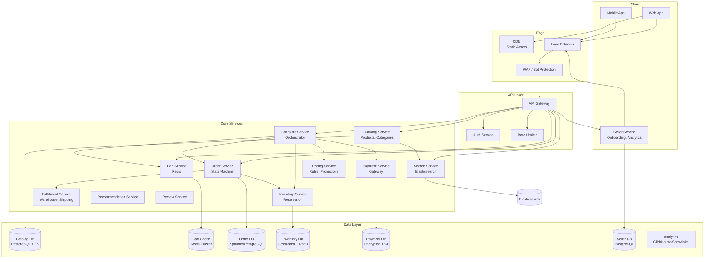
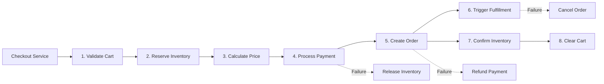

---
tags:
  - System-Design
  - FAANG
  - E-commerce
  - Payments
  - Inventory
  - Marketplace
aliases:
  - E-commerce Patterns
  - Amazon Design
  - Payment Gateway
  - Inventory Management
---

# 🛒 E-commerce Patterns

> **FAANG Questions:** Design Amazon, Design Shopping Cart, Design Checkout Service, Design Inventory Management, Design Order Management, Design Payment Gateway, Design Flash Sale System, Design Price Tracking, Design Wishlist, Design Coupon Service

---

## 🎯 Pattern 1: Amazon / E-commerce Platform — Core Marketplace

### Problem Statement
Design a large-scale e-commerce platform supporting millions of products, billions of requests/day, complex pricing, inventory management, multi-seller marketplace, personalized recommendations, and global fulfillment.

### Requirements Clarification

| Functional | Non-Functional |
|------------|----------------|
| Product catalog (browse, search, filter) | Latency: < 100ms (read), < 500ms (write) |
| Shopping cart & checkout | Availability: 99.99% |
| Multi-seller marketplace | Consistency: Strong for inventory/orders |
| Order management & tracking | Scalability: 10M+ orders/day |
| Payment processing | Global: Multi-currency, multi-region |
| Inventory management | Cost efficiency |
| Reviews, ratings, Q&A | Fault tolerance |
| Promotions, coupons, flash sales | Audit trail |

### High-Level Architecture



### Shopping Cart: **Redis-based with Optimistic Locking**

```python
class ShoppingCart:
    def __init__(self, redis):
        self.redis = redis
    
    async def add_item(self, user_id, product_id, quantity, variant_id=None):
        key = f"cart:{user_id}"
        item_key = f"{product_id}:{variant_id or 'default'}"
        
        # Lua script for atomic add with inventory check
        lua_script = """
        local cart_key = KEYS[1]
        local item_key = ARGV[1]
        local quantity = tonumber(ARGV[2])
        local inventory_key = ARGV[3]
        
        -- Check inventory
        local available = tonumber(redis.call('GET', inventory_key) or 0)
        local current = tonumber(redis.call('HGET', cart_key, item_key) or 0)
        
        if current + quantity > available then
            return {-1, available}  -- Insufficient inventory
        end
        
        -- Update cart
        local new_qty = redis.call('HINCRBY', cart_key, item_key, quantity)
        redis.call('EXPIRE', cart_key, 2592000)  -- 30 days TTL
        return {1, new_qty}
        """
        
        inventory_key = f"inventory:available:{product_id}:{variant_id or 'default'}"
        result = await self.redis.eval(lua_script, 1, key, item_key, quantity, inventory_key)
        
        if result[0] == -1:
            raise InsufficientInventoryError(f"Only {result[1]} available")
        return result[1]

    async def get_cart(self, user_id):
        key = f"cart:{user_id}"
        items = await self.redis.hgetall(key)
        # Enrich with product details
        return await self.enrich_items(items)
```

### Inventory Management: **Reservation Pattern**

```python
class InventoryService:
    def __init__(self, redis, db):
        self.redis = redis
        self.db = db
    
    async def reserve_inventory(self, order_id, items):
        """
        Two-phase commit for inventory reservation:
        1. Try reserve (decrement available, increment reserved)
        2. Confirm (decrement reserved, decrement on_hand) or Release
        """
        reservation_id = f"res:{order_id}"
        
        # Phase 1: Try Reserve (Lua for atomicity)
        lua_reserve = """
        local reservation_key = KEYS[1]
        local items = cjson.decode(ARGV[1])
        
        -- Check all items have sufficient inventory
        for _, item in ipairs(items) do
            local available = tonumber(redis.call('GET', 'inv:avail:' .. item.product_id) or 0)
            if available < item.quantity then
                return {0, item.product_id, available}
            end
        end
        
        -- Reserve all
        for _, item in ipairs(items) do
            redis.call('DECRBY', 'inv:avail:' .. item.product_id, item.quantity)
            redis.call('INCRBY', 'inv:reserved:' .. item.product_id, item.quantity)
            redis.call('HSET', reservation_key, item.product_id, item.quantity)
        end
        redis.call('EXPIRE', reservation_key, 900)  -- 15 min TTL
        return {1}
        """
        
        result = await self.redis.eval(lua_reserve, 1, reservation_key, json.dumps(items))
        if result[0] == 0:
            raise InsufficientInventoryError(f"Product {result[1]}: only {result[2]} available")
        
        return reservation_id
    
    async def confirm_reservation(self, reservation_id):
        """Convert reservation to actual deduction"""
        lua_confirm = """
        local reservation_key = KEYS[1]
        local items = redis.call('HGETALL', reservation_key)
        
        for i = 1, #items, 2 do
            local product_id = items[i]
            local qty = tonumber(items[i+1])
            redis.call('DECRBY', 'inv:reserved:' .. product_id, qty)
            redis.call('DECRBY', 'inv:on_hand:' .. product_id, qty)
        end
        redis.call('DEL', reservation_key)
        return {1}
        """
        await self.redis.eval(lua_confirm, 1, reservation_id)
    
    async def release_reservation(self, reservation_id):
        """Release reserved inventory back to available"""
        lua_release = """
        local reservation_key = KEYS[1]
        local items = redis.call('HGETALL', reservation_key)
        
        for i = 1, #items, 2 do
            local product_id = items[i]
            local qty = tonumber(items[i+1])
            redis.call('INCRBY', 'inv:avail:' .. product_id, qty)
            redis.call('DECRBY', 'inv:reserved:' .. product_id, qty)
        end
        redis.call('DEL', reservation_key)
        return {1}
        """
        await self.redis.eval(lua_release, 1, reservation_id)

# Inventory Sync (Background Job)
async def sync_inventory_to_db():
    """Periodically sync Redis inventory to PostgreSQL"""
    pipeline = redis.pipeline()
    for key in redis.scan_iter("inv:on_hand:*"):
        product_id = key.split(":")[-1]
        on_hand = await redis.get(key)
        available = await redis.get(f"inv:avail:{product_id}")
        pipeline.execute(
            "UPDATE inventory SET on_hand = %s, available = %s WHERE product_id = %s",
            (on_hand, available, product_id)
        )
    await pipeline.execute()
```

### Checkout Service: **Saga Pattern (Choreography)**



```python
class CheckoutService:
    async def checkout(self, user_id, payment_method_id, shipping_address):
        # 1. Get & validate cart
        cart = await self.cart_service.get_cart(user_id)
        if not cart.items:
            raise EmptyCartError()
        
        # 2. Reserve inventory (with timeout)
        reservation_id = await self.inventory.reserve_inventory(
            f"checkout:{user_id}:{uuid4()}", 
            cart.items
        )
        
        try:
            # 3. Calculate pricing (with promotions)
            pricing = await self.pricing.calculate(cart, user_id, shipping_address)
            
            # 4. Process payment
            payment_result = await self.payment.process(
                user_id, payment_method_id, pricing.total, order_id
            )
            
            # 5. Create order
            order = await self.order.create(
                user_id, cart.items, pricing, payment_result, shipping_address
            )
            
            # 8. Confirm inventory deduction
            await self.inventory.confirm_reservation(reservation_id)
            
            # 9. Clear cart
            await self.cart_service.clear(user_id)
            
            # 10. Async: Trigger fulfillment
            await self.event_bus.publish("order.created", order)
            
            return order
            
        except Exception as e:
            # Compensating transactions
            await self.inventory.release_reservation(reservation_id)
            if 'payment_result' in locals():
                await self.payment.refund(payment_result.transaction_id)
            raise
```

### Flash Sale System: **High-Concurrency Handling**

```python
class FlashSaleService:
    def __init__(self, redis):
        self.redis = redis
    
    async def purchase(self, user_id, product_id, sale_id):
        # 1. Check sale validity
        sale = await self.get_sale(sale_id)
        if not sale.is_active():
            raise SaleNotActiveError()
        
        # 2. User purchase limit (Lua for atomicity)
        lua_check = """
        local user_limit_key = KEYS[1]
        local sale_stock_key = KEYS[2]
        local user_limit = tonumber(ARGV[1])
        
        -- Check user limit
        local user_count = tonumber(redis.call('GET', user_limit_key) or 0)
        if user_count >= user_limit then
            return {0, "user_limit"}
        end
        
        -- Check stock
        local stock = tonumber(redis.call('GET', sale_stock_key) or 0)
        if stock <= 0 then
            return {0, "out_of_stock"}
        end
        
        -- Atomic decrement & increment
        redis.call('DECR', sale_stock_key)
        redis.call('INCR', user_limit_key)
        return {1}
        """
        
        result = await self.redis.eval(lua_check, 2, 
            f"flashsale:{sale_id}:user:{user_id}:count",
            f"flashsale:{sale_id}:stock",
            sale.user_limit
        )
        
        if result[0] == 0:
            raise FlashSaleError(result[1])
        
        # 3. Create order asynchronously
        await self.event_bus.publish("flashsale.purchase", {
            "user_id": user_id,
            "product_id": product_id,
            "sale_id": sale_id
        })
        return {"status": "queued", "message": "Order being processed"}

# Pre-warming & Queue
class FlashSaleQueue:
    def __init__(self, redis):
        self.redis = redis
    
    async def enqueue(self, sale_id, user_id, product_id):
        # Priority queue: earlier requests first
        await self.redis.zadd(
            f"flashsale:{sale_id}:queue",
            {json.dumps({"user_id": user_id, "product_id": product_id}): time.time()}
        )
    
    async def process_queue(self, sale_id, batch_size=100):
        while True:
            batch = await self.redis.zpopmin(f"flashsale:{sale_id}:queue", batch_size)
            if not batch:
                break
            for item, score in batch:
                data = json.loads(item)
                await self.process_purchase(data["user_id"], data["product_id"], sale_id)
```

---

## 🎯 Pattern 2: Payment Gateway — Secure Transaction Processing

### Problem Statement
Design a payment gateway processing millions of transactions/day with PCI compliance, multiple payment methods (cards, wallets, bank transfers), fraud detection, multi-currency, refunds, and reconciliation.

### Architecture

```mermaid
graph TB
    subgraph Merchant
        Merchant[Merchant Site/App]
    end
    
    subgraph Gateway API
        API[Payment API]
        SDK[Client SDKs<br/>JS, iOS, Android]
    end
    
    subgraph Core Gateway
        Tokenize[Tokenization<br/>PCI Vault]
        Route[Smart Routing<br/>Acquirer Selection]
        Fraud[Fraud Engine<br/>ML Rules]
        ThreeDS[3D Secure<br/>Challenge Flow]
        Processor[Processor Adapter<br/>Visa/MC/Amex/Discover]
    end
    
    subgraph Payment Methods
        Card[Card Networks<br/>Visa, MC, Amex]
        Wallet[Digital Wallets<br/>Apple Pay, Google Pay]
        Bank[Bank Transfers<br/>ACH, SEPA, UPI]
        BNPL[Buy Now Pay Later<br/>Klarna, Affirm]
    end
    
    subgraph Operations
        Settle[Settlement<br/>Batch Processing]
        Reconcile[Reconciliation<br/>Daily Matching]
        Refund[Refund Service]
        Chargeback[Chargeback Mgmt]
        Reporting[Reporting & Analytics]
    end
    
    subgraph Compliance
        PCI[PCI DSS Vault]
        KYC[KYC/AML]
        Audit[Audit Logging]
    end
    
    Merchant --> SDK
    SDK --> API
    API --> Tokenize
    Tokenize --> Route
    Route --> Fraud
    Fraud --> ThreeDS
    ThreeDS --> Processor
    
    Processor --> Card
    Processor --> Wallet
    Processor --> Bank
    Processor --> BNPL
    
    Processor --> Settle
    Settle --> Reconcile
    Refund --> Processor
    Chargeback --> Processor
    
    PCI --> Tokenize
    KYC --> Merchant
    Audit --> All[All Services]
```

### Tokenization (PCI Compliance)

```python
class TokenizationService:
    def __init__(self, vault_client, encryption_key):
        self.vault = vault_client  # PCI-compliant vault (HashiCorp Vault, AWS CloudHSM)
        self.key = encryption_key
    
    def tokenize_card(self, card_number, exp_month, exp_year, cvv):
        # 1. Validate card (Luhn check)
        if not self.luhn_check(card_number):
            raise InvalidCardError()
        
        # 2. Generate token (format-preserving or random)
        token = self.generate_token(card_number)
        
        # 3. Encrypt sensitive data
        sensitive_data = {
            "pan": card_number,
            "exp_month": exp_month,
            "exp_year": exp_year,
            "cvv": cvv
        }
        encrypted = self.encrypt(json.dumps(sensitive_data))
        
        # 3. Store in PCI vault
        self.vault.write(f"tokens/{token}", {
            "encrypted_data": encrypted,
            "last_four": card_number[-4:],
            "brand": self.detect_brand(card_number),
            "exp_month": exp_month,
            "exp_year": exp_year,
            "created_at": datetime.utcnow().isoformat()
        })
        
        return Token(
            token=token,
            last_four=card_number[-4:],
            brand=self.detect_brand(card_number),
            exp_month=exp_month,
            exp_year=exp_year
        )
    
    def detokenize(self, token):
        data = self.vault.read(f"tokens/{token}")
        if not data:
            raise TokenNotFoundError()
        return self.decrypt(data["encrypted_data"])
    
    def luhn_check(self, card_number):
        digits = [int(d) for d in card_number]
        checksum = sum(digits[-1::-2]) + sum(
            sum(divmod(2 * d, 10)) for d in digits[-2::-2]
        )
        return checksum % 10 == 0
```

### Smart Routing & Fraud Detection

```python
class SmartRouter:
    def __init__(self):
        self.acquirers = {
            "visa": [AcquirerA(), AcquirerB()],
            "mastercard": [AcquirerB(), AcquirerC()],
            "amex": [AcquirerA()],
        }
        self.rules = RoutingRules()
    
    def select_acquirer(self, transaction):
        # 1. Filter by card brand
        candidates = self.acquirers.get(transaction.card_brand, [])
        
        # 2. Apply routing rules
        for rule in self.rules:
            candidates = rule.filter(candidates, transaction)
        
        # 3. Score remaining (success rate, cost, latency)
        scored = [
            (a, self.score_acquirer(a, transaction)) 
            for a in candidates
        ]
        
        return max(scored, key=lambda x: x[1])[0] if candidates else None

class FraudEngine:
    def __init__(self, ml_model, rule_engine):
        self.ml_model = ml_model
        self.rules = rule_engine
    
    def assess(self, transaction, user_profile):
        # Rule-based checks (fast)
        rule_score = self.rules.evaluate(transaction, user_profile)
        
        # ML model (slower, more accurate)
        features = self.extract_features(transaction, user_profile)
        ml_score = self.ml_model.predict_proba(features)[1]  # Fraud probability
        
        # Combined score
        final_score = 0.3 * rule_score + 0.7 * ml_score
        
        if final_score > 0.9:
            return FraudDecision.BLOCK
        elif final_score > 0.7:
            return FraudDecision.CHALLENGE_3DS
        elif final_score > 0.5:
            return FraudDecision.REVIEW
        return FraudDecision.APPROVE
```

---

## 🎯 Pattern 3: Coupon & Promotion Engine

### Architecture: **Flexible Rule Engine**

```python
class PromotionEngine:
    def __init__(self):
        self.promotions = {}  # promotion_id -> Promotion
    
    def apply(self, cart, user, context):
        applicable = self.find_applicable(cart, user, context)
        results = []
        
        for promo in applicable:
            result = promo.apply(cart, context)
            if result:
                results.append(result)
        
        # Apply stacking rules
        return self.apply_stacking_rules(results, cart)
    
    def find_applicable(self, cart, user, context):
        return [
            p for p in self.promotions.values()
            if p.is_valid() and p.matches(cart, user, context)
        ]

class Promotion:
    def __init__(self, id, name, type, conditions, actions, stacking_rules):
        self.id = id
        self.type = type  # percentage, fixed, bogo, free_shipping, bundle
        self.conditions = conditions  # Rule AST
        self.actions = actions
        self.stacking = stacking_rules  # exclusive, stackable, best_only
    
    def matches(self, cart, user, context):
        return self.conditions.evaluate({
            "cart": cart,
            "user": user,
            "context": context
        })
    
    def apply(self, cart, context):
        if self.type == "percentage":
            discount = cart.subtotal * self.actions["percentage"] / 100
            return Discount(self.id, discount, "percentage")
        elif self.type == "fixed":
            return Discount(self.id, self.actions["amount"], "fixed")
        elif self.type == "bogo":
            return self.apply_bogo(cart, self.actions)
        elif self.type == "free_shipping":
            return Discount(self.id, cart.shipping_cost, "free_shipping")
```

### Coupon Service

```python
class CouponService:
    def __init__(self, redis, db):
        self.redis = redis
        self.db = db
    
    async def validate_coupon(self, code, user_id, cart):
        # 1. Check cache
        cached = await self.redis.get(f"coupon:{code}")
        if cached:
            coupon = json.loads(cached)
        else:
            coupon = await self.db.get_coupon(code)
            if not coupon:
                raise CouponNotFoundError()
            await self.redis.setex(f"coupon:{code}", 3600, json.dumps(coupon))
        
        # 2. Validate
        if not coupon.is_active:
            raise CouponExpiredError()
        if coupon.usage_limit and coupon.used_count >= coupon.usage_limit:
            raise CouponExhaustedError()
        if coupon.user_limit and await self.get_user_usage(user_id, code) >= coupon.user_limit:
            raise UserLimitExceededError()
        if not coupon.conditions.evaluate({"cart": cart, "user_id": user_id}):
            raise ConditionsNotMetError()
        
        return coupon
    
    async def apply_coupon(self, code, user_id, cart):
        coupon = await self.validate_coupon(code, user_id, cart)
        
        # Atomic increment usage
        lua_apply = """
        local coupon_key = KEYS[1]
        local user_usage_key = KEYS[2]
        local limit = tonumber(ARGV[1])
        local user_limit = tonumber(ARGV[2])
        
        local used = tonumber(redis.call('GET', coupon_key) or 0)
        if used >= limit then return {0, "exhausted"} end
        
        local user_used = tonumber(redis.call('GET', user_usage_key) or 0)
        if user_used >= user_limit then return {0, "user_limit"} end
        
        redis.call('INCR', coupon_key)
        redis.call('INCR', user_usage_key)
        return {1}
        """
        result = await self.redis.eval(lua_apply, 2,
            f"coupon:{code}:used",
            f"coupon:{code}:user:{user_id}",
            coupon.usage_limit, coupon.user_limit
        )
        if result[0] == 0:
            raise CouponError(result[1])
        
        return coupon.calculate_discount(cart)
```

---

## 📊 Comparison Matrix

| System | Scale | Key Challenge | Solution |
|--------|-------|---------------|----------|
| **Amazon** | 10M+ orders/day | Inventory consistency | Reservation pattern, saga |
| **Shopify** | 2M+ merchants | Multi-tenancy | Sharded DB, per-tenant isolation |
| **Stripe** | 1B+ transactions | PCI compliance | Tokenization, smart routing |
| **PayPal** | 400M users | Fraud + Regulation | ML fraud, 3DS, compliance |
| **Flash Sale** | 100K req/sec | Stock consistency | Redis atomic ops, queue |

---

## 🎯 Common Interview Questions

| Question | Key Points |
|----------|------------|
| **How does Amazon handle inventory during checkout?** | Reservation pattern (two-phase), Lua scripts for atomicity, saga for compensation |
| **How does a payment gateway ensure PCI compliance?** | Tokenization (vault), never store PAN, encryption, audit logs, network segmentation |
| **Design a flash sale system** | Redis atomic stock decrement, user limits, pre-warming, async queue processing |
| **How does a coupon system handle concurrent usage?** | Redis atomic counters with Lua, idempotency keys, usage limits |
| **How does smart routing work in payment gateway?** | Acquirer selection based on success rate, cost, geography, card brand |
| **Design a shopping cart** | Redis hash, TTL, optimistic locking, merge on login, cross-device sync |
| **How to handle inventory overselling?** | Reservation pattern, database constraints, compensation transactions |

---

## 🏷️ Tags

```yaml
tags:
  - System-Design
  - FAANG
  - E-commerce
  - Payments
  - Inventory
  - Marketplace
  - Flash-Sale
  - Coupons
  - PCI-Compliance
  - Payment-Gateway
```