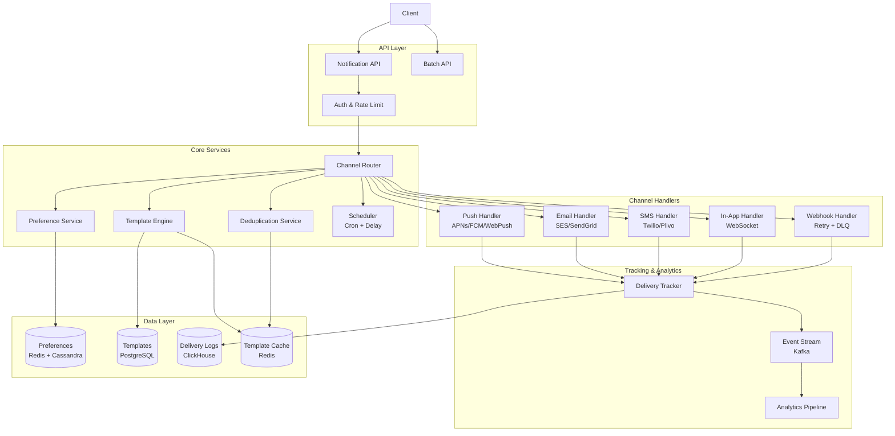
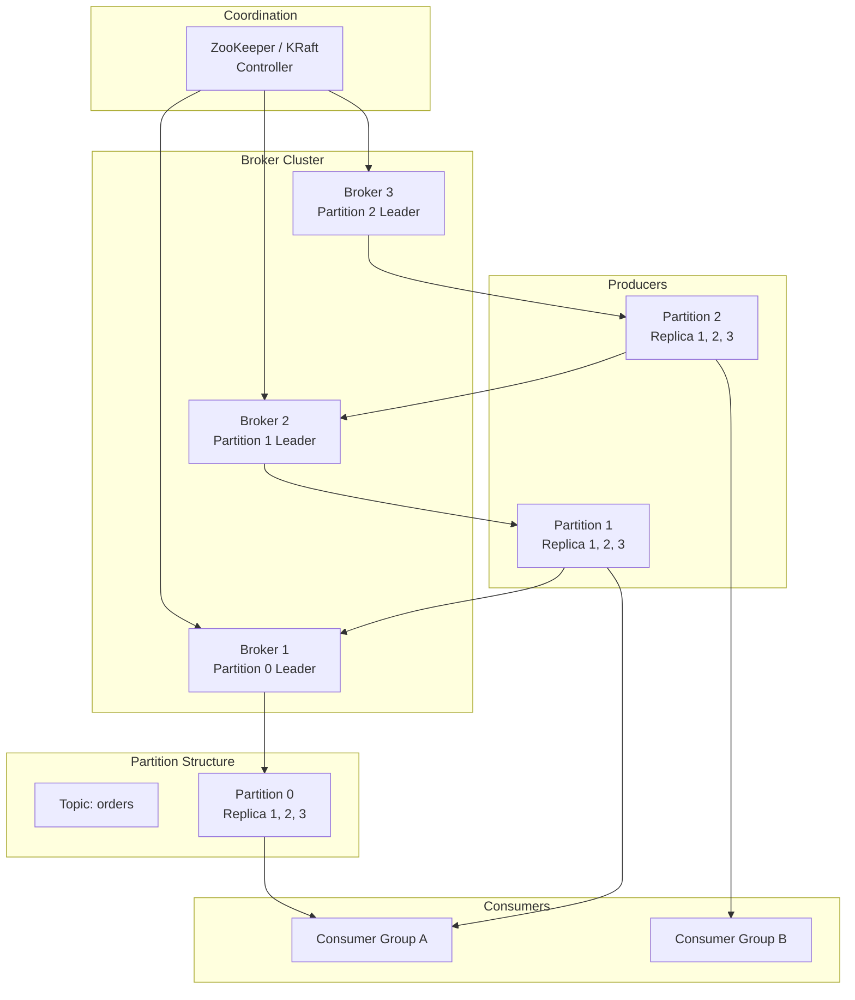
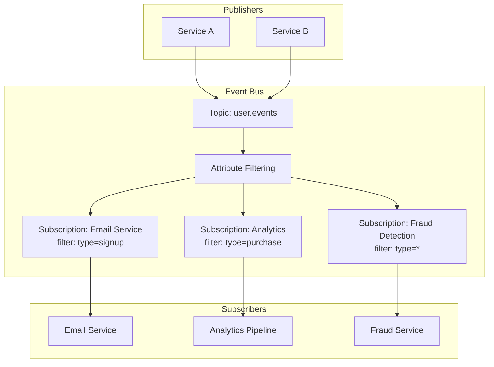

---
tags:
  - System-Design
  - FAANG
  - Messaging
  - Notifications
  - Pub-Sub
  - Kafka
  - Push-Notifications
  - Email
aliases:
  - Messaging Patterns
  - Notification System
  - Pub/Sub Design
---

# 📨 Messaging & Notifications Patterns

> **FAANG Questions:** Design Notification Service, Design Push Notification System, Design Email Service, Design SMS Gateway, Design Chat Application, Design Pub/Sub System, Design Kafka-like Queue, Design RabbitMQ, Design Event Bus

---

## 🎯 Pattern 1: Notification Service — Multi-channel Delivery

### Problem Statement
Design a unified notification service that delivers notifications via push, email, SMS, in-app, webhook across multiple platforms (iOS, Android, Web). Handle 1B+ notifications/day, delivery guarantees, deduplication, preferences, scheduling.

### Requirements Clarification

| Functional | Non-Functional |
|------------|----------------|
| Multi-channel: Push, Email, SMS, In-app, Webhook | Latency: < 1s (push), < 5s (email) |
| User preferences (opt-in/out, frequency) | Availability: 99.99% |
| Templates with variables | Delivery guarantee: At-least-once |
| Scheduling (cron, delays) | Deduplication: < 0.1% |
| Delivery tracking (sent, delivered, opened, clicked) | Scalability: 1M+ notifications/sec |
| Batch API for bulk sends | Cost optimization |

### High-Level Architecture



### Template Engine

```python
# Jinja2-based Template Engine with Variable Validation
class NotificationTemplate:
    def __init__(self, template_id, subject, body, channel):
        self.template_id = template_id
        self.subject = subject
        self.body = body
        self.channel = channel
        self.required_vars = self._extract_variables()
    
    def _extract_variables(self):
        # Extract {{ variable }} from template
        import re
        return set(re.findall(r'\{\{(\w+)\}\}', self.subject + self.body))
    
    def render(self, variables):
        missing = self.required_vars - set(variables.keys())
        if missing:
            raise ValueError(f"Missing variables: {missing}")
        
        # Secure rendering (no arbitrary code execution)
        from jinja2 import Environment, SandboxedEnvironment
        env = SandboxedEnvironment(autoescape=True)
        subject_tmpl = env.from_string(self.subject)
        body_tmpl = env.from_string(self.body)
        
        return {
            "subject": subject_tmpl.render(**variables),
            "body": body_tmpl.render(**variables)
        }

# Template Versioning
class TemplateRegistry:
    def __init__(self):
        self.templates = {}  # template_id -> {version: Template}
    
    def register(self, template_id, version, template):
        if template_id not in self.templates:
            self.templates[template_id] = {}
        self.templates[template_id][version] = template
    
    def get(self, template_id, version="latest"):
        versions = self.templates.get(template_id, {})
        if version == "latest":
            version = max(versions.keys())
        return versions.get(version)
```

### Channel Handlers

```python
# Push Notification Handler (APNs/FCM/WebPush)
class PushNotificationHandler:
    def __init__(self):
        self.apns_client = APNsClient()
        self.fcm_client = FCMClient()
        self.webpush_client = WebPushClient()
    
    async def send(self, notification):
        device_tokens = await self.get_device_tokens(notification.user_id)
        results = []
        
        for token in device_tokens:
            if token.platform == "ios":
                result = await self.apns_client.send(token.token, notification.payload)
            elif token.platform == "android":
                result = await self.fcm_client.send(token.token, notification.payload)
            elif token.platform == "web":
                result = await self.webpush_client.send(token.subscription, notification.payload)
            results.append(result)
        return results

# Email Handler with Provider Abstraction
class EmailHandler:
    def __init__(self):
        self.providers = {
            "ses": SESProvider(),
            "sendgrid": SendGridProvider(),
            "mailgun": MailgunProvider(),
        }
        self.primary = "ses"
        self.fallback = "sendgrid"
    
    async def send(self, notification):
        rendered = notification.rendered_content
        email = Email(
            to=notification.recipient_email,
            subject=rendered["subject"],
            html=rendered["body"],
            text=strip_html(rendered["body"])
        )
        
        # Try primary, fallback on failure
        try:
            return await self.providers[self.primary].send(email)
        except ProviderError:
            return await self.providers[self.fallback].send(email)

# SMS Handler
class SMSHandler:
    def __init__(self):
        self.providers = {"twilio": TwilioProvider(), "plivo": PlivoProvider()}
    
    async def send(self, notification):
        rendered = notification.rendered_content
        sms = SMS(to=notification.phone_number, body=rendered["body"])
        # Use least-cost routing
        provider = self.select_cheapest_provider(notification.country_code)
        return await self.providers[provider].send(sms)
```

### Delivery Guarantees & Retry Logic

```python
class DeliveryTracker:
    def __init__(self):
        self.redis = Redis()
        self.kafka = KafkaProducer()
    
    async def track_sent(self, notification_id, channel, provider_id):
        await self.redis.hset(f"delivery:{notification_id}", mapping={
            "status": "sent",
            "channel": channel,
            "provider": provider_id,
            "sent_at": datetime.utcnow().isoformat(),
        })
        await self.kafka.send("delivery-events", {
            "notification_id": notification_id,
            "event": "sent",
            "channel": channel,
            "timestamp": datetime.utcnow().isoformat()
        })
    
    async def track_delivered(self, notification_id, external_id):
        await self.redis.hset(f"delivery:{notification_id}", mapping={
            "status": "delivered",
            "external_id": external_id,
            "delivered_at": datetime.utcnow().isoformat()
        })

# Retry with Exponential Backoff + Dead Letter Queue
class RetryPolicy:
    def __init__(self, max_retries=3, base_delay=1, max_delay=300):
        self.max_retries = max_retries
        self.base_delay = base_delay
        self.max_delay = max_delay
    
    def get_delay(self, attempt):
        delay = min(self.base_delay * (2 ** attempt), self.max_delay)
        # Add jitter
        return delay + random.uniform(0, delay * 0.1)

class NotificationProcessor:
    async def process(self, notification):
        for attempt in range(self.retry_policy.max_retries + 1):
            try:
                result = await self.channel_handler.send(notification)
                await self.tracker.track_sent(notification.id, ...)
                return result
            except TransientError as e:
                if attempt < self.retry_policy.max_retries:
                    delay = self.retry_policy.get_delay(attempt)
                    await asyncio.sleep(delay)
                    continue
                # Move to DLQ
                await self.move_to_dlq(notification, str(e))
                raise
            except PermanentError:
                await self.tracker.track_failed(notification.id, str(e))
                raise

# Deduplication (Idempotency Keys)
class DeduplicationService:
    def __init__(self):
        self.redis = Redis()
    
    def check_and_set(self, idempotency_key, ttl=86400):
        # Returns True if new, False if duplicate
        return self.redis.set(idempotency_key, "1", nx=True, ex=ttl)
```

---

## 🎯 Pattern 2: Push Notification System (APNs/FCM)

### Problem Statement
Design a push notification infrastructure handling 1B+ devices, 10M+ notifications/sec, with support for APNs (iOS), FCM (Android), WebPush, and proper token management.

### Architecture

```mermaid
graph TB
    subgraph Token Management
        Register[Token Registration API]
        Refresh[Token Refresh Worker]
        Invalid[Invalid Token Cleanup]
    end
    
    subgraph Sending Pipeline
        Gateway[Push Gateway]
        Batcher[Batcher<br/>Aggregate by App/Topic]
        Sender[Sender Workers<br/>APNs/FCM/WebPush]
    end
    
    subgraph Feedback
        Feedback[Feedback Service<br/>Invalid Tokens]
        Metrics[Metrics Collector]
    end
    
    subgraph Providers
        APNs[Apple Push Notification Service]
        FCM[Firebase Cloud Messaging]
        WebPush[WebPush (VAPID)]
    end
    
    Client --> Register
    Register --> TokenDB[(Token Store<br/>Redis + Cassandra)]
    
    App --> Gateway
    Gateway --> Batcher
    Batcher --> Sender
    
    Sender --> APNs
    Sender --> FCM
    Sender --> WebPush
    
    APNs --> Feedback
    FCM --> Feedback
    WebPush --> Feedback
    
    Feedback --> Invalid
    Invalid --> TokenDB
```

### APNs/FCM Best Practices

```python
# APNs (HTTP/2) - Apple Push Notification Service
class APNsClient:
    def __init__(self, auth_key_path, key_id, team_id, bundle_id):
        self.client = httpx.AsyncClient(http2=True)
        self.jwt = self._generate_jwt(auth_key_path, key_id, team_id)
    
    async def send(self, device_token, payload):
        headers = {
            "authorization": f"bearer {self.jwt}",
            "apns-topic": self.bundle_id,
            "apns-priority": "10",  # Immediate delivery
            "apns-push-type": "alert",
        }
        
        url = f"https://api.push.apple.com/3/device/{device_token}"
        response = await self.client.post(url, json=payload, headers=headers)
        
        if response.status_code == 410:  # Unregistered
            raise UnregisteredTokenError(device_token)
        return response

# FCM (HTTP v1) - Firebase Cloud Messaging
class FCMClient:
    def __init__(self, service_account_path):
        self.credentials = google.oauth2.service_account.Credentials.from_service_account_file(
            service_account_path, scopes=["https://www.googleapis.com/auth/firebase.messaging"]
        )
    
    async def send(self, token, payload):
        access_token = self.credentials.token
        headers = {
            "Authorization": f"Bearer {access_token}",
            "Content-Type": "application/json"
        }
        
        message = {
            "message": {
                "token": token,
                "notification": payload.get("notification"),
                "data": payload.get("data"),
                "android": {
                    "priority": "high",
                    "ttl": "86400s"
                }
            }
        }
        
        url = "https://fcm.googleapis.com/v1/projects/PROJECT_ID/messages:send"
        response = await httpx.AsyncClient().post(url, json=message, headers=headers)
        return response

# Connection Pooling for High Throughput
class ConnectionPool:
    def __init__(self, max_connections=1000):
        self.semaphore = asyncio.Semaphore(max_connections)
        self.sessions = {}
    
    async def acquire(self, provider):
        await self.semaphore.acquire()
        if provider not in self.sessions:
            self.sessions[provider] = httpx.AsyncClient(http2=True, limits=httpx.Limits(max_connections=100))
        return self.sessions[provider]
```

### Token Management

```python
# Token Registration with Validation
async def register_device_token(user_id, platform, token, app_version):
    # 1. Validate token format
    if platform == "ios":
        assert len(token) == 64  # 32 bytes hex
    elif platform == "android":
        assert token.startswith("f")  # FCM token format
    
    # 2. Store with metadata
    await redis.hset(f"device:{user_id}:{platform}", mapping={
        "token": token,
        "app_version": app_version,
        "updated_at": datetime.utcnow().isoformat(),
        "active": "true"
    })
    
    # 3. Index by token for reverse lookup
    await redis.set(f"token:{token}", user_id, ex=86400*30)

# Automatic Invalid Token Cleanup (APNs Feedback / FCM Invalid)
async def cleanup_invalid_tokens(feedback_events):
    for event in feedback_events:
        if event.type == "unregistered":
            user_id = await redis.get(f"token:{event.token}")
            if user_id:
                await redis.hset(f"device:{user_id}:{event.platform}", "active", "false")
                await redis.delete(f"token:{event.token}")
```

---

## 🎯 Pattern 3: Message Queue / Event Bus (Kafka-like)

### Problem Statement
Design a distributed, fault-tolerant message queue with high throughput, ordering guarantees, replayability, and exactly-once semantics. Handle 10M+ msgs/sec.

### Architecture: **Kafka-style Distributed Log**



### Key Concepts

| Concept | Implementation |
|---------|----------------|
| **Partitioning** | Key-based (hash) or Round-robin |
| **Replication** | ISR (In-Sync Replicas), min.insync.replicas |
| **Ordering** | Per-partition ordering |
| **Consumer Groups** | Each partition consumed by one member |
| **Offsets** | Stored in __consumer_offsets topic |
| **Retention** | Time-based (7 days) or Size-based (1TB) |
| **Compaction** | Log compaction by key (latest value) |

### Producer Semantics

```python
class KafkaProducer:
    def __init__(self, acks="all", retries=3, enable_idempotence=True):
        self.producer = KafkaProducer(
            acks=acks,              # all = wait for ISR
            retries=retries,
            enable_idempotence=enable_idempotence,  # Exactly-once
            max_in_flight_requests_per_connection=5,
            compression_type="snappy",
            linger_ms=5,            # Batch wait
            batch_size=16384,
        )
    
    def send(self, topic, key, value, headers=None):
        future = self.producer.send(
            topic,
            key=key,  # Determines partition
            value=value,
            headers=headers
        )
        return future

# Idempotent Producer (Exactly-Once)
# 1. PID (Producer ID) + Sequence Number per partition
# 2. Broker deduplicates based on PID + Seq
# 3. Transactional API for multi-partition atomicity

class TransactionalProducer:
    def __init__(self):
        self.producer = KafkaProducer(
            transactional_id="producer-1",
            enable_idempotence=True
        )
    
    def send_in_transaction(self, operations):
        self.producer.init_transactions()
        self.producer.begin_transaction()
        try:
            for topic, key, value in operations:
                self.producer.send(topic, key=key, value=value)
            self.producer.commit_transaction()
        except Exception:
            self.producer.abort_transaction()
            raise
```

### Consumer Semantics

```python
class KafkaConsumer:
    def __init__(self, group_id, auto_offset_reset="latest"):
        self.consumer = KafkaConsumer(
            "topic",
            group_id=group_id,
            auto_offset_reset=auto_offset_reset,
            enable_auto_commit=False,  # Manual commit
            max_poll_records=500,
            max_poll_interval_ms=300000,
            session_timeout_ms=30000,
            heartbeat_interval_ms=10000,
        )
    
    def consume(self):
        while True:
            records = self.consumer.poll(timeout_ms=1000)
            for tp, messages in records.items():
                for msg in messages:
                    self.process(msg)
                # Commit offset after successful processing
                self.consumer.commit_async({tp: OffsetAndMetadata(messages[-1].offset + 1)})

# Exactly-Once Processing (Idempotent Consumer)
class IdempotentConsumer:
    def __init__(self):
        self.processed = Redis()  # Store processed offsets
    
    def process(self, message):
        offset_key = f"processed:{message.topic}:{message.partition}:{message.offset}"
        if self.processed.set(offset_key, "1", nx=True, ex=86400*7):
            # Process message
            self.do_process(message)
        else:
            logger.info(f"Duplicate message skipped: {offset_key}")
```

---

## 🎯 Pattern 4: Event Bus / Pub-Sub (Cloud Pub/Sub Style)

### Architecture: **Fan-out with Subscription Filtering**



```python
# Cloud Pub/Sub Style Message
class PubSubMessage:
    def __init__(self, data, attributes=None, ordering_key=None):
        self.data = data          # bytes
        self.attributes = attributes or {}  # string key-value
        self.ordering_key = ordering_key    # for ordering guarantee
        self.message_id = uuid4()
        self.publish_time = datetime.utcnow()

# Subscription with Filter
class Subscription:
    def __init__(self, name, topic, filter_expr=None, dead_letter_topic=None):
        self.name = name
        self.topic = topic
        self.filter = filter_expr  # e.g., 'attributes.type="signup"'
        self.dlq = dead_letter_topic
        self.ack_deadline = 10  # seconds
        self.retry_policy = ExponentialBackoff(max_delay=600)

# Delivery with Acknowledgment
class PubSubDelivery:
    async def deliver(self, message, subscription):
        try:
            await subscription.push(message)
            await self.ack(message.ack_id)
        except Exception as e:
            await self.nack(message.ack_id)
            if subscription.dlq and subscription.retry_count > 3:
                await self.send_to_dlq(message, subscription.dlq)
```

---

## 🎯 Pattern 5: Rate Limiter as a Service

### Problem Statement
Design a distributed rate limiter supporting multiple algorithms (token bucket, sliding window, fixed window), per-user/IP/API key, with distributed coordination.

### Algorithms

```python
# 1. Token Bucket (Smooth Burst Handling)
class TokenBucketRateLimiter:
    def __init__(self, redis, capacity, refill_rate):
        self.redis = redis
        self.capacity = capacity
        self.refill_rate = refill_rate  # tokens per second
    
    async def allow(self, key, tokens=1):
        lua_script = """
        local key = KEYS[1]
        local capacity = tonumber(ARGV[1])
        local refill_rate = tonumber(ARGV[2])
        local tokens = tonumber(ARGV[3])
        local now = tonumber(ARGV[4])
        
        local bucket = redis.call('HMGET', key, 'tokens', 'last_refill')
        local tokens_available = tonumber(bucket[1]) or capacity
        local last_refill = tonumber(bucket[2]) or now
        
        -- Refill tokens
        local elapsed = now - last_refill
        tokens_available = math.min(capacity, tokens_available + elapsed * refill_rate)
        
        if tokens_available >= tokens then
            tokens_available = tokens_available - tokens
            redis.call('HMSET', key, 'tokens', tokens_available, 'last_refill', now)
            redis.call('EXPIRE', key, 86400)
            return {1, tokens_available}
        else
            redis.call('HMSET', key, 'tokens', tokens_available, 'last_refill', now)
            redis.call('EXPIRE', key, 86400)
            return {0, tokens_available}
        end
        """
        result = await self.redis.eval(lua_script, 1, key, self.capacity, self.refill_rate, tokens, time.time())
        return bool(result[0]), result[1]

# 2. Sliding Window Log (Precise)
class SlidingWindowLogLimiter:
    async def allow(self, key, limit, window_seconds):
        now = time.time()
        window_start = now - window_seconds
        
        # Remove expired entries
        await self.redis.zremrangebyscore(key, 0, window_start)
        
        # Count current requests
        current = await self.redis.zcard(key)
        
        if current < limit:
            await self.redis.zadd(key, {str(now): now})
            await self.redis.expire(key, window_seconds + 1)
            return True, current + 1
        return False, current

# 3. Sliding Window Counter (Hybrid - Memory Efficient)
class SlidingWindowCounterLimiter:
    async def allow(self, key, limit, window_seconds):
        now = time.time()
        current_window = int(now // window_seconds)
        prev_window = current_window - 1
        
        pipe = self.redis.pipeline()
        pipe.get(f"{key}:{current_window}")
        pipe.get(f"{key}:{prev_window}")
        curr_count, prev_count = await pipe.execute()
        
        curr_count = int(curr_count or 0)
        prev_count = int(prev_count or 0)
        
        # Weighted count
        weight = 1 - (now % window_seconds) / window_seconds
        estimated = curr_count + prev_count * weight
        
        if estimated < limit:
            await self.redis.incr(f"{key}:{current_window}")
            await self.redis.expire(f"{key}:{current_window}", window_seconds * 2)
            return True
        return False
```

### Distributed Rate Limiter with Redis Cluster

```python
class DistributedRateLimiter:
    def __init__(self, redis_cluster, algorithm="sliding_window"):
        self.redis = redis_cluster
        self.algorithm = algorithm
        self.limiters = {
            "token_bucket": TokenBucketRateLimiter(redis_cluster, 100, 10),
            "sliding_window": SlidingWindowLogLimiter(redis_cluster),
            "fixed_window": FixedWindowLimiter(redis_cluster),
        }
    
    async def check_rate_limit(self, identifier, limit=100, window=60, algorithm="sliding_window"):
        key = f"ratelimit:{algorithm}:{identifier}"
        limiter = self.limiters[algorithm]
        return await limiter.allow(key, limit, window)

# Rate Limit Headers (Standard)
def rate_limit_headers(limit, remaining, reset_time):
    return {
        "X-RateLimit-Limit": str(limit),
        "X-RateLimit-Remaining": str(max(0, remaining)),
        "X-RateLimit-Reset": str(int(reset_time)),
        "Retry-After": str(max(0, int(reset_time - time.time()))) if remaining == 0 else ""
    }
```

---

## 📊 Comparison Matrix

| System | Throughput | Latency | Ordering | Delivery | Use Case |
|--------|------------|---------|----------|----------|----------|
| **Kafka** | 10M+/sec | 2-5ms | Partition | At-least-once / Exactly-once | Event streaming, audit logs |
| **RabbitMQ** | 100K/sec | <1ms | Per-queue | At-least-once | Task queues, RPC |
| **Pulsar** | 1M+/sec | 2-5ms | Partition | Exactly-once | Geo-replication, multi-tenant |
| **Cloud Pub/Sub** | 1M+/sec | <100ms | Ordering key | At-least-once | Serverless, GCP native |
| **Redis Streams** | 500K/sec | <1ms | Per-stream | At-least-once | Lightweight, Redis users |
| **NATS JetStream** | 1M+/sec | <1ms | Per-stream | At-least-once | IoT, edge |

---

## 🎯 Common Interview Questions

| Question | Key Points |
|----------|------------|
| **How does Kafka achieve high throughput?** | Sequential disk I/O, zero-copy, batching, compression, page cache |
| **How does Kafka ensure exactly-once?** | Idempotent producer (PID + seq), transactional API, consumer offset management |
| **How does Kafka handle consumer rebalancing?** | Cooperative sticky assignor, static membership, incremental rebalance |
| **How does FCM/APNs handle millions of devices?** | Connection pooling, HTTP/2 multiplexing, token invalidation feedback |
| **Design a rate limiter for API Gateway** | Token bucket / sliding window in Redis, Lua scripts for atomicity |
| **How to handle duplicate notifications?** | Idempotency keys, deduplication service, exactly-once delivery |
| **Design a dead letter queue** | Max retries → DLQ topic, alerting, replay capability |
| **How to implement priority in message queue?** | Priority queue per partition, or separate priority topics |

---

## 🏷️ Tags

```yaml
tags:
  - System-Design
  - FAANG
  - Messaging
  - Notifications
  - Pub-Sub
  - Kafka
  - Push-Notifications
  - Email
  - Rate-Limiter
  - Message-Queue
```