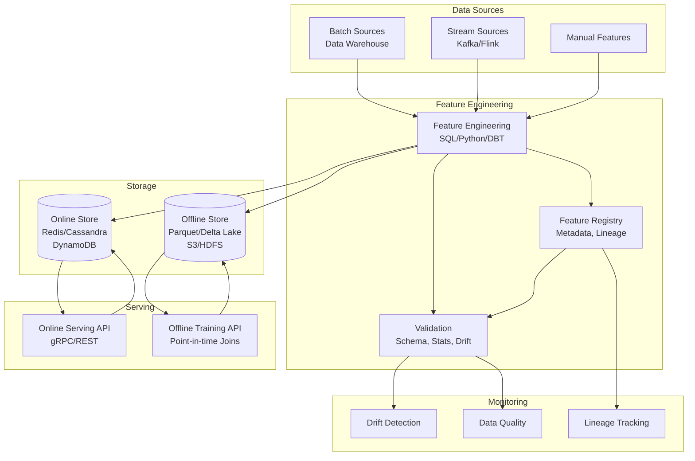
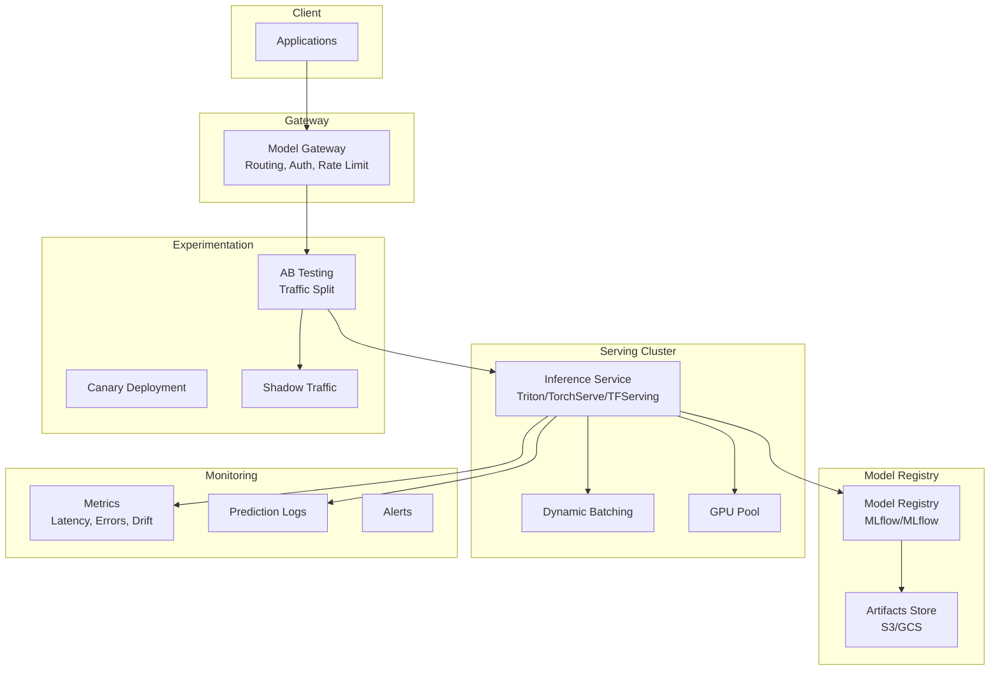
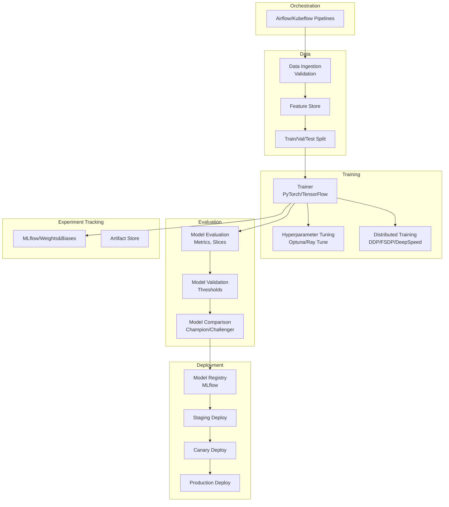
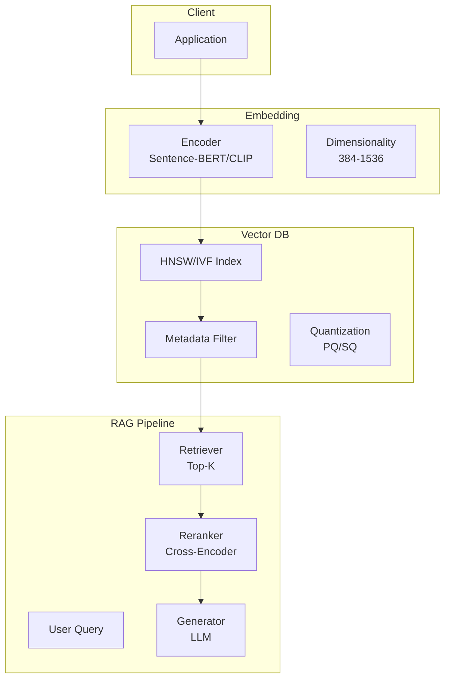

---
tags:
  - System-Design
  - FAANG
  - ML-Systems
  - Machine-Learning
  - Feature-Store
  - Model-Serving
  - Vector-Database
  - RAG
  - LLM-Serving
aliases:
  - ML Systems Patterns
  - Machine Learning Infrastructure
  - Feature Store
  - Model Serving
---

# 🤖 ML Systems Patterns

> **FAANG Questions:** Design Feature Store, Design Model Serving, Design ML Training Pipeline, Design Recommendation System, Design Real-Time Inference, Design Vector Database, Design Semantic Search, Design RAG System, Design LLM Serving Platform

---

## 🎯 Pattern 1: Feature Store — Centralized Feature Management

### Problem Statement
Design a feature store providing consistent, versioned, point-in-time correct features for training and real-time inference. Handle billions of features, low-latency online serving, and reproducible training.

### Requirements Clarification

| Functional | Non-Functional |
|------------|----------------|
| Feature registration & versioning | Latency: < 5ms (online) |
| Point-in-time correctness | Availability: 99.99% |
| Online serving (low-latency) | Consistency: Strong |
| Offline training datasets | Scalability: 10K+ features |
| Feature discovery & lineage | Reproducibility |
| Feature monitoring & drift detection | Cost efficiency |

### Architecture



### Data Model

```python
# Feature Definition
@dataclass
class Feature:
    name: str
    entity: str           # e.g., "user", "item"
    value_type: str       # "float", "int", "string", "embedding"
    description: str
    owner: str
    tags: List[str]
    transformation: str   # SQL/Python expression
    schedule: str         # Cron or "streaming"
    ttl: Optional[timedelta]
    
    # Online serving config
    online_enabled: bool
    online_ttl: timedelta
    
    # Monitoring
    drift_threshold: float
    quality_checks: List[str]

# Feature View (Group of Features)
@dataclass
class FeatureView:
    name: str
    entities: List[str]
    features: List[Feature]
    ttl: timedelta
    online: bool
    source: DataSource  # Batch/Stream
```

### Offline Store: **Point-in-Time Correct Joins**

```python
class OfflineFeatureStore:
    def __init__(self, warehouse):
        self.warehouse = warehouse  # Spark/BigQuery/Snowflake
    
    def get_training_data(self, 
                          entity_df: DataFrame,  # entity_id, event_timestamp
                          feature_views: List[FeatureView]) -> DataFrame:
        """
        Point-in-time correct join:
        For each entity row, join features as of event_timestamp
        (not including future data)
        """
        result = entity_df
        
        for fv in feature_views:
            # Get feature data up to each timestamp
            feature_data = self._get_historical_features(fv)
            
            # As-of join (point-in-time correct)
            result = result.join(
                feature_data,
                on=fv.entities,
                condition=(entity_df.event_timestamp >= feature_data.event_timestamp),
                how="left"
            )
        
        return result
    
    def _get_historical_features(self, fv: FeatureView) -> DataFrame:
        # Read from offline store with event_timestamp
        return self.warehouse.read(f"features/{fv.name}")
```

### Online Store: **Low-Latency Serving**

```python
class OnlineFeatureStore:
    def __init__(self, redis_cluster, cassandra=None):
        self.redis = redis_cluster
        self.cassandra = cassandra  # For embeddings/large features
    
    async def get_online_features(self, entity_rows: List[Dict]) -> List[Dict]:
        """
        entity_rows: [{"user_id": "123"}, {"user_id": "456"}]
        Returns: [{"user_id": "123", "feature1": 0.5, ...}, ...]
        """
        results = []
        
        # Batch by feature view for efficiency
        for fv_name in self.feature_views:
            entity_keys = [row[fv_name.entity] for row in entity_rows]
            
            if fv_name.uses_cassandra:
                results = await self._get_from_cassandra(fv_name, entity_keys)
            else:
                results = await self._get_from_redis(fv_name, entity_keys)
            
            # Merge into results
            for i, row in enumerate(entity_rows):
                row.update(results[i])
        
        return results
    
    async def _get_from_redis(self, fv_name, entity_keys):
        # Batch get using pipeline
        pipe = self.redis.pipeline()
        for key in entity_keys:
            pipe.hgetall(f"feature:{fv_name}:{key}")
        values = await pipe.execute()
        
        # Deserialize
        return [json.loads(v) if v else {} for v in values]
```

### Feature Computation Pipeline

```python
# Materialization Job (Airflow/Spark)
class FeatureMaterializationJob:
    def __init__(self, feature_view, warehouse, online_store):
        self.fv = feature_view
        self.warehouse = warehouse
        self.online = online_store
    
    async def materialize(self, start_time, end_time):
        # 1. Compute features from source
        features = await self.compute_features(start_time, end_time)
        
        # 2. Write to offline store (partitioned by date)
        await self.offline_store.write(
            features, 
            partition_by="event_date",
            mode="overwrite"
        )
        
        # 3. Materialize to online store
        if self.fv.online_enabled:
            await self.materialize_online(features)
    
    async def materialize_online(self, features: DataFrame):
        # Convert to key-value and batch write
        records = features.to_dict("records")
        
        batch_size = 1000
        for i in range(0, len(records), batch_size):
            batch = records[i:i+batch_size]
            
            pipe = redis.pipeline()
            for record in batch:
                key = f"feature:{self.fv.name}:{record['entity_id']}"
                pipe.hset(key, mapping={k: json.dumps(v) for k, v in record.items() if k != 'entity_id'})
                pipe.expire(key, self.fv.online_ttl.total_seconds())
            
            await pipe.execute()
```

---

## 🎯 Pattern 2: Model Serving — Real-time Inference

### Problem Statement
Design a model serving platform supporting multiple frameworks, A/B testing, canary deployments, autoscaling, and sub-100ms latency.

### Architecture



### Model Server: **Triton Inference Server / TorchServe**

```python
# Model Server Interface
class ModelServer:
    def __init__(self, model_repository):
        self.models = {}  # model_name -> ModelInstance
    
    async def load_model(self, model_name, version=None):
        model_path = self.get_model_path(model_name, version)
        
        # Detect framework
        if model_path.endswith(".pt") or model_path.endswith(".pth"):
            model = self.load_pytorch(model_path)
        elif model_path.endswith(".onnx"):
            model = self.load_onnx(model_path)
        elif model_path.endswith(".pb"):
            model = self.load_tensorflow(model_path)
        elif model_path.endswith(".trt"):
            model = self.load_tensorrt(model_path)
        
        self.models[model_name] = ModelInstance(
            name=model_name,
            model=model,
            metadata=self.load_metadata(model_path)
        )
    
    async def predict(self, model_name, inputs, request_id):
        instance = self.models.get(model_name)
        if not instance:
            raise ModelNotFoundError()
        
        # Preprocess
        processed = instance.preprocess(inputs)
        
        # Inference
        with torch.no_grad():
            outputs = instance.model(processed)
        
        # Postprocess
        return instance.postprocess(outputs)

# Dynamic Batching (Triton-style)
class DynamicBatcher:
    def __init__(self, model, max_batch_size=32, max_wait_ms=10):
        self.model = model
        self.max_batch_size = max_batch_size
        self.max_wait_ms = max_wait_ms
        self.queue = asyncio.Queue()
        self.running = True
    
    async def predict(self, input_data):
        future = asyncio.Future()
        await self.queue.put((input_data, future))
        return await future
    
    async def run(self):
        while self.running:
            batch = []
            futures = []
            
            # Collect batch
            try:
                item, future = await asyncio.wait_for(
                    self.queue.get(), 
                    timeout=self.max_wait_ms / 1000
                )
                batch.append(item)
                futures.append(future)
                
                while len(batch) < self.max_batch_size:
                    try:
                        item, future = self.queue.get_nowait()
                        batch.append(item)
                        futures.append(future)
                    except asyncio.QueueEmpty:
                        break
            except asyncio.TimeoutError:
                if not batch:
                    continue
            
            # Batch inference
            outputs = await self.model.batch_predict(batch)
            
            # Resolve futures
            for future, output in zip(futures, outputs):
                future.set_result(output)
```

### A/B Testing & Canary Deployment

```python
class ABTestingRouter:
    def __init__(self):
        self.experiments = {}  # experiment_name -> ExperimentConfig
    
    def route(self, model_name, user_id, request_context):
        # Check active experiments
        for exp_name, exp in self.experiments.items():
            if model_name in exp.models:
                # Deterministic assignment
                bucket = self.get_bucket(user_id, exp.salt)
                
                if bucket < exp.traffic_allocation[exp.variant_b]:
                    return exp.models[model_name].variant_b
        
        return model_name  # Default/control

class CanaryDeployment:
    def __init__(self):
        self.canary_config = {}
    
    def get_model_version(self, model_name, request_context):
        config = self.canary_config.get(model_name)
        if not config:
            return "stable"
        
        # Gradual rollout
        if config.rollout_percentage > 0:
            # Deterministic by request ID
            if hash(request_context.request_id) % 100 < config.rollout_percentage:
                return config.canary_version
        
        return "stable"
```

---

## 🎯 Pattern 3: ML Training Pipeline — Kubeflow / Airflow

### Problem Statement
Design an end-to-end ML training pipeline: data ingestion → validation → training → evaluation → deployment. Reproducible, scalable, with experiment tracking.

### Architecture



### Kubeflow Pipeline (Python DSL)

```python
from kfp import dsl
from kfp.dsl import component, pipeline

@component
def data_ingestion(output_path: OutputPath('Dataset')):
    # Read from source, validate, write to output
    pass

@component
def feature_engineering(
    input_data: InputPath('Dataset'),
    output_path: OutputPath('Dataset')
):
    # Feature engineering
    pass

@component
def train_model(
    train_data: InputPath('Dataset'),
    val_data: InputPath('Dataset'),
    model_path: OutputPath('Model'),
    hyperparameters: dict
):
    # Training with MLflow logging
    import mlflow
    mlflow.start_run()
    # ... training code
    mlflow.pytorch.log_model(model, "model")
    mlflow.end_run()

@component
def evaluate_model(
    model_path: InputPath('Model'),
    test_data: InputPath('Dataset'),
    metrics_path: OutputPath('Metrics')
):
    # Evaluation
    pass

@component
def deploy_model(
    model_path: InputPath('Model'),
    metrics: InputPath('Metrics'),
    deploy_decision: OutputParameter(bool)
):
    # Check thresholds, deploy if passes
    pass

@pipeline(name="ml-training-pipeline")
def ml_pipeline(
    data_source: str,
    hyperparameters: dict = {"lr": 0.001, "batch_size": 32}
):
    ingestion = data_ingestion()
    features = feature_engineering(input_data=ingestion.output)
    
    split = train_test_split(features.output)
    
    train = train_model(
        train_data=split.outputs['train'],
        val_data=split.outputs['val'],
        hyperparameters=hyperparameters
    )
    
    eval = evaluate_model(
        model_path=train.outputs['model'],
        test_data=split.outputs['test']
    )
    
    deploy = deploy_model(
        model_path=train.outputs['model'],
        metrics=eval.outputs['metrics']
    )
```

### Distributed Training (PyTorch DDP)

```python
# Distributed Data Parallel Training
def setup_ddp(rank, world_size):
    os.environ['MASTER_ADDR'] = 'localhost'
    os.environ['MASTER_PORT'] = '12355'
    dist.init_process_group("nccl", rank=rank, world_size=world_size)

def cleanup_ddp():
    dist.destroy_process_group()

def train_ddp(rank, world_size, model, dataset, epochs):
    setup_ddp(rank, world_size)
    
    model = model.to(rank)
    model = DDP(model, device_ids=[rank])
    
    sampler = DistributedSampler(dataset, num_replicas=world_size, rank=rank)
    loader = DataLoader(dataset, batch_size=32, sampler=sampler)
    
    optimizer = torch.optim.Adam(model.parameters(), lr=0.001)
    
    for epoch in range(epochs):
        sampler.set_epoch(epoch)
        for batch in loader:
            optimizer.zero_grad()
            output = model(batch.to(rank))
            loss = criterion(output, target.to(rank))
            loss.backward()
            optimizer.step()
    
    cleanup_ddp()

# FSDP (Fully Sharded Data Parallel) for Large Models
def train_fsdp(model, dataset):
    from torch.distributed.fsdp import FullyShardedDataParallel as FSDP
    from torch.distributed.fsdp.wrap import transformer_auto_wrap_policy
    
    model = FSDP(
        model,
        auto_wrap_policy=transformer_auto_wrap_policy,
        mixed_precision=MixedPrecision(
            param_dtype=torch.float16,
            reduce_dtype=torch.float16,
            buffer_dtype=torch.float16
        )
    )
    # ... training loop
```

---

## 🎯 Pattern 4: Vector Database & Semantic Search

### Problem Statement
Design a vector database for embedding storage, similarity search, and RAG (Retrieval-Augmented Generation). Handle billions of vectors, millisecond latency, filtering.

### Architecture: **Pinecone / Weaviate / Milvus / Qdrant / pgvector**



### Vector Index Algorithms

| Algorithm | Latency | Recall | Memory | Best For |
|-----------|---------|--------|--------|----------|
| **HNSW** | ~1ms | 95%+ | High | General purpose |
| **IVF** | ~5ms | 90%+ | Medium | Large datasets |
| **IVF+PQ** | ~2ms | 85%+ | Low | Memory constrained |
| **DiskANN** | ~5ms | 95%+ | Low (SSD) | Billions of vectors |
| **ScaNN** | ~2ms | 95%+ | Medium | Google-scale |

### Vector Search with Filtering

```python
class VectorDatabase:
    def __init__(self, index_type="hnsw", dim=768):
        self.index = self.create_index(index_type, dim)
        self.metadata_store = {}  # id -> metadata
    
    def create_index(self, index_type, dim):
        if index_type == "hnsw":
            import hnswlib
            index = hnswlib.Index(space='cosine', dim=dim)
            index.init_index(max_elements=1000000, ef_construction=200, M=16)
            index.set_ef(50)
        return index
    
    def add(self, vectors, ids, metadata=None):
        self.index.add_items(vectors, ids)
        if metadata:
            for i, id in enumerate(ids):
                self.metadata_store[id] = metadata[i]
    
    def search(self, query_vector, k=10, filter_expr=None):
        # 1. Search index
        labels, distances = self.index.knn_query(query_vector, k=k*10)  # Over-fetch
        
        # 2. Apply metadata filter
        results = []
        for id, dist in zip(labels[0], distances[0]):
            if filter_expr and not self._match_filter(self.metadata_store[id], filter_expr):
                continue
            results.append({"id": id, "score": 1-dist, "metadata": self.metadata_store[id]})
            if len(results) >= k:
                break
        
        return results
    
    def _match_filter(self, metadata, filter_expr):
        # Simple filter: {"category": "electronics", "price": {"$lt": 100}}
        for key, condition in filter_expr.items():
            if key not in metadata:
                return False
            if isinstance(condition, dict):
                for op, value in condition.items():
                    if op == "$lt" and not metadata[key] < value: return False
                    if op == "$gt" and not metadata[key] > value: return False
                    if op == "$eq" and not metadata[key] == value: return False
            elif metadata[key] != condition:
                return False
        return True

# RAG Pipeline
class RAGPipeline:
    def __init__(self, vector_db, encoder, reranker, llm):
        self.vector_db = vector_db
        self.encoder = encoder
        self.reranker = reranker
        self.llm = llm
    
    async def query(self, question, top_k=5, filter=None):
        # 1. Encode query
        query_emb = self.encoder.encode(question)
        
        # 2. Retrieve candidates
        candidates = self.vector_db.search(query_emb, k=20, filter_expr=filter)
        
        # 3. Rerank (cross-encoder)
        pairs = [(question, c['metadata']['text']) for c in candidates]
        rerank_scores = self.reranker.predict(pairs)
        
        # 4. Select top-K
        ranked = sorted(zip(candidates, rerank_scores), key=lambda x: x[1], reverse=True)
        top_docs = [c for c, _ in ranked[:5]]
        
        # 5. Generate answer
        context = "\n".join([d['metadata']['text'] for d in top_docs])
        prompt = f"Context:\n{context}\n\nQuestion: {question}\nAnswer:"
        answer = self.llm.generate(prompt)
        
        return {"answer": answer, "sources": top_docs}
```

---

## 🎯 Pattern 5: LLM Serving Platform — vLLM / TGI / Triton

### Problem Statement
Design an LLM serving platform for high-throughput, low-latency inference with PagedAttention, continuous batching, and tensor parallelism.

### Architecture: **vLLM (PagedAttention)**

```mermaid
graph TB
    subgraph Client
        API[API Gateway]
    end
    
    subgraph Scheduler
        Scheduler[vLLM Scheduler<br/>Continuous Batching]
    end
    
    subgraph Workers
        Worker1[Worker 1<br/>GPU 0-3]
        Worker2[Worker 2<br/>GPU 4-7]
    end
    
    subgraph KV Cache
        KVCache[Paged KV Cache<br/>Block Manager]
    end
    
    subgraph Model
        Model[LLM<br/>Tensor Parallel]
    end
    
    API --> Scheduler
    Scheduler --> Worker1
    Scheduler --> Worker2
    Worker1 --> KVCache
    Worker2 --> KVCache
    Worker1 --> Model
    Worker2 --> Model
```

### vLLM Key Concepts

```python
# PagedAttention: Virtual Memory for KV Cache
class PagedAttention:
    """
    Traditional: Contiguous KV cache per sequence (fragmentation)
    PagedAttention: Logical blocks → Physical blocks (like OS virtual memory)
    """
    
    def __init__(self, block_size=16, num_blocks=8192):
        self.block_size = block_size
        self.num_blocks = num_blocks
        self.free_blocks = list(range(num_blocks))
        self.block_tables = {}  # seq_id -> [block_ids]
    
    def allocate(self, seq_id, num_tokens):
        num_blocks = (num_tokens + self.block_size - 1) // self.block_size
        if len(self.free_blocks) < num_blocks:
            raise OutOfMemoryError()
        
        blocks = [self.free_blocks.pop() for _ in range(num_blocks)]
        self.block_tables[seq_id] = blocks
        return blocks
    
    def free(self, seq_id):
        for block in self.block_tables.pop(seq_id, []):
            self.free_blocks.append(block)
    
    def append(self, seq_id, num_tokens=1):
        # Append to existing blocks, allocate new if needed
        blocks = self.block_tables[seq_id]
        last_block = blocks[-1]
        used_in_last = self.get_used_in_block(last_block)
        
        if used_in_last + num_tokens <= self.block_size:
            self.mark_used(last_block, used_in_last + num_tokens)
        else:
            # Need new block
            new_block = self.allocate(seq_id, num_tokens)[0]
            self.block_tables[seq_id].append(new_block)

# Continuous Batching (vLLM Scheduler)
class ContinuousBatchingScheduler:
    def __init__(self, max_batch_size=256, max_tokens=4096):
        self.waiting = []  # Waiting requests
        self.running = {}  # req_id -> RequestState
        self.max_batch_size = max_batch_size
        self.max_tokens = max_tokens
    
    def add_request(self, request):
        self.waiting.append(request)
    
    def schedule(self):
        # 1. Preempt if needed (priority-based)
        # 2. Select from waiting (FCFS + priority)
        # 3. Check KV cache space
        # 4. Form batch
        pass
```

### Tensor Parallelism (Megatron-LM / vLLM)

```python
# Tensor Parallelism for Large Models
class TensorParallelLinear(nn.Module):
    def __init__(self, in_features, out_features, tp_size, rank):
        super().__init__()
        self.tp_size = tp_size
        self.rank = rank
        
        # Split output dimension
        assert out_features % tp_size == 0
        self.local_out = out_features // tp_size
        
        self.weight = nn.Parameter(torch.empty(self.local_out, in_features))
    
    def forward(self, input):
        # All-gather input if needed (sequence parallel)
        # Local matmul
        output = F.linear(input, self.weight)
        
        # All-reduce output (if needed)
        if self.tp_size > 1:
            dist.all_reduce(output, op=dist.ReduceOp.SUM)
        
        return output

# Pipeline Parallelism (for very large models)
class PipelineParallelModel(nn.Module):
    def __init__(self, model_chunks, pp_rank, pp_size):
        super().__init__()
        self.chunks = model_chunks[pp_rank]
        self.pp_rank = pp_rank
        self.pp_size = pp_size
    
    def forward(self, input):
        x = input
        for chunk in self.chunks:
            x = chunk(x)
        
        # Pass to next stage
        if self.pp_rank < self.pp_size - 1:
            dist.send(x, dst=self.pp_rank + 1)
        if self.pp_rank > 0:
            x = dist.recv(src=self.pp_rank - 1)
        
        return x
```

---

## 📊 Comparison Matrix

| Component | Options | Latency | Throughput | Best For |
|-----------|---------|---------|------------|----------|
| **Feature Store** | Feast, Tecton, Hopsworks | <5ms | 100K+/sec | ML feature management |
| **Model Serving** | Triton, TorchServe, vLLM | 10-100ms | 1000+/sec | Production inference |
| **Vector DB** | Pinecone, Milvus, Weaviate, Qdrant | 1-10ms | 10K+/sec | Semantic search, RAG |
| **LLM Serving** | vLLM, TGI, Triton | 50-500ms | 100+/sec | LLM inference |
| **Training** | Kubeflow, Airflow, MLflow | N/A | Distributed | Model development |

---

## 🎯 Common Interview Questions

| Question | Key Points |
|----------|------------|
| **How does a feature store ensure point-in-time correctness?** | As-of joins using event_timestamp, offline store partitioned by time |
| **How does vLLM's PagedAttention work?** | Virtual memory for KV cache, block allocation, eliminates fragmentation |
| **How does continuous batching work in vLLM?** | Requests dynamically added/removed from batch, scheduler manages KV cache |
| **How to implement tensor parallelism?** | Split weight matrices, all-reduce outputs, Megatron-LM style |
| **Design a feature store** | Offline (Parquet/Delta) + Online (Redis/Cassandra), registry, materialization |
| **How to handle model drift in production?** | Monitor feature distributions, prediction distributions, retrain triggers |
| **Design a RAG system** | Encoder → Vector DB → Retriever → Reranker → LLM Generator |
| **How to optimize LLM inference latency?** | Quantization (GPTQ/AWQ), KV cache, batching, tensor parallel, speculative decoding |

---

## 🏷️ Tags

```yaml
tags:
  - System-Design
  - FAANG
  - ML-Systems
  - Machine-Learning
  - Feature-Store
  - Model-Serving
  - Vector-Database
  - RAG
  - LLM-Serving
  - Kubeflow
  - MLflow
```