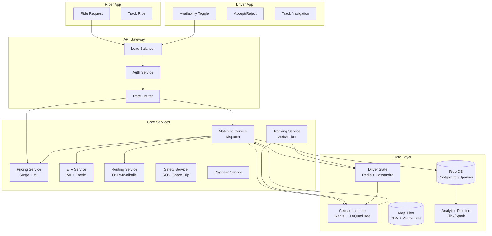
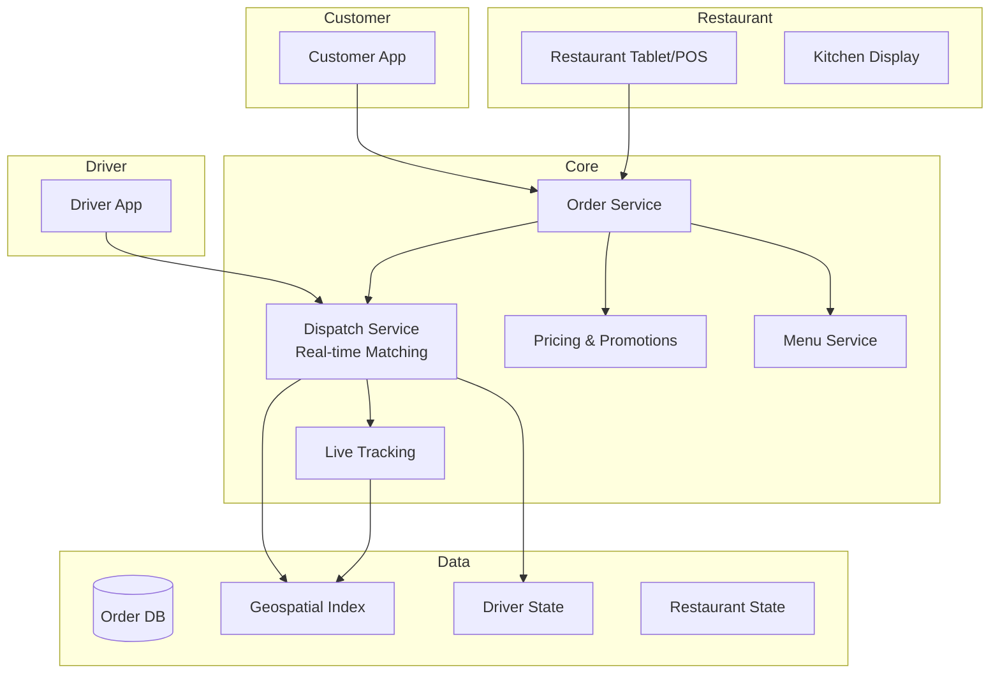

---
tags:
  - System-Design
  - FAANG
  - Ride-Sharing
  - Maps
  - Geospatial
  - Real-Time
  - Matching
aliases:
  - Ride Sharing Patterns
  - Uber Design
  - Maps Design
  - Geospatial Systems
---

# 🗺️ Ride Sharing & Maps Patterns

> **FAANG Questions:** Design Uber, Design Lyft, Design Google Maps, Design GPS Navigation, Design ETA Service, Design Nearby Friends, Design Food Delivery, Design DoorDash, Design Swiggy/Zomato

---

## 🎯 Pattern 1: Uber / Lyft — Ride Hailing Platform

### Problem Statement
Design a ride-hailing platform matching riders with drivers in real-time. 100M+ users, 15M+ trips/day, sub-second matching, global scale, dynamic pricing, safety.

### Requirements Clarification

| Functional | Non-Functional |
|------------|----------------|
| Request ride (pickup, dropoff, type) | Matching latency < 500ms |
| Driver matching & dispatch | Availability: 99.99% |
| Real-time tracking (rider + driver) | Consistency: Strong for matching |
| ETA calculation | Scalability: 1M+ concurrent rides |
| Dynamic pricing (surge) | Global: Multi-region |
| Payment, rating, safety | Fault tolerance |
| Driver onboarding, background check | Cost efficiency |

### High-Level Architecture



### Geospatial Indexing: **H3 (Hierarchical Hexagonal Grid)**

```python
# Uber's H3 Grid System
import h3

# Convert lat/lng to H3 cell at resolution 8 (~737m edge)
def latlng_to_h3(lat, lng, resolution=8):
    return h3.latlng_to_cell(lat, lng, resolution)

# Find nearby drivers within radius
def find_nearby_drivers(lat, lng, radius_km=5, resolution=8):
    # Get all H3 cells within radius
    origin = h3.latlng_to_cell(lat, lng, resolution)
    cells = h3.k_ring(origin, int(radius_km / h3.edge_length(resolution, unit='km')))
    
    # Query Redis for drivers in these cells
    driver_ids = []
    for cell in cells:
        drivers = redis.smembers(f"drivers:cell:{cell}")
        driver_ids.extend(drivers)
    return driver_ids

# Driver location update
def update_driver_location(driver_id, lat, lng, heading, resolution=8):
    old_cell = redis.get(f"driver:{driver_id}:cell")
    new_cell = h3.latlng_to_cell(lat, lng, resolution)
    
    if old_cell != new_cell:
        # Remove from old cell
        if old_cell:
            redis.srem(f"drivers:cell:{old_cell}", driver_id)
        # Add to new cell
        redis.sadd(f"drivers:cell:{new_cell}", driver_id)
        redis.set(f"driver:{driver_id}:cell", new_cell)
    
    # Update precise location
    redis.hset(f"driver:{driver_id}:location", mapping={
        "lat": lat, "lng": lng, "heading": heading,
        "updated_at": time.time()
    })
```

### Matching Algorithm: **Marketplace Optimization**

```python
# Supply-Demand Matching (Global Optimization)
class RideMatcher:
    def __init__(self):
        self.cost_matrix = None
    
    def match(self, requests, drivers):
        """
        requests: List[Request] - {id, pickup_lat, pickup_lng, dropoff_lat, dropoff_lng, ride_type}
        drivers: List[Driver] - {id, lat, lng, heading, ride_types, rating}
        
        Returns: List[Match] - {request_id, driver_id, score}
        """
        # 1. Filter eligible drivers (ride type, distance, availability)
        eligible = self.filter_eligible(requests, drivers)
        
        # 2. Build cost matrix (bipartite matching)
        # Cost = -(w1 * ETA + w2 * driver_rating + w3 * pickup_distance + w4 * surge)
        cost_matrix = self.build_cost_matrix(requests, eligible)
        
        # 3. Hungarian Algorithm / Kuhn-Munkres for optimal assignment
        matches = hungarian_algorithm(cost_matrix)
        
        # 4. Apply business constraints (max detour, min earnings)
        return self.apply_constraints(matches, requests, eligible)
    
    def filter_eligible(self, requests, drivers):
        eligible = {}
        for req in requests:
            nearby = find_nearby_drivers(req.pickup_lat, req.pickup_lng, radius_km=10)
            eligible[req.id] = [
                d for d in nearby 
                if d.ride_type in req.ride_types 
                and d.is_available
                and d.rating >= 4.0
            ]
        return eligible

# Real-time Matching (Event-driven)
async def on_ride_request(request):
    # 1. Immediate candidate retrieval from H3
    candidates = find_nearby_drivers(request.pickup_lat, request.pickup_lng, 5)
    
    # 2. Score candidates (parallel)
    scores = await asyncio.gather(*[
        score_driver(request, d) for d in candidates
    ])
    
    # 3. Select top N, offer sequentially
    top_drivers = sorted(zip(candidates, scores), key=lambda x: x[1], reverse=True)[:5]
    
    for driver, score in top_drivers:
        if await offer_ride(driver, request, timeout=15):
            return Match(request.id, driver.id)
    
    # Expand radius, retry
    return await expand_and_retry(request)

def score_driver(request, driver):
    w_eta, w_rating, w_dist, w_surge = 0.4, 0.2, 0.2, 0.2
    eta = calculate_eta(driver.lat, driver.lng, request.pickup_lat, request.pickup_lng)
    dist = haversine(driver.lat, driver.lng, request.pickup_lat, request.pickup_lng)
    surge = get_surge_multiplier(request.pickup_lat, request.pickup_lng)
    return w_eta * (1/eta) + w_rating * driver.rating + w_dist * (1/dist) + w_surge * surge
```

### Dynamic Pricing (Surge)

```python
# Surge Pricing: Supply-Demand Balance
def calculate_surge(zone_id, timestamp):
    # 1. Get supply (active drivers) and demand (requests) in zone
    supply = get_active_drivers_in_zone(zone_id)
    demand = get_pending_requests_in_zone(zone_id)
    
    # 2. Supply-demand ratio
    ratio = demand / max(supply, 1)
    
    # 3. Surge multiplier curve
    if ratio < 1.0:
        return 1.0
    elif ratio < 2.0:
        return 1.0 + (ratio - 1.0) * 0.5  # Linear
    elif ratio < 3.0:
        return 1.5 + (ratio - 2.0) * 0.75
    else:
        return min(2.25 + (ratio - 3.0) * 0.5, 5.0)  # Cap at 5x
    
    # Alternative: ML-based pricing (Uber's approach)
    # Features: historical demand, events, weather, time, traffic
    # Model: Gradient Boosted Trees predicting optimal multiplier
```

### ETA Service (ML-based)

```python
# ETA Prediction using Gradient Boosted Trees
class ETAModel:
    def __init__(self):
        self.model = joblib.load("eta_model.pkl")
    
    def predict(self, features):
        return self.model.predict(features)

# Features for ETA
class ETAServer:
    def get_eta(self, origin_lat, origin_lng, dest_lat, dest_lng, timestamp):
        # 1. Route from OSRM/Valhalla
        route = routing_service.get_route(origin_lat, origin_lng, dest_lat, dest_lng)
        
        # 2. Extract features
        features = {
            "distance_km": route.distance,
            "duration_base": route.duration,
            "num_turns": len(route.steps),
            "highway_ratio": route.highway_km / route.distance,
            "hour_of_day": timestamp.hour,
            "day_of_week": timestamp.weekday(),
            "is_holiday": is_holiday(timestamp),
            "weather": get_weather(origin_lat, origin_lng),
            "traffic_incidents": get_incidents_on_route(route),
            "historical_avg": get_historical_avg(origin, dest, timestamp),
        }
        
        # 3. Predict
        return self.model.predict([list(features.values())])[0]

# Real-time traffic integration
def get_realtime_traffic(route):
    # Aggregate from: 
    # - Probe data (anonymized driver GPS)
    # - Third-party (TomTom, HERE, Google)
    # - Government feeds
    # - Waze/Community reports
    pass
```

---

## 🎯 Pattern 2: Google Maps / Navigation — Map Rendering & Routing

### Problem Statement
Design a mapping platform with global coverage, turn-by-turn navigation, real-time traffic, Street View, places, transit. 1B+ users, planet-scale.

### Architecture

```mermaid
graph TB
    subgraph Data Ingestion
        Satellite[Satellite Imagery]
        StreetView[Street View Cars]
        Probes[Probe Data<br/>Anonymous GPS]
        Partners[Third-party Data<br/>TomTom, HERE, Gov]
        UserEdits[User Edits<br/>Local Guides]
    end
    
    subgraph Processing Pipeline
        ImageryProc[Imagery Processing<br/>Orthorectification, Mosaicking]
        Vectorization[Vectorization<br/>Road Network Extraction]
        Conflation[Conflation<br/>Merge Sources]
        GraphBuild[Graph Building<br/>Routing Graph]
        TrafficProc[Traffic Processing<br/>Speed Profiles]
    end
    
    subgraph Serving
        TileServer[Tile Server<br/>Vector Tiles (MVT)]
        RoutingEngine[Routing Engine<br/>Contraction Hierarchies]
        TrafficTile[Traffic Tiles<br/>Real-time Speeds]
        PlacesAPI[Places API<br/>Geocoding, Search]
        DirectionsAPI[Directions API]
    end
    
    subgraph Client
        MapApp[Maps App<br/>WebGL/Canvas]
        NavApp[Navigation<br/>Turn-by-turn]
    end
    
    Satellite --> ImageryProc
    StreetView --> ImageryProc
    Probes --> TrafficProc
    Partners --> Conflation
    UserEdits --> Conflation
    
    ImageryProc --> TileServer
    Conflation --> GraphBuild
    GraphBuild --> RoutingEngine
    TrafficProc --> TrafficTile
    Conflation --> PlacesAPI
    
    TileServer --> MapApp
    RoutingEngine --> NavApp
    TrafficTile --> NavApp
    PlacesAPI --> MapApp
```

### Vector Tiles (Mapbox Vector Tile - MVT)

```protobuf
// Vector Tile Structure (Protobuf)
message Tile {
  repeated Layer layers = 1;
}

message Layer {
  string name = 1;
  uint32 version = 2;
  repeated Feature features = 3;
  uint32 extent = 4;  // Default 4096
}

message Feature {
  uint64 id = 1;
  repeated uint32 tags = 2;  // Key-value pairs (indices into layer keys/values)
  enum GeomType {
    UNKNOWN = 0;
    POINT = 1;
    LINESTRING = 2;
    POLYGON = 3;
  }
  GeomType type = 3;
  repeated uint32 geometry = 4;  // Commands: MoveTo, LineTo, ClosePath
}
```

### Routing Algorithm: **Contraction Hierarchies (CH)**

```python
# Contraction Hierarchies for Fast Routing
# Preprocessing: Add shortcut edges to preserve shortest paths
# Query: Bidirectional Dijkstra on upward/downward graphs

class ContractionHierarchies:
    def __init__(self, graph):
        self.graph = graph
        self.node_order = []
        self.shortcuts = []
        self.upward_adj = defaultdict(list)
        self.downward_adj = defaultdict(list)
    
    def preprocess(self):
        # 1. Order nodes by importance (edge difference, contracted neighbors)
        order = self.compute_node_order()
        
        # 2. Contract nodes in order
        for node in order:
            self.contract_node(node)
        
        # 3. Build upward/downward adjacency
        self.build_search_graph()
    
    def contract_node(self, v):
        # Find all pairs of incoming/outgoing edges
        incoming = [(u, w) for u, w in self.graph.in_edges(v)]
        outgoing = [(w, x) for w, x in self.graph.out_edges(v)]
        
        # Add shortcuts for all pairs
        for u, _ in incoming:
            for _, x in outgoing:
                # Check if shortcut is necessary (witness path)
                if not self.has_witness_path(u, x, v):
                    self.add_shortcut(u, x, dist(u,v) + dist(v,x))
        
        # Remove v from graph
        self.graph.remove_node(v)
    
    def query(self, source, target):
        # Bidirectional Dijkstra on CH graph
        forward_dist = self.upward_dijkstra(source)
        backward_dist = self.downward_dijkstra(target)
        
        # Find meeting node with min distance
        best = inf
        for node in forward_dist:
            if node in backward_dist:
                best = min(best, forward_dist[node] + backward_dist[node])
        return best

# Alternative: A* with Landmarks (ALT) or Transit Node Routing
```

### Map Rendering (Client-side)

```javascript
// Vector Tile Rendering (MapLibre GL / Mapbox GL)
const map = new maplibregl.Map({
    container: 'map',
    style: {
        version: 8,
        sources: {
            osm: {
                type: 'vector',
                tiles: ['https://tiles.example.com/{z}/{x}/{y}.pbf'],
                minzoom: 0,
                maxzoom: 14
            }
        },
        layers: [
            {
                id: 'road',
                type: 'line',
                source: 'osm',
                'source-layer': 'roads',
                paint: {
                    'line-color': [
                        'match', ['get', 'class'],
                        'motorway', '#ff0000',
                        'trunk', '#ff7700',
                        'primary', '#ffff00',
                        '#ffffff'
                    ],
                    'line-width': [
                        'interpolate', ['linear'], ['zoom'],
                        8, 0.5, 12, 2, 16, 8
                    ]
                }
            },
            {
                id: 'building',
                type: 'fill-extrusion',
                source: 'osm',
                'source-layer': 'buildings',
                paint: {
                    'fill-extrusion-color': '#aaaaaa',
                    'fill-extrusion-height': ['get', 'height'],
                    'fill-extrusion-base': ['get', 'min_height']
                }
            }
        ]
    });
```

---

## 🎯 Pattern 3: Food Delivery (DoorDash/Uber Eats/Swiggy)

### Problem Statement
Design a three-sided marketplace (customers, restaurants, drivers). Real-time order tracking, dynamic dispatch, kitchen integration, ratings.

### Architecture



### Three-sided Matching

```python
# Order → Restaurant → Driver (Sequential with Parallel Optimization)
class FoodDeliveryMatcher:
    
    async def on_order_placed(self, order):
        # 1. Find nearby restaurants (already done at order time)
        restaurant = order.restaurant
        
        # 2. Estimate prep time (ML model)
        prep_time = self.predict_prep_time(restaurant, order.items, current_load)
        ready_time = now() + prep_time
        
        # 3. Find drivers near restaurant (ready at ready_time)
        drivers = await self.find_available_drivers(
            restaurant.lat, restaurant.lng,
            ready_time, 
            vehicle_type=order.vehicle_type
        )
        
        # 4. Dispatch with ETA to restaurant
        for driver in drivers[:3]:
            driver_eta = self.eta_service.get_eta(
                driver.lat, driver.lng,
                restaurant.lat, restaurant.lng
            )
            if await self.offer_order(driver, order, ready_time, driver_eta):
                return DispatchResult(driver, ready_time)
        
        # 5. Expand search
        return await self.expand_search(order)
    
    def predict_prep_time(self, restaurant, items, current_orders):
        # Features: item complexity, kitchen load, time of day, historical
        features = extract_features(restaurant, items, current_orders)
        return prep_model.predict(features)
```

### Restaurant Integration

```python
# POS Integration
class RestaurantIntegration:
    def __init__(self):
        self.pos_connectors = {
            "toast": ToastConnector(),
            "square": SquareConnector(),
            "clover": CloverConnector(),
            "generic": GenericWebhookConnector(),
        }
    
    def sync_menu(self, restaurant_id):
        connector = self.pos_connectors.get(restaurant.pos_type)
        menu = connector.fetch_menu(restaurant_id)
        self.menu_service.update_menu(restaurant_id, menu)
    
    def receive_order(self, restaurant_id, order):
        connector = self.pos_connectors.get(restaurant.pos_type)
        connector.push_order(restaurant_id, order)
    
    def order_status_webhook(self, restaurant_id, order_id, status):
        # Restaurant updates: confirmed, preparing, ready, picked_up
        self.order_service.update_status(order_id, status)
```

---

## 📊 Comparison Matrix

| System | Sides | Matching | Latency | Key Tech |
|--------|-------|----------|---------|----------|
| **Uber/Lyft** | 2-sided | Real-time marketplace | < 500ms | H3, Hungarian, ML pricing |
| **Google Maps** | N/A | CH Routing | < 100ms | Contraction Hierarchies, MVT |
| **DoorDash** | 3-sided | Sequential + Parallel | < 2s | ML prep time, geospatial |
| **Google Maps Nav** | N/A | CH + Traffic | < 100ms | CH, Traffic tiles |
| **DoorDash Dispatch** | 3-sided | Restaurant→Driver | < 1s | Geospatial, ML prep |

---

## 🎯 Common Interview Questions

| Question | Key Points |
|----------|------------|
| **How does Uber match riders to drivers in < 500ms?** | H3 grid for geospatial indexing, candidate retrieval, scoring, sequential offer |
| **How does Uber handle surge pricing?** | Supply-demand ratio per zone, ML model with features (events, weather, history) |
| **How does Google Maps compute routes so fast?** | Contraction Hierarchies (preprocessing adds shortcuts), bidirectional Dijkstra |
| **How does Google Maps handle real-time traffic?** | Probe data aggregation, speed profiles per road segment, traffic tiles |
| **How does DoorDash dispatch drivers?** | Restaurant prep time prediction → find drivers near restaurant at ready time |
| **Design a nearby friends feature** | H3/Geohash indexing, periodic location updates, privacy controls |
| **How does ETA prediction work?** | ML model (GBDT) with features: distance, traffic, weather, historical, turns |
| **How does Google Maps render vector tiles?** | MVT format, client-side WebGL rendering, style specification |

---

## 🏷️ Tags

```yaml
tags:
  - System-Design
  - FAANG
  - Ride-Sharing
  - Maps
  - Geospatial
  - Real-Time
  - Matching
  - Routing
  - H3
  - Contraction-Hierarchies
```