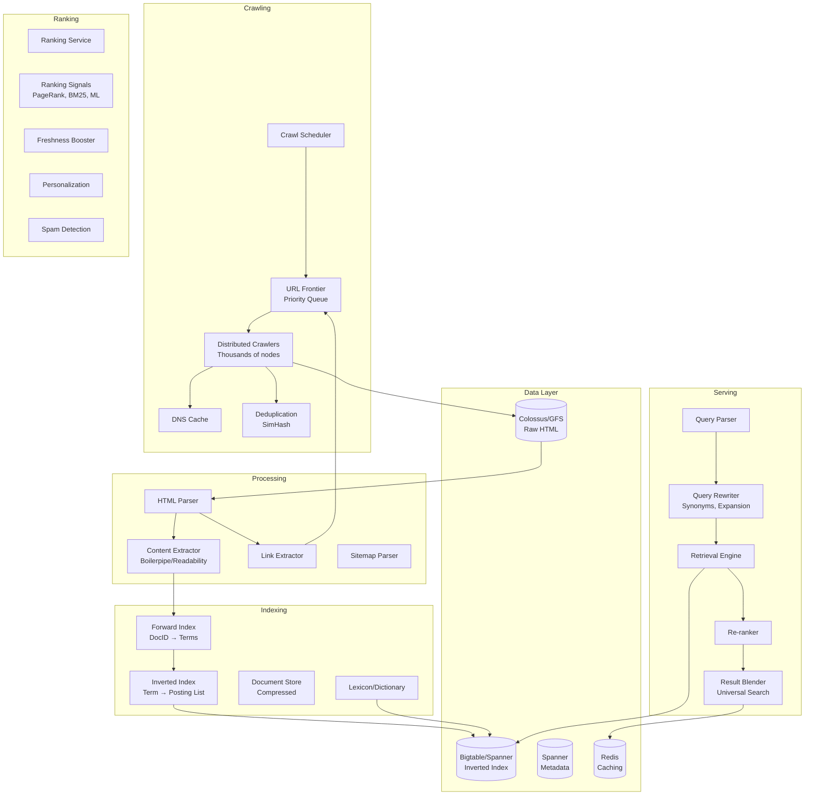
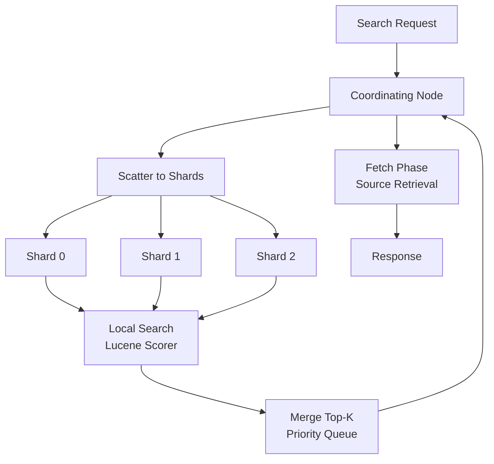
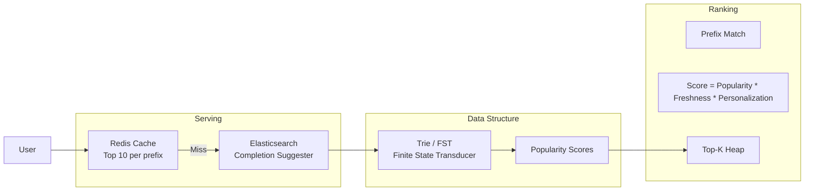
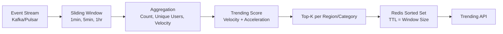

---
tags:
  - System-Design
  - FAANG
  - Search
  - Recommendation
  - Elasticsearch
  - Information-Retrieval
  - Machine-Learning
aliases:
  - Search Patterns
  - Recommendation Engine
  - Search System Design
---

# 🔍 Search & Recommendation Patterns

> **FAANG Questions:** Design Google Search, Design Elasticsearch, Design Autocomplete, Design Spell Checker, Design Recommendation Engine, Design Personalized Feed, Design Trending Topics, Design Product Search, Design News Ranking System

---

## 🎯 Pattern 1: Google Search — Web Search Engine

### Problem Statement
Design a web search engine that crawls billions of pages, indexes them, and returns relevant results in < 100ms. Handle 100K+ QPS, freshness (minutes), personalization, spam fighting.

### Requirements Clarification

| Functional | Non-Functional |
|------------|----------------|
| Crawl web pages | Latency < 100ms (p99) |
| Index content | Freshness: minutes for news, hours for web |
| Rank results (relevance, authority) | Availability: 99.99% |
| Spell correction | Scalability: 100B+ pages |
| Autocomplete/suggestions | Cost efficiency |
| SafeSearch filtering | Global distribution |

### High-Level Architecture



### Inverted Index Structure

```python
# Posting List Entry
class Posting:
    doc_id: int
    tf: int              # Term frequency in doc
    positions: List[int] # Position in doc (for phrase queries)
    fields: Dict[str, float]  # Title, body, anchor weights

# Inverted Index: Term → List[Posting] (sorted by doc_id)
# Compression: Varint encoding + Delta encoding + PForDelta

# Example: "machine learning"
inverted_index = {
    "machine": [
        Posting(doc_id=1, tf=3, positions=[5, 12, 45], fields={"title": 2.0, "body": 1.0}),
        Posting(doc_id=5, tf=1, positions=[10], fields={"body": 1.0}),
    ],
    "learning": [
        Posting(doc_id=1, tf=2, positions=[6, 13], fields={"title": 2.0, "body": 1.0}),
        Posting(doc_id=3, tf=5, positions=[2, 8, 15, 22, 30], fields={"body": 1.0}),
    ]
}
```

### Ranking Pipeline

```mermaid
graph LR
    subgraph Phase 1: Retrieval (Top 1000)
        Q[Query] --> R1[Term Matching<br/>BM25]
        R1 --> R2[Posting List Intersection<br/>DAAT/TAAT]
        R2 --> R3[Early Termination<br/>WAND/BMW]
    end
    
    subgraph Phase 2: Scoring (Top 100)
        R3 --> S1[Feature Extraction<br/>500+ signals]
        S1 --> S2[Lightweight Model<br/>Linear/GBDT]
        S2 --> S3[Top-K Selection]
    end
    
    subgraph Phase 3: Re-ranking (Top 10)
        S3 --> RR1[Heavy Model<br/>BERT/Transformer]
        RR1 --> RR2[Personalization]
        RR2 --> RR3[Diversification<br/>MMR]
        RR3 --> RR3[Blending<br/>News, Images, Videos]
```

### Ranking Signals

| Category | Signals | Weight |
|----------|---------|--------|
| **Text Relevance** | BM25, TF-IDF, Phrase Match, Proximity | High |
| **Authority** | PageRank, TrustRank, Domain Authority | High |
| **Freshness** | Recency, Query Deserves Freshness (QDF) | Medium |
| **User Behavior** | CTR, Dwell Time, Bounce Rate | High |
| **Quality** | Content Depth, Originality, E-E-A-T | Medium |
| **Personalization** | Location, Language, Search History | Medium |
| **Spam** | Link Spam, Content Spam, Cloaking | Penalty |

---

## 🎯 Pattern 2: Elasticsearch — Distributed Search Engine

### Problem Statement
Design a distributed, RESTful search and analytics engine. Real-time indexing, horizontal scaling, multi-tenancy, aggregations, log analytics.

### Architecture

```mermaid
graph TB
    subgraph Cluster Coordination
        Master[Master Nodes<br/>3-5, Raft]
        State[Cluster State<br/>Metadata]
    end
    
    subgraph Data Nodes
        Node1[Data Node 1<br/>Shards 0, 2, 4]
        Node2[Data Node 2<br/>Shards 1, 3, 5]
        Node3[Data Node 3<br/>Shards 0, 1, 2]
    end
    
    subgraph Shard Structure
        Index[Index]
        Shard0[Shard 0<br/>Primary]
        Shard0R[Shard 0<br/>Replica 1]
        Shard1[Shard 1<br/>Primary]
        Shard1R[Shard 1<br/>Replica 1]
    end
    
    subgraph Segments (Lucene)
        Seg1[Segment 1<br/>Immutable]
        Seg2[Segment 2<br/>Immutable]
        Seg3[Segment 3<br/>Merging]
    end
    
    Master --> State
    State --> Node1
    State --> Node2
    State --> Node3
    
    Index --> Shard0
    Index --> Shard1
    Shard0 --> Seg1
    Shard0 --> Seg2
    Shard1 --> Seg3
```

### Indexing Pipeline

```python
# Elasticsearch Write Path
def index_document(index, doc_id, document):
    # 1. Routing: Determine shard
    shard_id = hash(doc_id) % num_primary_shards
    
    # 2. Primary shard receives request
    primary = get_primary_shard(shard_id)
    
    # 3. Write to Lucene (memory buffer)
    primary.lucene_buffer.add(doc_id, document)
    
    # 4. Refresh (default 1s) → new segment visible
    # Flush (translog sync) → durability
    
    # 5. Replicate to replica shards (async)
    for replica in get_replicas(shard_id):
        replica.replicate(primary.get_operations())
    
    return {"_shards": {"successful": 1 + num_replicas}}

# Near Real-Time Search: refresh_interval (default 1s)
# Force refresh: POST /index/_refresh
```

### Query Execution



### Key Features Implementation

| Feature | Implementation |
|---------|----------------|
| **Full-text Search** | Lucene inverted index + BM25 |
| **Filtering** | DocValues (columnar) + Bitset caching |
| **Aggregations** | Map-Reduce on shards + global merge |
| **Geo Search** | BKD Trees / Quad Trees |
| **Suggesters** | FST (Finite State Transducer) for completion |
| **Percolator** | Reverse search (queries as docs) |

---

## 🎯 Pattern 3: Autocomplete & Spell Checker

### Autocomplete (Type-ahead)



```python
# FST-based Autocomplete (Space-efficient)
class AutocompleteFST:
    def __init__(self):
        self.fst = fst.Builder()  # Minimal perfect hash
        self.weights = {}  # term → weight
    
    def build(self, queries: List[Tuple[str, int]]):
        """queries = [("machine learning", 10000), ("machine learning course", 5000)]"""
        for query, weight in sorted(queries, key=lambda x: x[0]):
            self.fst.add(query, weight)
        self.fst.finish()
    
    def search(self, prefix: str, k: int = 10) -> List[str]:
        node = self.fst.get_node(prefix)
        if not node: return []
        return self._top_k_suggestions(node, k)

# Spell Checker: Symmetric Delete + Edit Distance
class SpellChecker:
    def __init__(self, dictionary: List[str], max_edit_distance: int = 2):
        self.dict = set(dictionary)
        self.deletes = defaultdict(set)
        for word in dictionary:
            for i in range(1, max_edit_distance + 1):
                for variant in self._generate_deletes(word, i):
                    self.deletes[variant].add(word)
    
    def correct(self, word: str, max_dist: int = 2) -> List[str]:
        if word in self.dict: return [word]
        candidates = self.deletes.get(word, set())
        return sorted(candidates, key=lambda w: edit_distance(word, w))[:5]
```

---

## 🎯 Pattern 4: Recommendation Engine — Personalized Feed

### Problem Statement
Design a recommendation system for content discovery (YouTube, Netflix, TikTok, Amazon). Billions of users, millions of items, real-time personalization, cold-start handling.

### Architecture: **Two-Tower + Retrieval + Ranking**

```mermaid
graph TB
    subgraph Offline Training
        Logs[User Logs<br/>Implicit/Explicit]
        Features[Feature Engineering]
        Train[Training Pipeline<br/>TF/PyTorch]
        Model[Model Registry]
    end
    
    subgraph Online Serving
        subgraph Retrieval (Candidate Generation)
            UserTower[User Tower<br/>Embedding]
            ItemTower[Item Tower<br/>Embedding]
            ANN[ANN Index<br/>ScaNN/FAISS/HNSW]
            Candidates[Top 1000 Candidates]
        end
        
        subgraph Ranking
            Ranker[Ranking Model<br/>DeepFM/DCMT/Wide&Deep]
            Features[Real-time Features]
            Scored[Scored Items]
        end
        
        subgraph Post-Ranking
            Diversify[MMR Diversity]
            Business[Business Rules]
            Final[Final Top-K]
        end
    end
    
    Logs --> Features
    Features --> Train
    Train --> Model
    Model --> UserTower
    Model --> ItemTower
    Model --> Ranker
    
    ItemTower --> ANN
    UserTower --> ANN
    ANN --> Candidates
    Candidates --> Ranker
    Ranker --> Features
    Features --> Scored
    Scored --> Diversify
    Diversify --> Business
    Business --> Final
```

### Two-Tower Model (Retrieval)

```python
class TwoTowerModel(nn.Module):
    def __init__(self, user_dim, item_dim, embed_dim=128):
        super().__init__()
        self.user_tower = nn.Sequential(
            nn.Linear(user_dim, 512), nn.ReLU(),
            nn.Linear(512, 256), nn.ReLU(),
            nn.Linear(256, embed_dim)
        )
        self.item_tower = nn.Sequential(
            nn.Linear(item_dim, 512), nn.ReLU(),
            nn.Linear(512, 256), nn.ReLU(),
            nn.Linear(256, embed_dim)
        )
    
    def forward(self, user_feats, item_feats):
        user_emb = F.normalize(self.user_tower(user_feats), dim=1)
        item_emb = F.normalize(self.item_tower(item_feats), dim=1)
        return (user_emb * item_emb).sum(dim=1)  # Dot product = cosine similarity

# Training: In-batch negatives + sampled softmax
# Loss: Cross-entropy with in-batch negatives
```

### ANN Index (ScaNN/FAISS)

```python
# ScaNN (Scalable Nearest Neighbors) - Google's ANN
import scann

def build_ann_index(item_embeddings: np.ndarray, num_leaves=1000):
    """Build ScaNN index for fast approximate nearest neighbor search"""
    searcher = scann.scann_ops_pybind.builder(
        item_embeddings, 10, "dot_product"
    ).tree(
        num_leaves=num_leaves,
        num_leaves_to_search=100,
        training_sample_size=250000
    ).score_ah(
        dimensions_per_block=2,
        anisotropic_quantization_threshold=0.2
    ).reorder(100).build()
    return searcher

# Query: searcher.search_batched(user_embeddings, final_num_neighbors=1000)
```

### Ranking Model (DeepFM)

```python
class DeepFMRanker(nn.Module):
    """Wide & Deep + Factorization Machines"""
    def __init__(self, sparse_features, dense_features, embed_dim=16):
        super().__init__()
        # FM Layer (2nd order interactions)
        self.fm_embeddings = nn.ModuleDict({
            feat: nn.Embedding(vocab_size, embed_dim)
            for feat, vocab_size in sparse_features.items()
        })
        
        # Deep Layer
        deep_input_dim = len(sparse_features) * embed_dim + len(dense_features)
        self.deep = nn.Sequential(
            nn.Linear(deep_input_dim, 512), nn.ReLU(), nn.BatchNorm1d(512),
            nn.Linear(512, 256), nn.ReLU(), nn.BatchNorm1d(256),
            nn.Linear(256, 128), nn.ReLU(),
            nn.Linear(128, 1)
        )
    
    def forward(self, sparse_x, dense_x):
        # FM Part
        fm_embs = [emb(sparse_x[:, i]) for i, emb in enumerate(self.fm_embeddings.values())]
        fm_out = 0.5 * (sum(fm_embs).pow(2).sum(1) - sum(e.pow(2).sum(1) for e in fm_embs))
        
        # Deep Part
        deep_in = torch.cat([*fm_embs, dense_x], dim=1)
        deep_out = self.deep(deep_in)
        
        return torch.sigmoid(fm_out + deep_out)
```

---

## 🎯 Pattern 5: Trending Topics & Real-time Analytics

### Architecture: **Streaming + Windowed Aggregation**



```python
# Trending Score: Velocity + Acceleration (Twitter-style)
def trending_score(current_count, prev_count, window_hours=1):
    """Score = velocity + acceleration_factor * acceleration"""
    velocity = current_count / window_hours
    acceleration = max(0, (current_count - prev_count) / window_hours)
    return velocity + 2.0 * acceleration

# Sliding Window Aggregation (Flink/Spark Streaming)
def trending_pipeline(events_stream):
    return (events_stream
        .key_by(lambda e: (e.topic, e.region))
        .window(SlidingEventTimeWindows.of(Time.hours(1), Time.minutes(5)))
        .aggregate(CountAggregator())
        .map(calculate_trending_score)
        .key_by(lambda x: x.region)
        .window(TumblingEventTimeWindows.of(Time.minutes(5)))
        .process(TopKPerRegion(50))
        .sink_to(redis_sorted_set_sink))
```

---

## 🎯 Pattern 6: Product Search (Amazon/E-commerce)

### Architecture: **Semantic Search + Filtering + Personalization**

```mermaid
graph TB
    subgraph Indexing
        Catalog[Product Catalog] --> Attr[Attribute Extraction]
        Attr --> Text[Text Embeddings<br/>CLIP/Sentence-BERT]
        Attr --> Struct[Structured Attributes<br/>Color, Size, Brand]
        Text --> VecIdx[Vector Index<br/>HNSW]
        Struct --> AttrIdx[Attribute Index<br/>Inverted/Forward]
    end
    
    subgraph Query
        Query[User Query] --> NLP[NLP Pipeline<br/>Intent, Entities]
        NLP --> Semantic[Semantic Search<br/>VecIdx]
        NLP --> Filter[Structured Filters<br/>AttrIdx]
        Semantic --> Fusion[Score Fusion<br/>BM25 + Semantic + Personal]
        Filter --> Fusion
        Fusion --> Rank[Ranking Model<br/>CTR, Conversion, Margin]
        Rank --> Results
    end
```

### Hybrid Search: **Lexical + Semantic**

```python
def hybrid_search(query, filters, user_id, top_k=50):
    # 1. Lexical Search (BM25 on title/description)
    lexical_results = bm25_search(query, filters, top_k * 3)
    
    # 2. Semantic Search (Vector similarity)
    query_emb = embedder.encode(query)
    semantic_results = vector_index.search(query_emb, top_k * 3)
    
    # 3. Reciprocal Rank Fusion (RRF)
    def rrf_score(rank, k=60):
        return 1.0 / (k + rank)
    
    fused = {}
    for i, doc in enumerate(lexical_results):
        fused[doc.id] = fused.get(doc.id, 0) + rrf_score(i)
    for i, doc in enumerate(semantic_results):
        fused[doc.id] = fused.get(doc.id, 0) + rrf_score(i)
    
    # 4. Re-rank with ML model
    candidates = sorted(fused.items(), key=lambda x: x[1], reverse=True)[:top_k]
    final_scores = ranker.predict([doc for doc, _ in candidates], user_id)
    
    return sorted(zip(candidates, final_scores), key=lambda x: x[1], reverse=True)
```

---

## 📊 Comparison Matrix

| System | Scale | Index Type | Ranking | Freshness | Key Tech |
|--------|-------|------------|---------|-----------|----------|
| **Google Search** | 100B+ pages | Inverted + Forward | Multi-phase ML | Minutes | Bigtable, Spanner, Borg |
| **Elasticsearch** | 10B+ docs | Inverted (Lucene) | BM25 + Script | 1s (refresh) | Lucene, FST, BKD |
| **YouTube Recs** | 5B videos | Two-Tower + ANN | DeepFM/DCN | Seconds | ScaNN, TF |
| **Amazon Search** | 350M products | Hybrid (Lexical+Sem) | LambdaMART | Near-real-time | OpenSearch, SageMaker |
| **TikTok FYP** | 1M videos | Two-Tower + ANN | DeepFM | Real-time | FAISS, Flink |
| **Netflix Recs** | 15K titles | Matrix Factorization | A/B tested | Batch + Online | Spark, Custom |

---

## 🎯 Common Interview Questions

| Question | Key Points |
|----------|------------|
| **How does Google Search handle 100K QPS?** | Sharded inverted index, early termination (WAND), multi-phase ranking, heavy caching |
| **How does Elasticsearch achieve real-time search?** | Refresh interval (1s) creates new Lucene segments, translog for durability |
| **Design Autocomplete for Google** | FST/Trie for prefix, popularity + personalization, cache top-K per prefix |
| **How does YouTube recommendation work?** | Two-Tower retrieval (ScaNN) → DeepFM ranking → MMR diversification |
| **How does Elasticsearch handle aggregations?** | DocValues (columnar) + map-reduce on shards + coordinating node merge |
| **Design a Spell Checker** | Symmetric delete + edit distance, or Transformer-based (BERT) |
| **How to handle cold-start in recommendations?** | Content-based (item features), popularity, demographic, explore-exploit |
| **Design Trending Topics for Twitter** | Sliding window counts, velocity + acceleration, geo-sharding |

---

## 🏷️ Tags

```yaml
tags:
  - System-Design
  - FAANG
  - Search
  - Recommendation
  - Elasticsearch
  - Information-Retrieval
  - Machine-Learning
  - Two-Tower
  - ANN
  - Ranking
```