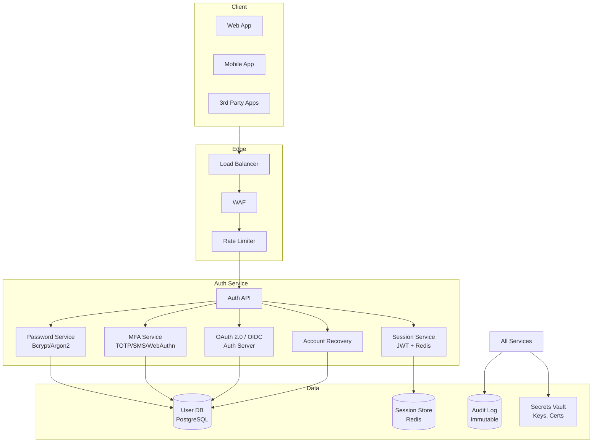
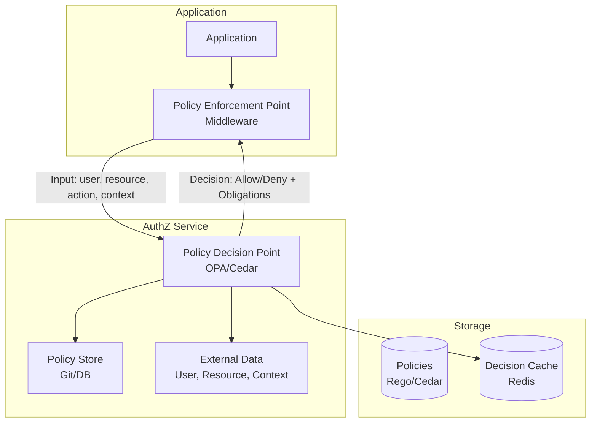
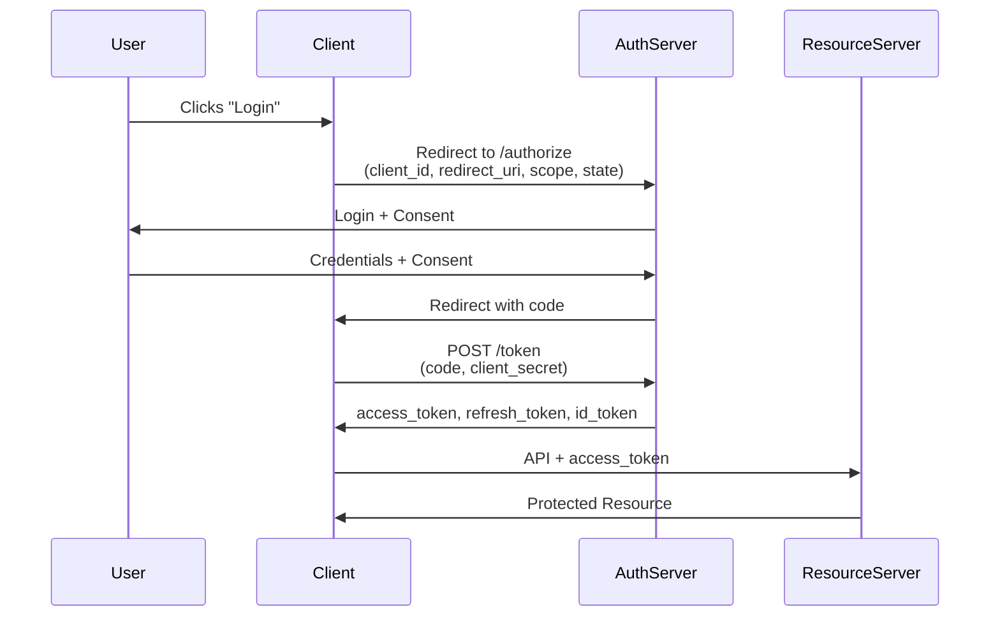
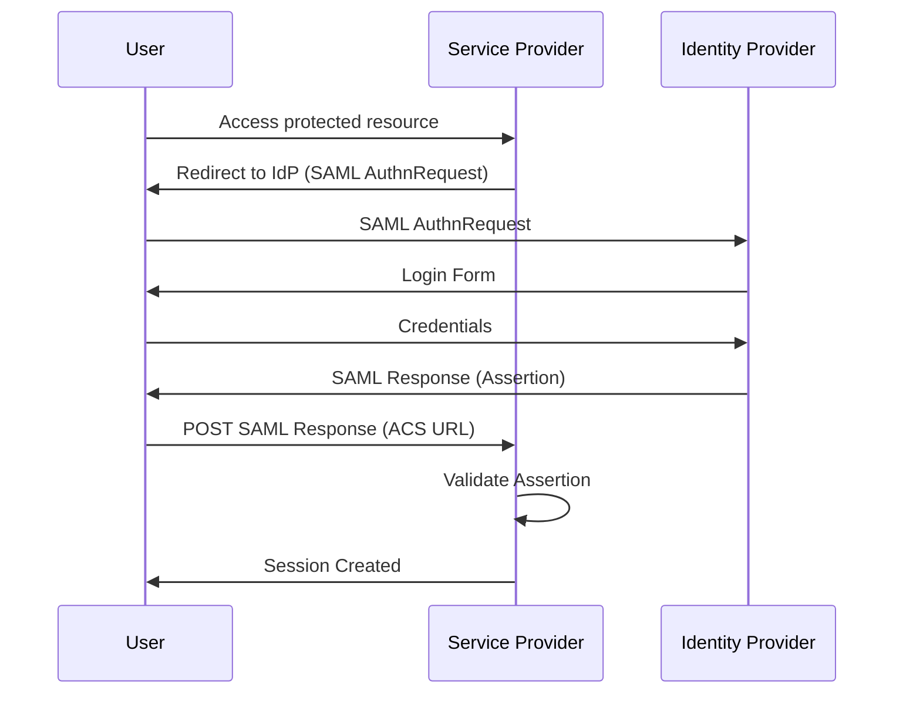

---
tags:
  - System-Design
  - FAANG
  - Security
  - Authentication
  - Authorization
  - OAuth
  - SSO
  - Fraud-Detection
  - Rate-Limiting
aliases:
  - Security Patterns
  - Auth Patterns
  - OAuth Design
---

# 🔐 Security Patterns

> **FAANG Questions:** Design Authentication System, Design Authorization Service, Design OAuth Server, Design Single Sign-On (SSO), Design Password Manager, Design Fraud Detection, Design API Rate Limiting, Design CAPTCHA Service

---

## 🎯 Pattern 1: Authentication System — Identity & Access Management

### Problem Statement
Design an authentication system handling user registration, login, MFA, passwordless auth, session management, token refresh, and account recovery for 100M+ users.

### Requirements Clarification

| Functional | Non-Functional |
|------------|----------------|
| Register, login, logout | Latency: < 100ms (auth) |
| Passwordless (magic link, OTP, WebAuthn) | Availability: 99.99% |
| Multi-factor auth (TOTP, SMS, push) | Security: Brute-force resistant |
| Session management (JWT, refresh tokens) | Scalability: 10M+ concurrent |
| OAuth 2.0 / OIDC provider | Audit: Full trail |
| Account recovery | Compliance: GDPR, SOC2 |

### Architecture



### Passwordless Authentication (WebAuthn/FIDO2)

```python
# WebAuthn Registration (Passkey)
class WebAuthnService:
    def __init__(self, rp_id, rp_name, origin):
        self.rp_id = rp_id
        self.rp_name = rp_name
        self.origin = origin
    
    def begin_registration(self, user_id, username):
        # 1. Generate challenge
        challenge = secrets.token_bytes(32)
        
        # 2. Create credential creation options
        options = {
            "publicKey": {
                "rp": {"name": self.rp_name, "id": self.rp_id},
                "user": {
                    "id": base64.urlsafe_b64encode(user_id.to_bytes(16, 'big')),
                    "name": username,
                    "displayName": username
                },
                "challenge": base64.urlsafe_b64encode(challenge).decode(),
                "pubKeyCredParams": [
                    {"type": "public-key", "alg": -7},   # ES256
                    {"type": "public-key", "alg": -257}  # RS256
                ],
                "authenticatorSelection": {
                    "authenticatorAttachment": "platform",
                    "userVerification": "required",
                    "residentKey": "preferred"
                },
                "timeout": 60000,
                "attestation": "direct"
            }
        }
        
        # Store challenge for verification
        redis.setex(f"webauthn:challenge:{user_id}", 300, challenge)
        
        return options
    
    def verify_registration(self, user_id, credential):
        # 1. Verify challenge
        stored_challenge = redis.get(f"webauthn:challenge:{user_id}")
        if not stored_challenge or stored_challenge != credential['response']['clientDataJSON']['challenge']:
            raise VerificationFailed()
        
        # 2. Verify attestation
        attestation = credential['response']['attestationObject']
        credential_id = credential['id']
        public_key = self.extract_public_key(attestation)
        
        # 3. Store credential
        self.store_credential(user_id, credential_id, public_key)
        
        return True

# WebAuthn Authentication
    def begin_authentication(self, user_id):
        challenge = secrets.token_bytes(32)
        credentials = self.get_user_credentials(user_id)
        
        options = {
            "publicKey": {
                "challenge": base64.urlsafe_b64encode(challenge).decode(),
                "allowCredentials": [
                    {"type": "public-key", "id": cred_id}
                    for cred_id in credentials
                ],
                "userVerification": "preferred",
                "timeout": 60000
            }
        }
        redis.setex(f"webauthn:auth_challenge:{user_id}", 300, challenge)
        return options
    
    def verify_authentication(self, user_id, credential):
        # Verify signature, counter, user presence
        pass
```

### JWT Token Management

```python
class TokenService:
    def __init__(self, private_key, public_key, access_ttl=900, refresh_ttl=604800):
        self.private_key = private_key
        self.public_key = public_key
        self.access_ttl = access_ttl
        self.refresh_ttl = refresh_ttl
    
    def create_tokens(self, user_id, roles, session_id):
        now = datetime.utcnow()
        
        # Access Token (short-lived)
        access_payload = {
            "sub": str(user_id),
            "sid": session_id,
            "roles": roles,
            "type": "access",
            "iat": now,
            "exp": now + timedelta(seconds=self.access_ttl)
        }
        access_token = jwt.encode(access_payload, self.private_key, algorithm="RS256")
        
        # Refresh Token (long-lived, stored in DB)
        refresh_payload = {
            "sub": str(user_id),
            "sid": session_id,
            "type": "refresh",
            "iat": now,
            "exp": now + timedelta(seconds=self.refresh_ttl)
        }
        refresh_token = jwt.encode(refresh_payload, self.private_key, algorithm="RS256")
        
        # Store refresh token hash
        refresh_hash = hashlib.sha256(refresh_token.encode()).hexdigest()
        redis.setex(f"refresh_token:{refresh_hash}", self.refresh_ttl, json.dumps({
            "user_id": user_id,
            "session_id": session_id,
            "created_at": now.isoformat()
        }))
        
        return {"access_token": access_token, "refresh_token": refresh_token}
    
    def refresh_access_token(self, refresh_token):
        # 1. Decode and verify
        try:
            payload = jwt.decode(refresh_token, self.public_key, algorithms=["RS256"])
        except jwt.InvalidTokenError:
            raise InvalidTokenError()
        
        if payload["type"] != "refresh":
            raise InvalidTokenError()
        
        # 2. Check if refresh token exists and valid
        refresh_hash = hashlib.sha256(refresh_token.encode()).hexdigest()
        stored = redis.get(f"refresh_token:{refresh_hash}")
        if not stored:
            raise TokenRevokedError()
        
        stored_data = json.loads(stored)
        
        # 3. Create new token pair (rotate refresh token)
        return self.create_tokens(
            payload["sub"], 
            payload.get("roles", []), 
            payload["sid"]
        )
    
    def revoke_session(self, session_id):
        # Invalidate all tokens for session
        redis.delete(f"session:{session_id}")
        # Could also maintain blocklist for access tokens
```

---

## 🎯 Pattern 2: Authorization Service — RBAC / ABAC / ReBAC

### Architecture: **Policy Decision Point (PDP) + Policy Enforcement Point (PEP)**



### OPA (Open Policy Agent) with Rego

```rego
# RBAC Policy
package authz

# Default deny
default allow = false

# Allow if user has required role
allow {
    input.action == "read"
    has_role(input.user, "viewer")
}

allow {
    input.action == "write"
    has_role(input.user, "editor")
}

allow {
    input.action == "delete"
    has_role(input.user, "admin")
}

# Role hierarchy
has_role(user, role) {
    user_roles := data.roles[user]
    role in user_roles
}

has_role(user, "admin") {
    user_roles := data.roles[user]
    "admin" in user_roles
}

# ABAC: Resource-based access
allow {
    input.action == "read"
    input.resource.owner == input.user.id
}

allow {
    input.action == "write"
    input.resource.project_id == input.user.project_id
    input.user.role == "member"
}

# Context-aware (time, IP, MFA)
allow {
    input.action == "admin"
    data.mfa_verified[input.user.id] == true
    time.hour >= 9
    time.hour <= 17
}

# Resource-based access control (ReBAC)
allow {
    input.action == "read"
    related(input.user, input.resource, "viewer")
}

related(user, resource, relation) {
    tuple := data.relationships[_]
    tuple.user == user
    tuple.resource == resource
    tuple.relation == relation
}

# Transitive relations (groups, orgs)
related(user, resource, "viewer") {
    related(user, group, "member")
    related(group, resource, "viewer")
}
```

```python
# OPA Client
class AuthorizationClient:
    def __init__(self, opa_url):
        self.opa_url = opa_url
    
    async def authorize(self, user, resource, action, context):
        input_data = {
            "user": user,
            "resource": resource,
            "action": action,
            "context": context
        }
        
        # Check cache first
        cache_key = f"authz:{hashlib.sha256(json.dumps(input_data).encode()).hexdigest()}"
        cached = await redis.get(cache_key)
        if cached:
            return json.loads(cached)
        
        # Query OPA
        response = await httpx.post(
            f"{self.opa_url}/v1/data/authz/allow",
            json={"input": input_data}
        )
        
        result = response.json()["result"]
        
        # Cache decision
        await redis.setex(f"authz:cache:{hash}", 300, json.dumps(result))
        
        return result
```

---

## 🎯 Pattern 3: OAuth 2.0 / OIDC Server

### Flows



```python
# OAuth 2.0 Authorization Server
class OAuthServer:
    def __init__(self, token_service, client_store, auth_code_store):
        self.token_service = token_service
        self.clients = client_store
        self.auth_codes = auth_code_store
    
    async def authorize(self, client_id, redirect_uri, scope, state, response_type, user_id):
        # 1. Validate client
        client = await self.clients.get(client_id)
        if not client or client.redirect_uri != redirect_uri:
            raise InvalidClientError()
        
        if response_type != "code":
            raise UnsupportedResponseTypeError()
        
        # 2. Generate auth code
        auth_code = secrets.token_urlsafe(32)
        await self.auth_codes.set(auth_code, {
            "client_id": client_id,
            "user_id": user_id,
            "redirect_uri": redirect_uri,
            "scope": scope,
            "expires_at": time.time() + 600
        })
        
        # 3. Redirect
        redirect = f"{redirect_uri}?code={auth_code}&state={state}"
        return RedirectResponse(redirect)
    
    async def token(self, grant_type, code, client_id, client_secret, redirect_uri):
        # 1. Validate client
        client = await self.clients.get(client_id)
        if not client or client.secret != client_secret:
            raise InvalidClientError()
        
        if grant_type == "authorization_code":
            # Validate auth code
            auth_data = await self.auth_codes.get(code)
            if not auth_data or auth_data["client_id"] != client_id:
                raise InvalidGrantError()
            if auth_data["redirect_uri"] != redirect_uri:
                raise InvalidGrantError()
            if auth_data["expires_at"] < time.time():
                raise InvalidGrantError()
            
            # Generate tokens
            tokens = self.token_service.create_tokens(
                auth_data["user_id"],
                auth_data["scope"].split(),
                session_id=secrets.token_urlsafe(16)
            )
            
            # Delete used auth code
            await self.auth_codes.delete(code)
            
            return tokens
        
        elif grant_type == "refresh_token":
            return self.token_service.refresh_access_token(code)
        
        raise UnsupportedGrantTypeError()
```

---

## 🎯 Pattern 4: Single Sign-On (SSO) — SAML / OIDC

### SAML 2.0 Flow



---

## 🎯 Pattern 4: Fraud Detection & Rate Limiting (Already in distributed-systems.md)

### Advanced Fraud Detection

```python
class FraudDetectionEngine:
    def __init__(self, ml_model, feature_store, rule_engine):
        self.ml_model = ml_model
        self.features = feature_store
        self.rules = rule_engine
    
    async def assess(self, transaction, user_profile):
        # 1. Real-time rules (fast)
        rule_result = self.rules.evaluate(transaction, user_profile)
        
        if rule_result.block:
            return FraudDecision.BLOCK, rule_result.reasons
        
        # 2. Feature extraction
        features = await self.extract_features(transaction, user_profile)
        
        # 2. ML scoring
        fraud_score = self.ml_model.predict_proba(features)[1]
        
        # 3. Decision
        if fraud_score > 0.95:
            return FraudDecision.BLOCK, ["high_fraud_score"]
        elif fraud_score > 0.8:
            return FraudDecision.CHALLENGE_3DS, ["elevated_risk"]
        elif fraud_score > 0.6:
            return FraudDecision.REVIEW, ["review_required"]
        
        return FraudDecision.APPROVE, []
    
    async def extract_features(self, txn, profile):
        return {
            "amount": txn.amount,
            "amount_zscore": (txn.amount - profile.avg_amount) / max(profile.std_amount, 1),
            "velocity_1h": await self.get_velocity(profile.user_id, "1h"),
            "velocity_24h": await self.get_velocity(profile.user_id, "24h"),
            "new_device": txn.device_fingerprint not in profile.known_devices,
            "new_location": txn.location not in profile.known_locations,
            "time_since_last_txn": time.time() - profile.last_txn_time,
            "mfa_verified": profile.mfa_verified,
            "account_age_days": (time.time() - profile.created_at) / 86400,
        }

# CAPTCHA Service
class CaptchaService:
    def __init__(self, provider="hcaptcha"):
        self.provider = provider
    
    async def generate_challenge(self, user_id):
        # Generate challenge
        challenge_id = secrets.token_urlsafe(16)
        challenge_data = self.generate_challenge_data()
        
        # Store with TTL
        await redis.setex(f"captcha:{challenge_id}", 300, json.dumps({
            "answer": challenge_data["answer"],
            "user_id": user_id
        }))
        
        return {"challenge_id": challenge_id, "challenge": challenge_data["challenge"]}
    
    async def verify(self, challenge_id, user_response):
        data = await redis.get(f"captcha:{challenge_id}")
        if not data:
            return False
        
        data = json.loads(data)
        verified = self.verify_response(data["answer"], user_response)
        
        if verified:
            await redis.delete(f"captcha:{challenge_id}")
        
        return verified
```

---

## 📊 Comparison Matrix

| Pattern | Security Level | Complexity | Latency | Use Case |
|---------|----------------|------------|---------|----------|
| **JWT + Refresh** | Medium | Low | <10ms | Stateless auth |
| **Session/Cookie** | High | Medium | <5ms | Traditional web |
| **WebAuthn/Passkeys** | Very High | High | ~100ms | High-security |
| **OAuth 2.0/OIDC** | High | Medium | ~50ms | 3rd party access |
| **SAML SSO** | High | High | ~100ms | Enterprise |
| **OPA/Rego** | High | Medium | <10ms | Fine-grained authZ |
| **Fraud ML** | Very High | High | ~50ms | Payments, login |

---

## 🎯 Common Interview Questions

| Question | Key Points |
|----------|------------|
| **How to implement JWT securely?** | RS256, short expiry, refresh rotation, secure storage, revocation |
| **Difference between OAuth 2.0 and OIDC?** | OAuth: authorization; OIDC: authentication + identity token |
| **How to implement SSO?** | SAML/OIDC, IdP-initiated vs SP-initiated, metadata exchange |
| **How to prevent brute force?** | Rate limiting, account lockout, CAPTCHA, exponential backoff |
| **How to implement MFA?** | TOTP (RFC 6238), WebAuthn, push notifications, backup codes |
| **How to revoke JWT tokens?** | Short expiry, refresh token rotation, blocklist, token versioning |
| **How does WebAuthn work?** | Public key crypto, challenge-response, origin binding, attestation |
| **How to design rate limiting for auth endpoints?** | Per-IP, per-user, adaptive, CAPTCHA after N failures |

---

## 🏷️ Tags

```yaml
tags:
  - System-Design
  - FAANG
  - Security
  - Authentication
  - Authorization
  - OAuth
  - SSO
  - Fraud-Detection
  - Rate-Limiting
  - WebAuthn
  - MFA
```