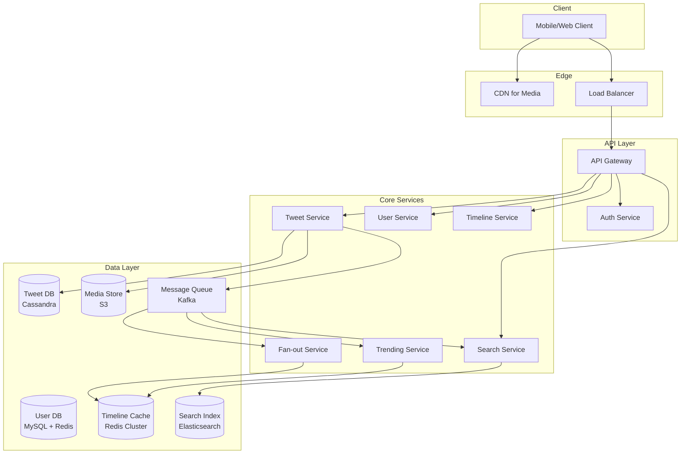
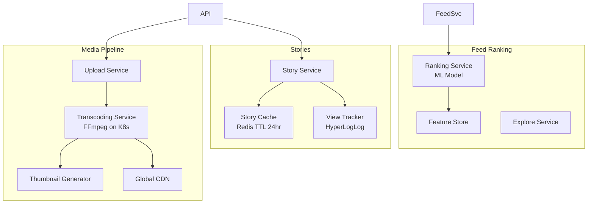
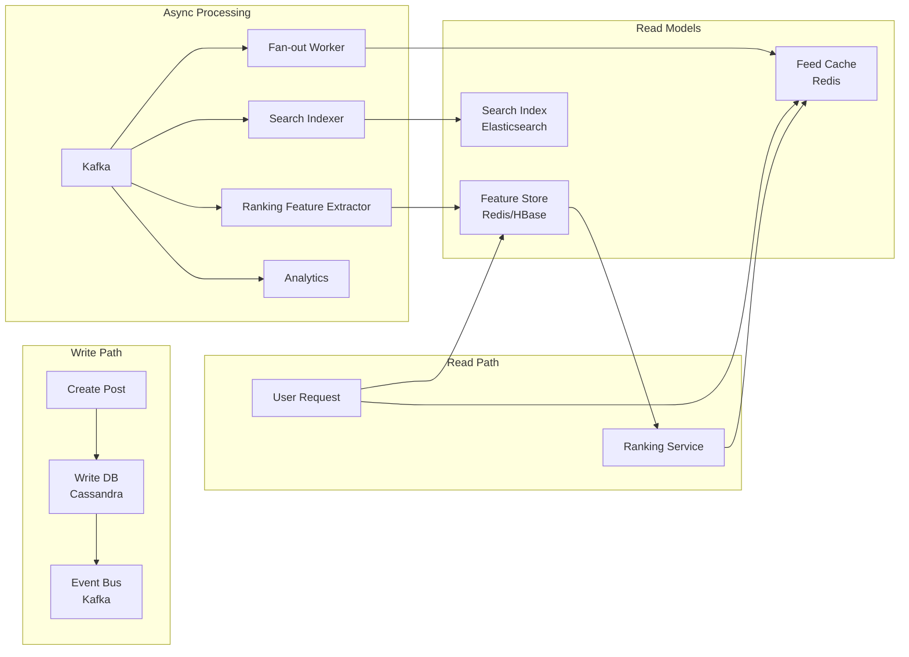
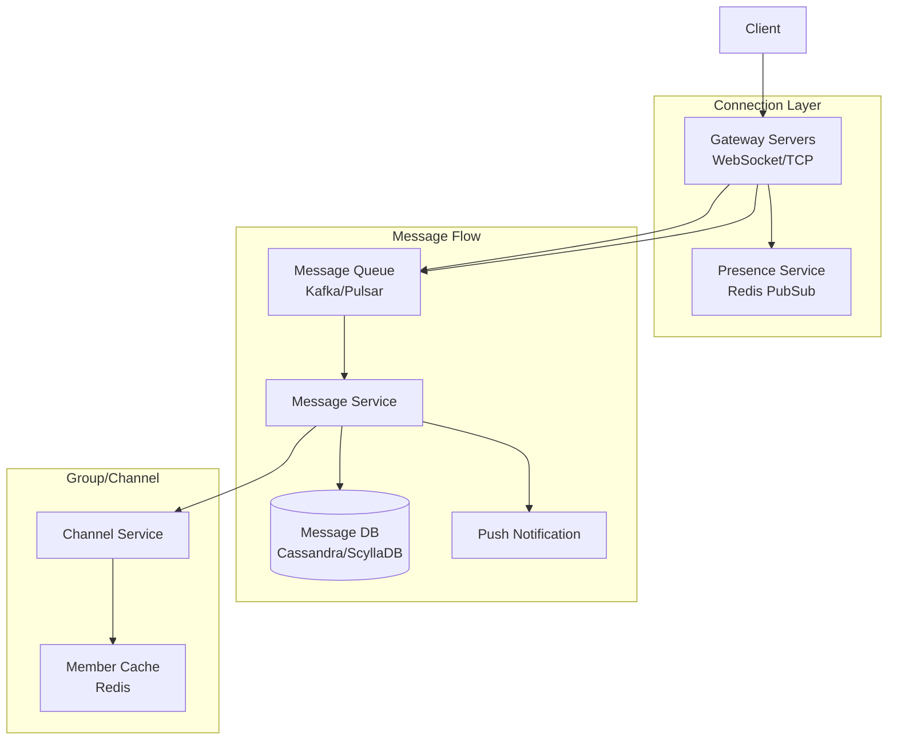
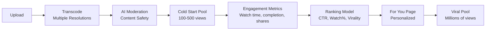

---
tags:
  - System-Design
  - FAANG
  - Social-Media
  - Twitter
  - Instagram
  - News-Feed
  - Distributed-Systems
aliases:
  - Social Media Patterns
  - Twitter Design
  - Instagram Design
  - Feed Design
---

# 📱 Social Media & Communication Patterns

> **FAANG Questions:** Design Twitter/X, Design Instagram, Design Facebook News Feed, Design WhatsApp, Design Slack, Design Discord, Design Reddit, Design TikTok, Design Snapchat Stories

---

## 🎯 Pattern 1: Twitter/X — Microblogging & Timeline

### Problem Statement
Design a microblogging platform where users post tweets (280 chars), follow others, and see a real-time timeline of tweets from people they follow. Support 300M+ MAU, 500M tweets/day, peak 100K QPS.

### Requirements Clarification

| Functional | Non-Functional |
|------------|----------------|
| Post tweet (text, media) | Latency < 200ms (timeline) |
| Follow/Unfollow users | Availability > 99.99% |
| Timeline (home + mentions) | Durability: no tweet loss |
| Like, Retweet, Reply | Scalability: 10x growth |
| Search tweets/hashtags | Real-time fan-out for celeb |
| Trending topics | Eventual consistency OK for likes |

### High-Level Architecture



### Data Modeling

#### Tweet Table (Cassandra - Write Optimized)
```sql
CREATE TABLE tweets (
    tweet_id UUID PRIMARY KEY,
    user_id UUID,
    content TEXT,
    media_ids LIST<UUID>,
    created_at TIMESTAMP,
    reply_to_tweet_id UUID,
    retweet_of_tweet_id UUID
) WITH CLUSTERING ORDER BY (created_at DESC);
```

#### Timeline Table (Redis - Read Optimized)
```redis
# Key: timeline:{user_id} → Sorted Set (score = timestamp, value = tweet_id)
ZADD timeline:123 1700000000 "tweet:456"
ZRANGE timeline:123 0 19  # Get latest 20 tweets
```

#### User Graph (Redis + MySQL)
```redis
# Followers/Following as Sets
SADD followers:{user_id} {follower_id}
SADD following:{user_id} {followee_id}
```

### Key Components

| Component | Technology | Reason |
|-----------|------------|--------|
| **Tweet Storage** | Apache Cassandra | Write-optimized, linear scalability, time-series |
| **Timeline Cache** | Redis Cluster | Sub-ms reads, sorted sets for ordering |
| **Fan-out** | Kafka + Workers | Async, decoupled, handles celebrity spikes |
| **Search** | Elasticsearch | Full-text, hashtag, fuzzy search |
| **Media** | S3 + CloudFront CDN | Cost-effective, global distribution |
| **Trending** | Redis + Storm/Flink | Real-time aggregation, sliding windows |

### Fan-out Strategy: **Hybrid Approach**

```python
def fan_out_tweet(tweet):
    user_id = tweet.user_id
    follower_count = get_follower_count(user_id)
    
    if follower_count < 10000:  # Regular user
        # Push model: write to all followers' timelines
        followers = get_followers(user_id)
        for follower_id in followers:
            redis.zadd(f"timeline:{follower_id}", {tweet.id: tweet.timestamp})
    else:  # Celebrity
        # Pull model: don't pre-populate, merge at read time
        celebrity_tweets.add(user_id, tweet)
        
def get_timeline(user_id):
    # Merge push-based + pull-based
    push_tweets = redis.zrange(f"timeline:{user_id}", 0, 19)
    pull_tweets = merge_celebrity_tweets(user_id)
    return merge_and_sort(push_tweets, pull_tweets)[:20]
```

### Trade-offs & Decisions

| Decision | Choice | Rationale |
|----------|--------|-----------|
| **Timeline Consistency** | Eventual | Likes/counters can lag; timeline freshness critical |
| **Fan-out Model** | Hybrid | Avoids "celebrity problem" (1M followers = 1M writes) |
| **Tweet Storage** | Cassandra | Write-heavy, time-series, no joins needed |
| **Timeline** | Redis Sorted Sets | O(log N) insert, O(1) range queries |
| **Search** | Elasticsearch | Inverted index, real-time indexing via Kafka |

### Scalability Strategies

| Layer | Strategy |
|-------|----------|
| **Tweet DB** | Partition by `user_id` (hash), TTL for old tweets |
| **Timeline Cache** | Redis Cluster with hash slots, read replicas |
| **Fan-out Workers** | Horizontal scaling, priority queue for celebrities |
| **Search** | Elasticsearch shards by time (daily indices) |
| **Trending** | Sliding window (1hr/24hr), pre-computed hourly |

### Failure Handling

| Failure | Mitigation |
|---------|------------|
| **Fan-out lag** | Priority queue, backpressure, dead letter queue |
| **Redis failure** | AOF + RDB, replica promotion, circuit breaker |
| **Cassandra node down** | Hinted handoff, read repair, RF=3 |
| **Kafka broker down** | ISR (In-Sync Replicas), min.insync.replicas=2 |
| **Celebrity tweet storm** | Rate limiting, priority queue, async processing |

---

## 🎯 Pattern 2: Instagram — Photo/Video Sharing & Feed

### Problem Statement
Design a photo/video sharing app with feed, stories, reels, explore. 2B+ MAU, 100M+ photos/day, heavy read (90% reads), media-heavy.

### Key Differences from Twitter
| Aspect | Twitter | Instagram |
|--------|---------|-----------|
| **Content** | Text-first | Media-first (photos/video) |
| **Feed Algorithm** | Reverse chronological + ranking | ML-ranked (interest graph) |
| **Stories** | Fleets (discontinued) | Core feature (24hr TTL) |
| **Media Pipeline** | Simple | Complex (transcoding, thumbnails) |

### High-Level Architecture Additions



### Feed Ranking (CQRS Pattern)

```python
# Write Path (Simple)
def create_post(user_id, media, caption):
    post_id = generate_id()
    media_urls = upload_media(media)  # Async to S3/CDN
    post = Post(post_id, user_id, media_urls, caption, timestamp)
    db.posts.insert(post)
    
    # Fan-out to followers' "unranked feed" (Redis list)
    for follower in get_followers(user_id):
        redis.lpush(f"feed:unranked:{follower}", post_id)
    
    return post_id

# Read Path (Complex - ML Ranking)
def get_feed(user_id, cursor, limit=20):
    # 1. Candidate Generation (from unranked feed + explore)
    candidates = get_candidates(user_id, cursor, limit * 10)
    
    # 2. Feature Extraction
    features = extract_features(user_id, candidates)
    
    # 3. ML Scoring (LightGBM/XGBoost)
    scores = ranking_model.predict(features)
    
    # 4. Diversification & Business Rules
    ranked = diversify(candidates, scores)
    
    return ranked[:limit]
```

### Stories Architecture (Ephemeral Content)

| Component | Design |
|-----------|--------|
| **Storage** | Redis with TTL=24hr (auto-expiry) |
| **Views** | HyperLogLog for unique viewer count |
| **Replies** | Separate table, linked to story |
| **Highlights** | Move to permanent Post storage |

---

## 🎯 Pattern 3: News Feed (Facebook/LinkedIn) — Ranking & CQRS

### Core Challenge
- **Billions of posts/day**, personalized ranking for each user
- **Read/Write ratio**: 1000:1 → **CQRS is essential**

### CQRS Architecture



### Feed Generation Strategies

| Strategy | Pros | Cons | Best For |
|----------|------|------|----------|
| **Push (Fan-out on Write)** | Fast reads, simple | Write amplification, celebrity problem | Twitter (hybrid) |
| **Pull (Fan-out on Read)** | No write amp, fresh data | Slow reads, complex | Small networks |
| **Hybrid (Push + Pull)** | Balanced | Complex | Facebook, Instagram |
| **Pre-computed (Batch)** | Fast, consistent | Stale, storage heavy | LinkedIn (daily batch) |

---

## 🎯 Pattern 4: WhatsApp/Slack/Discord — Real-time Messaging

### Requirements
| Feature | WhatsApp | Slack/Discord |
|---------|----------|---------------|
| **Scale** | 2B users, 100B msgs/day | 10M+ DAU, channels |
| **Delivery** | E2E encryption | Real-time, threads |
| **Groups** | 256 users | 10K+ members |
| **Presence** | Online/Last seen | Rich (typing, status) |

### Architecture



### Key Technical Decisions

| Challenge | Solution |
|-----------|----------|
| **Connection Management** | Gateway servers with sticky sessions, Redis for session state |
| **Message Ordering** | Per-partition ordering in Kafka (partition by chat_id) |
| **E2E Encryption** | Signal Protocol (Double Ratchet), keys never touch server |
| **Large Groups** | Partition by channel, fan-out via Kafka, lazy loading |
| **Presence** | Redis PubSub + heartbeat, last-seen in Redis |
| **Offline Delivery** | Push notifications (APNs/FCM), message queue retry |

### Message Storage Schema (Cassandra)

```sql
CREATE TABLE messages (
    channel_id UUID,
    message_id TIMEUUID,  -- Time-based UUID for ordering
    sender_id UUID,
    content TEXT,
    message_type TEXT,  -- text, image, file, system
    reply_to TIMEUUID,
    created_at TIMESTAMP,
    PRIMARY KEY (channel_id, message_id)
) WITH CLUSTERING ORDER BY (message_id DESC);
```

---

## 🎯 Pattern 5: Reddit/TikTok — Content Ranking & Virality

### Reddit: Subreddit-based Ranking

```python
# Hot Ranking Algorithm (Reddit)
def hot_score(ups, downs, date):
    s = ups - downs
    order = log10(max(abs(s), 1))
    sign = 1 if s > 0 else -1 if s < 0 else 0
    seconds = date - epoch_seconds(2005, 12, 8)
    return round(sign * order + seconds / 45000, 7)

# Controversy Ranking
def controversy_score(ups, downs):
    if ups + downs == 0: return 0
    return min(ups, downs) / max(ups, downs)
```

### TikTok: Viral Video Pipeline



---

## 📊 Comparison Matrix

| System | Scale | Key Pattern | DB | Cache | Queue |
|--------|-------|-------------|-----|-------|-------|
| **Twitter** | 500M tweets/day | Hybrid Fan-out | Cassandra | Redis | Kafka |
| **Instagram** | 100M photos/day | ML Feed + Stories | PostgreSQL + Cassandra | Redis | Kafka |
| **Facebook** | Billions posts | CQRS + ML Rank | MySQL + TAO | Redis + Memcached | Custom |
| **WhatsApp** | 100B msgs/day | Gateway + Kafka | ScyllaDB | Redis | Pulsar |
| **Slack** | 10M DAU | WebSocket + Channels | MySQL + Vitess | Redis | Kafka |
| **Discord** | 150M MAU | Gateway + Channels | Cassandra | Redis | Custom |
| **Reddit** | 50M DAU | Hot/Controversy Rank | PostgreSQL | Redis | Kafka |
| **TikTok** | 1B MAU | Viral Funnel + ML | MySQL + TiDB | Redis | Pulsar |

---

## 🎯 Common Interview Questions

| Question | Key Points |
|----------|------------|
| **How does Twitter handle celebrity tweets?** | Hybrid fan-out: push for regular, pull for celebrities |
| **How does Instagram rank feed?** | ML model (LightGBM) with features: interest, recency, relationship |
| **How does WhatsApp ensure message ordering?** | Per-chat partitioning in Kafka, single partition per chat |
| **How does Reddit compute "hot"?** | Wilson score + time decay: log(upvotes) + (time - epoch)/45000 |
| **How does TikTok's FYP work?** | Cold start pool → engagement metrics → ML ranking → viral pool |
| **Design a "Like" counter for Instagram** | Approximate counting (HyperLogLog) + async persistence |
| **How to design @mentions in Twitter?** | Inverted index on mentions, async notification via Kafka |

---

## 🏷️ Tags

```yaml
tags:
  - System-Design
  - FAANG
  - Social-Media
  - Twitter
  - Instagram
  - WhatsApp
  - Messaging
  - Feed-Ranking
  - Fan-out
  - CQRS
```