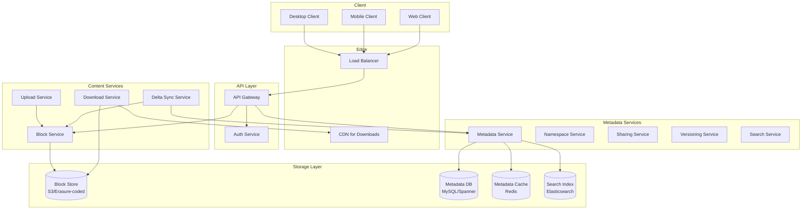
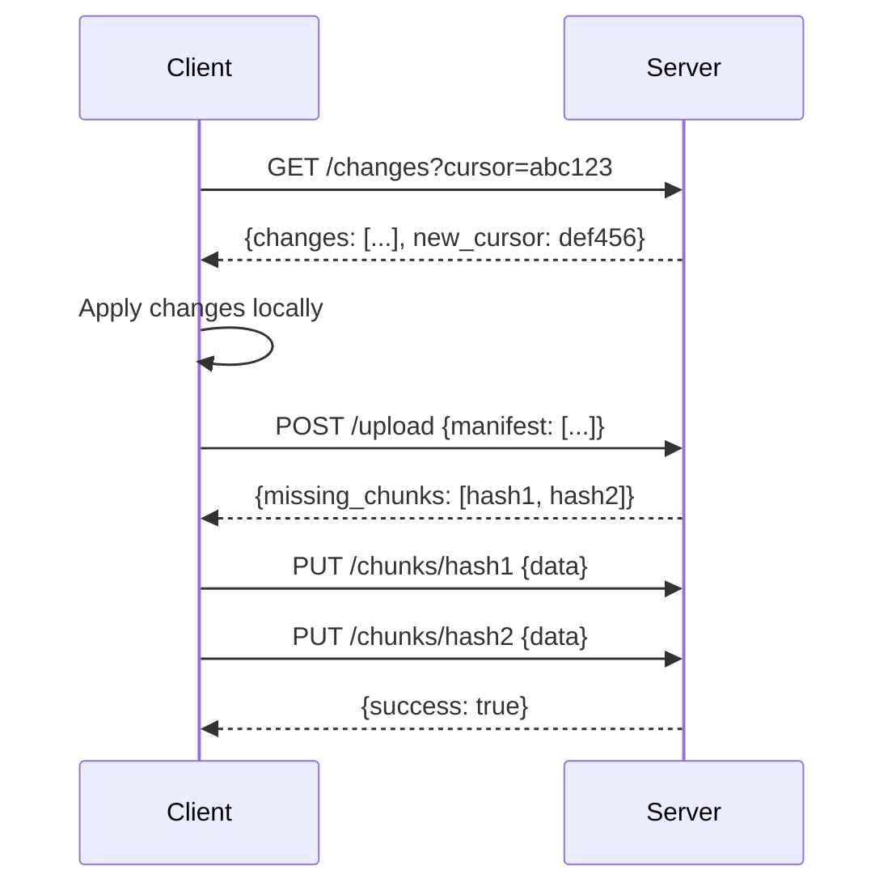
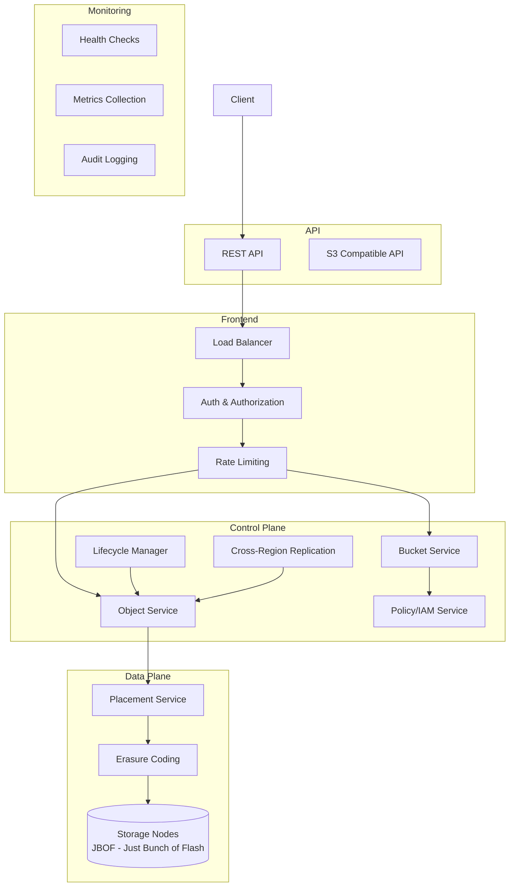
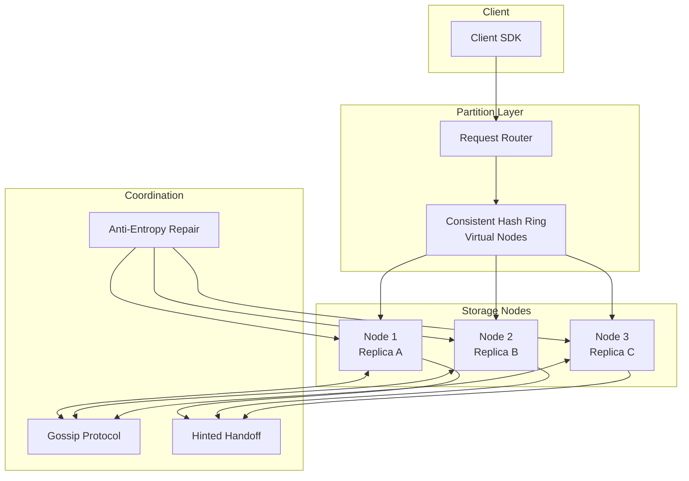
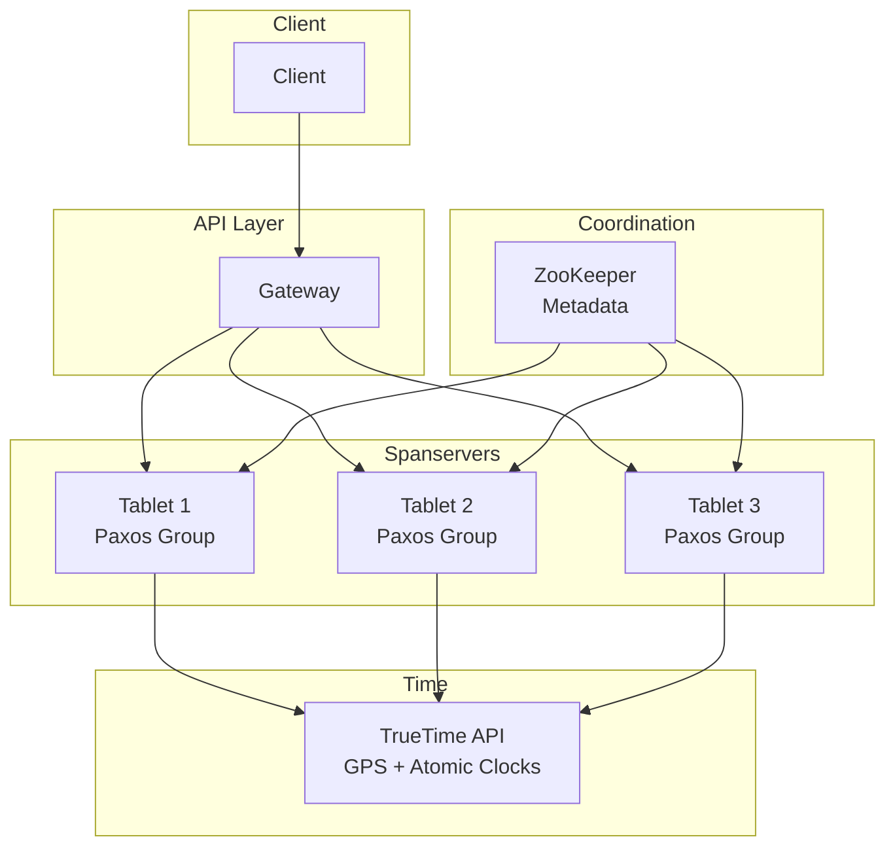
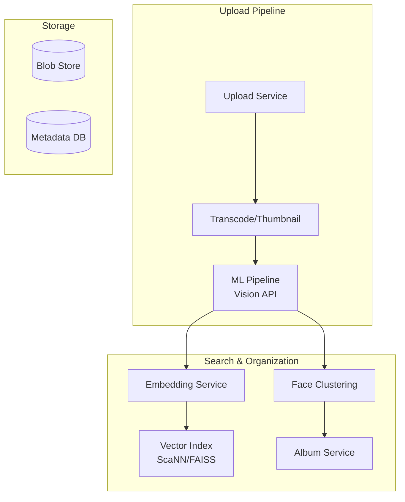

---
tags:
  - System-Design
  - FAANG
  - Storage
  - Databases
  - Distributed-Systems
  - S3
  - Dropbox
aliases:
  - Storage Patterns
  - Database Design
  - File Storage
---

# 💾 Storage & Databases Patterns

> **FAANG Questions:** Design Dropbox, Design Google Drive, Design Google Photos, Design Amazon S3, Design Distributed File System, Design Key-Value Store, Design NoSQL Database, Design SQL Database, Design Distributed Cache, Design Object Storage, Design Blob Storage, Design Metadata Service

---

## 🎯 Pattern 1: Dropbox / Google Drive — File Sync & Storage

### Problem Statement
Design a file synchronization and cloud storage service. Users upload files from multiple devices, changes sync across all devices in near real-time. Support 500M+ users, exabytes of data, version history, sharing.

### Requirements Clarification

| Functional | Non-Functional |
|------------|----------------|
| Upload/Download files | Consistency: Strong for metadata, Eventual for content |
| Sync across devices | Latency: < 1s for metadata, < 5s for content |
| Version history (30 days+) | Availability: 99.99% |
| Share files/folders (links, permissions) | Durability: 99.999999999% (11 9's) |
| Selective sync (choose folders) | Scalability: Exabytes |
| Offline access | Cost optimization (tiering) |

### High-Level Architecture



### Key Innovation: **Block-Level Deduplication (Content-Addressable Storage)**

```python
# Client-side chunking (Rabin fingerprinting / Rabin-Karp)
def chunk_file(file_path, avg_chunk_size=4MB):
    """Split file into variable-size chunks using content-defined chunking"""
    chunks = []
    window = 48 bytes
    for i in range(0, len(file), avg_chunk_size):
        # Find chunk boundary using rolling hash
        boundary = find_chunk_boundary(file[i:i+window])
        chunk = file[i:i+boundary]
        chunk_hash = sha256(chunk)
        chunks.append((chunk_hash, chunk))
    return chunks

# Upload: Client sends manifest (list of chunk hashes)
# Server responds with missing chunks
def upload_file(manifest):
    missing = []
    for chunk_hash in manifest:
        if not block_store.exists(chunk_hash):
            missing.append(chunk_hash)
    return missing  # Client uploads only missing chunks

# Reconstruction
def reconstruct_file(manifest):
    return b''.join(block_store.get(hash) for hash in manifest)
```

### Data Modeling

#### Metadata DB (Spanner/MySQL - Strong Consistency)
```sql
CREATE TABLE files (
    file_id UUID PRIMARY KEY,
    user_id UUID,
    parent_folder_id UUID,
    name VARCHAR(255),
    size BIGINT,
    content_hash VARCHAR(64),  -- SHA256 of full file
    chunk_manifest JSON,       -- List of {hash, size, order}
    version INT,
    created_at TIMESTAMP,
    updated_at TIMESTAMP,
    deleted BOOLEAN DEFAULT FALSE,
    INDEX idx_user_folder (user_id, parent_folder_id)
);

CREATE TABLE file_versions (
    version_id UUID PRIMARY KEY,
    file_id UUID,
    chunk_manifest JSON,
    size BIGINT,
    created_at TIMESTAMP,
    created_by UUID
);

CREATE TABLE shares (
    share_id UUID PRIMARY KEY,
    file_id UUID,
    owner_id UUID,
    target_user_id UUID,  -- NULL for link share
    permission ENUM('view', 'edit', 'comment'),
    expires_at TIMESTAMP
);
```

#### Block Store (S3/Erasure-Coded Object Store)
- **Key**: SHA256 hash of chunk content
- **Value**: Chunk data (encrypted)
- **Metadata**: Reference count (for garbage collection), tier (hot/warm/cold)

### Delta Sync Protocol



### Trade-offs & Decisions

| Decision | Choice | Rationale |
|----------|--------|-----------|
| **Consistency Model** | Strong for metadata, Eventual for content | Metadata changes must be consistent; content can sync async |
| **Chunking Strategy** | Content-defined (Rabin) | Better dedup for small edits vs fixed-size |
| **Storage Tiering** | Hot (SSD) → Warm (HDD) → Cold (Tape/S3 Glacier) | Cost optimization based on access frequency |
| **Conflict Resolution** | Last-writer-wins + version vectors | Simple, user can resolve via version history |
| **Garbage Collection** | Reference counting + background sweep | Delete blocks when refcount = 0 |

---

## 🎯 Pattern 2: Amazon S3 — Object Storage Service

### Problem Statement
Design a highly durable, available, and scalable object storage service. Unlimited storage, 99.999999999% durability, 99.99% availability, multi-region, multiple storage classes.

### Architecture



### Erasure Coding for Durability

```python
# Reed-Solomon (k=10, m=4) → 10 data + 4 parity = 14 fragments
# Can tolerate ANY 4 failures (disk, node, rack, AZ)
# Durability: (1 - failure_rate)^14 * combinations
# 11 9's = 99.999999999% over 1 year

def encode_object(data, k=10, m=4):
    fragments = reed_solomon_encode(data, k, m)
    # Distribute across 14 different failure domains
    for i, fragment in enumerate(fragments):
        placement = choose_failure_domain(i)
        storage_nodes[placement].write(fragment)

def decode_object(fragment_ids):
    # Need any k=10 fragments to reconstruct
    fragments = [storage_nodes[id].read() for id in fragment_ids[:10]]
    return reed_solomon_decode(fragments, k=10)
```

### Storage Classes & Tiering

| Class | Use Case | Durability | Availability | Min Duration | Retrieval |
|-------|----------|------------|--------------|--------------|-----------|
| **S3 Standard** | Frequently accessed | 11 9's | 99.99% | None | ms |
| **S3 Intelligent-Tiering** | Unknown access | 11 9's | 99.9% | None | ms |
| **S3 Standard-IA** | Infrequent access | 11 9's | 99.9% | 30 days | ms |
| **S3 One Zone-IA** | Non-critical, recreatable | 11 9's | 99.5% | 30 days | ms |
| **S3 Glacier Instant** | Archive, instant access | 11 9's | 99.9% | 90 days | ms |
| **S3 Glacier Flexible** | Archive, hours retrieval | 11 9's | 99.99% | 90 days | 1-12 hrs |
| **S3 Glacier Deep** | Long-term archive | 11 9's | 99.99% | 180 days | 12-48 hrs |

---

## 🎯 Pattern 3: Distributed Key-Value Store (DynamoDB/Cassandra Style)

### Problem Statement
Design a highly available, partition-tolerant key-value store with tunable consistency. Single-digit ms latency, seamless scaling, multi-region.

### Architecture: **Dynamo-style (AP with Tunable Consistency)**



### Key Concepts

| Concept | Implementation |
|---------|----------------|
| **Partitioning** | Consistent Hashing with Virtual Nodes (vnodes) |
| **Replication** | N replicas across failure zones (Rack/AZ aware) |
| **Consistency** | Quorum: W + R > N (e.g., W=2, R=2, N=3) |
| **Conflict Resolution** | Vector Clocks / Last-Writer-Wins / CRDTs |
| **Failure Handling** | Hinted Handoff, Read Repair, Anti-Entropy |
| **Scaling** | Add nodes → vnodes redistribute automatically |

### Quorum Configurations

| Config | W | R | N | Consistency | Availability | Latency |
|--------|---|---|---|-------------|--------------|---------|
| **Strong** | N | 1 | N | Linearizable | Low | High |
| **Quorum** | ⌈N/2⌉+1 | ⌈N/2⌉+1 | N | Strong | Medium | Medium |
| **Eventual** | 1 | 1 | N | Eventual | High | Low |
| **Custom** | 2 | 2 | 3 | Strong | High | Low |

---

## 🎯 Pattern 4: Distributed SQL Database (Google Spanner / CockroachDB)

### Problem Statement
Design a globally distributed SQL database with strong consistency (external consistency), horizontal scalability, and SQL semantics.

### Architecture: **Spanner-style (TrueTime + Paxos)**



### Key Innovations

| Feature | Implementation |
|---------|----------------|
| **External Consistency** | TrueTime (bounded clock uncertainty) + Commit Wait |
| **Horizontal Scaling** | Tablets (shards) + Paxos replication |
| **Schema Changes** | Online, non-blocking (via interleaved tables) |
| **Transactions** | 2PC over Paxos groups |
| **Geo-replication** | Multi-region Paxos groups |

### TrueTime & Commit Wait

```python
# TrueTime provides time interval [earliest, latest]
# Commit timestamp = latest (guaranteed > all previous commits)
# Wait until now() > commit_timestamp (ensures external consistency)

def commit_transaction(txn):
    # 1. Acquire locks, validate
    # 2. Get TrueTime interval
    earliest, latest = true_time.now()
    
    # 3. Choose commit timestamp = latest
    commit_ts = latest
    
    # 4. Write to Paxos log with commit_ts
    paxos_log.write(txn, commit_ts)
    
    # 5. **Commit Wait**: wait until now() > commit_ts
    while true_time.now().earliest <= commit_ts:
        sleep(1ms)
    
    # 6. Release locks
    return commit_ts
```

---

## 🎯 Pattern 5: Google Photos / Distributed Blob Store

### Problem Statement
Design a photo/video storage service with automatic backup, ML-powered search, sharing, albums, and editing. 1B+ users, 4T+ photos, petabytes of data.

### Architecture Additions for ML



### ML-Powered Features

| Feature | Implementation |
|---------|----------------|
| **Search by content** | CLIP embeddings → Vector similarity (ScaNN) |
| **Face grouping** | FaceNet embeddings → DBSCAN clustering |
| **Scene classification** | EfficientNet → labels (beach, birthday, dog) |
| **Duplicate detection** | Perceptual hashing (pHash) + Hamming distance |
| **Quality scoring** | Aesthetic scoring model |

---

## 📊 Comparison Matrix

| System | Type | Consistency | Partitioning | Replication | Best For |
|--------|------|-------------|--------------|-------------|----------|
| **Dropbox/Drive** | File Sync | Strong (meta) / Eventual (content) | User-based | Async | Personal/Team files |
| **S3** | Object Store | Strong (read-after-write) | Key-based | Erasure + Cross-region | App storage, backup, data lake |
| **DynamoDB** | KV Store | Tunable (Quorum) | Hash + Range | Multi-AZ Paxos | Low-latency, high-scale apps |
| **Cassandra** | Wide-column | Tunable (Quorum) | Token Ring | Multi-DC | Time-series, write-heavy |
| **Spanner** | Distributed SQL | External (TrueTime) | Tablets + Paxos | Multi-region Paxos | Global financial, inventory |
| **CockroachDB** | Distributed SQL | Strong (Serializable) | Ranges + Raft | Multi-region Raft | Cloud-native SQL |
| **Google Photos** | Blob + ML | Eventual (meta) | User + Content | Geo-redundant | Consumer media + ML search |

---

## 🎯 Common Interview Questions

| Question | Key Points |
|----------|------------|
| **How does Dropbox achieve fast sync?** | Block-level dedup (content-defined chunking), only upload missing blocks |
| **How does S3 achieve 11 9's durability?** | Erasure coding (10+4) across 3+ AZs, background repair, checksums |
| **How does DynamoDB handle hot partitions?** | Adaptive capacity, partition splitting, request routing |
| **How does Spanner achieve external consistency?** | TrueTime (GPS + atomic clocks) + commit wait |
| **Design a KV store with tunable consistency** | Consistent hashing + quorum (W+R>N) + hinted handoff + read repair |
| **How does Google Photos search "dog on beach"?** | CLIP embeddings → vector index (ScaNN) → similarity search |
| **Design a distributed cache** | Consistent hashing, LRU eviction, replication, cache-aside pattern |

---

## 🏷️ Tags

```yaml
tags:
  - System-Design
  - FAANG
  - Storage
  - Databases
  - S3
  - Dropbox
  - DynamoDB
  - Spanner
  - Distributed-Systems
  - Key-Value-Store
```