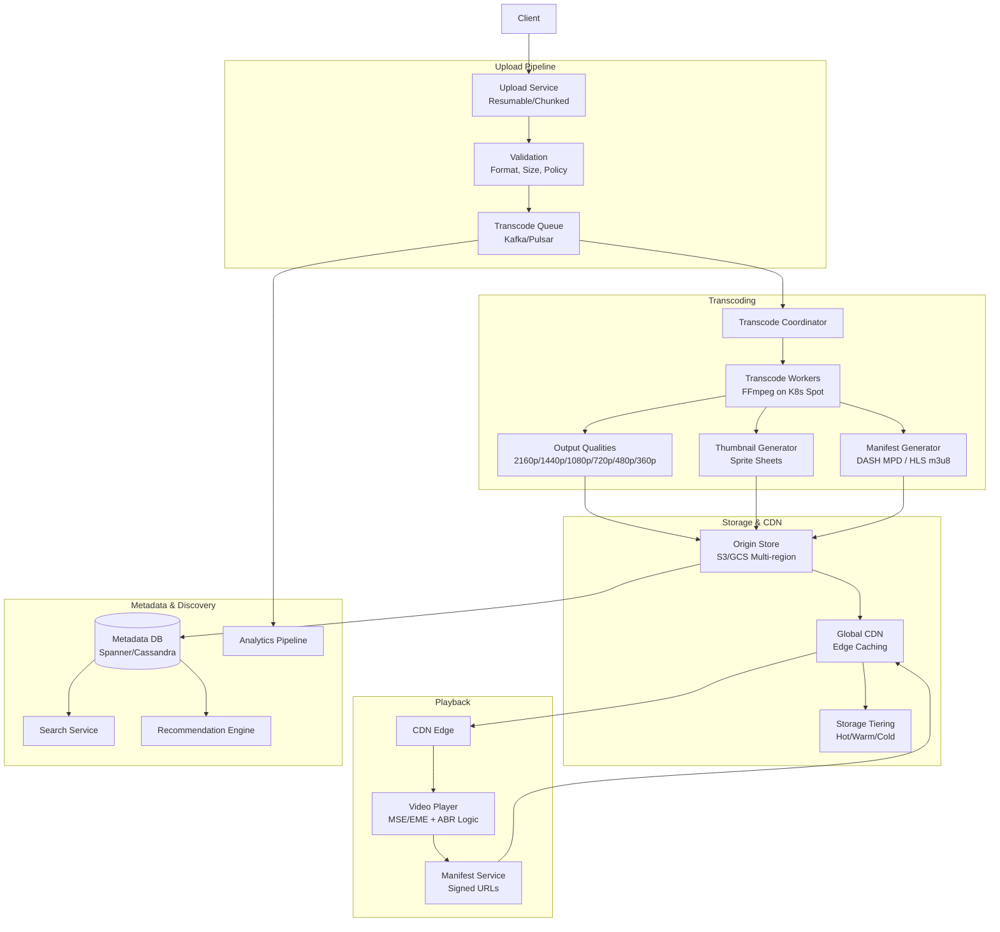
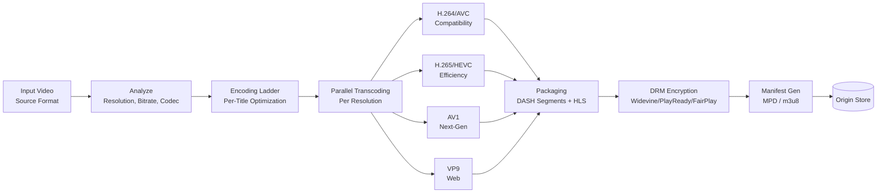
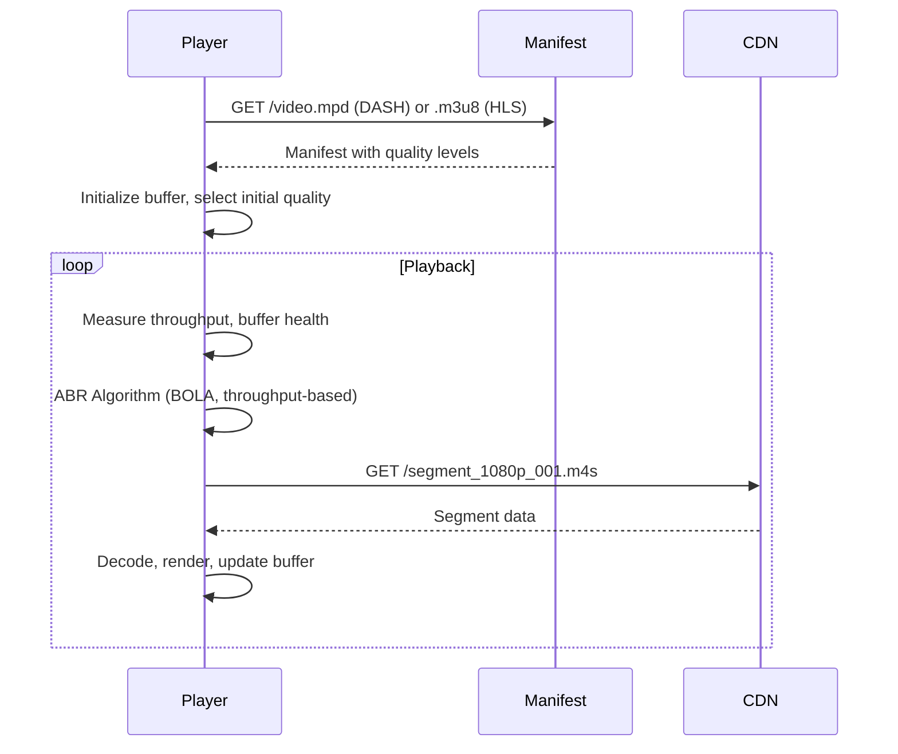

---
tags:
  - System-Design
  - FAANG
  - Video-Streaming
  - CDN
  - Transcoding
  - Adaptive-Bitrate
  - Live-Streaming
aliases:
  - Video Streaming Patterns
  - YouTube Design
  - Netflix Design
  - CDN Design
---

# 🎬 Video & Streaming Patterns

> **FAANG Questions:** Design YouTube, Design Netflix, Design Spotify, Design Live Video Streaming, Design Twitch, Design Zoom, Design Google Meet, Design Video Transcoding Service, Design CDN, Design Video Upload Pipeline

---

## 🎯 Pattern 1: YouTube / Netflix — Video on Demand (VoD)

### Problem Statement
Design a video streaming platform supporting 2B+ users, 500+ hours uploaded/minute, exabytes of storage, adaptive bitrate streaming, global CDN delivery, recommendations.

### Requirements Clarification

| Functional | Non-Functional |
|------------|----------------|
| Upload video (large files) | Latency: Start < 2s, Seek < 500ms |
| Transcode to multiple resolutions | Availability: 99.99% |
| Adaptive bitrate streaming (DASH/HLS) | Scalability: Exabytes storage |
| Video playback (web, mobile, TV) | Cost optimization (tiering) |
| Recommendations, search | DRM/Content protection |
| Live streaming support | Global availability |

### High-Level Architecture



### Video Transcoding Pipeline



### Encoding Ladder (Per-Title Optimization)

```python
# Traditional Fixed Ladder vs Per-Title
FIXED_LADDER = [
    {"resolution": "2160p", "bitrate": 15000, "codec": "HEVC"},
    {"resolution": "1440p", "bitrate": 8000, "codec": "HEVC"},
    {"resolution": "1080p", "bitrate": 5000, "codec": "AVC"},
    {"resolution": "720p", "bitrate": 2500, "codec": "AVC"},
    {"resolution": "480p", "bitrate": 1000, "codec": "AVC"},
    {"resolution": "360p", "bitrate": 500, "codec": "AVC"},
]

# Per-Title: Analyze content complexity, generate optimal ladder
def generate_encoding_ladder(video_path):
    # 1. Analyze spatial/temporal complexity
    complexity = analyze_complexity(video_path)
    
    # 2. Convex hull optimization (minimize bitrate for quality target)
    # Netflix's VMAF-based approach
    ladder = convex_hull_optimization(
        complexity=complexity,
        target_vmaf=95,
        max_resolution=max_resolution(video_path)
    )
    
    return ladder

# Example output for simple content (cartoon):
# 1080p @ 2Mbps, 720p @ 1Mbps, 480p @ 500kbps
# vs complex content (action movie):
# 1080p @ 8Mbps, 720p @ 4Mbps, 480p @ 1.5Mbps
```

### Adaptive Bitrate Streaming (ABR)



```python
# ABR Algorithms

# 1. Throughput-based (Simple)
def select_quality_throughput(bandwidth, qualities):
    """Select highest quality where bitrate < 0.8 * bandwidth"""
    for q in sorted(qualities, key=lambda q: q.bitrate, reverse=True):
        if q.bitrate < 0.8 * bandwidth:
            return q
    return qualities[0]  # Lowest

# 2. Buffer-based (BOLA - Buffer Occupancy based Lyapunov Algorithm)
def select_quality_bola(buffer_level, qualities, V=10):
    """Maximize utility: quality - V * rebuffer_risk"""
    best_utility = -inf
    best_quality = qualities[0]
    
    for q in qualities:
        utility = q.vmaf_score - V * max(0, q.duration - buffer_level)
        if utility > best_utility:
            best_utility = utility
            best_quality = q
    return best_quality

# 3. Hybrid (Netflix/YouTube)
def select_quality_hybrid(bandwidth, buffer, qualities):
    throughput_q = select_quality_throughput(bandwidth, qualities)
    buffer_q = select_quality_bola(buffer, qualities)
    # Choose more conservative
    return min(throughput_q, buffer_q, key=lambda q: q.bitrate)
```

### DASH vs HLS Manifest

```xml
<!-- DASH MPD (Media Presentation Description) -->
<MPD xmlns="urn:mpeg:dash:schema:mpd:2011" 
     minBufferTime="PT2S" 
     type="static" 
     mediaPresentationDuration="PT1H30M">
  <Period>
    <AdaptationSet mimeType="video/mp4" segmentAlignment="true">
      <Representation id="1080p" bandwidth="5000000" width="1920" height="1080" codecs="avc1.640028">
        <SegmentTemplate timescale="90000" duration="90000" 
                          initialization="init_$RepresentationID$.mp4"
                          media="seg_$RepresentationID$_$Number$.m4s"/>
      </Representation>
      <Representation id="720p" bandwidth="2500000" width="1280" height="720" codecs="avc1.4d401f">
        <SegmentTemplate timescale="90000" duration="90000"
                          initialization="init_$RepresentationID$.mp4"
                          media="seg_$RepresentationID$_$Number$.m4s"/>
      </Representation>
    </AdaptationSet>
    
    <AdaptationSet mimeType="audio/mp4" lang="en">
      <Representation id="audio_en" bandwidth="128000" codecs="mp4a.40.2">
        <SegmentTemplate timescale="48000" duration="96000"
                          initialization="init_$RepresentationID$.mp4"
                          media="seg_$RepresentationID$_$Number$.m4s"/>
      </Representation>
    </AdaptationSet>
  </Period>
</MPD>
```

```m3u
# HLS Master Playlist (.m3u8)
#EXTM3U
#EXT-X-VERSION:6
#EXT-X-STREAM-INF:BANDWIDTH=5000000,RESOLUTION=1920x1080,CODECS="avc1.640028,mp4a.40.2"
video_1080p.m3u8
#EXT-X-STREAM-INF:BANDWIDTH=2500000,RESOLUTION=1280x720,CODECS="avc1.4d401f,mp4a.40.2"
video_720p.m3u8
#EXT-X-STREAM-INF:BANDWIDTH=1000000,RESOLUTION=854x480,CODECS="avc1.4d401e,mp4a.40.2"
video_480p.m3u8

# Media Playlist (video_1080p.m3u8)
#EXTM3U
#EXT-X-TARGETDURATION:10
#EXT-X-PLAYLIST-TYPE:VOD
#EXTINF:10.0,
seg_1080p_00001.ts
#EXTINF:10.0,
seg_1080p_00002.ts
#EXT-X-ENDLIST
```

---

## 🎯 Pattern 2: Live Video Streaming (Twitch/YouTube Live)

### Problem Statement
Design a live streaming platform with < 5s latency (low-latency) or < 1s (ultra-low), millions of concurrent viewers, chat, transcoding, DVR, clipping.

### Architecture: **Low-Latency HLS (LL-HLS) / CMAF / WebRTC**

```mermaid
graph TB
    subgraph Ingestion
        Broadcaster[Broadcaster<br/>OBS/RTMP/SRT]
        Ingest[Ingest Servers<br/>NGINX-RTMP / MediaMTX]
        Auth[Stream Key Auth]
    end
    
    subgraph Transcoding (Near Real-time)
        Transcoder[Transcoders<br/>FFmpeg -low_delay]
        Segments[Segmenter<br/>1-2s segments]
        Packager[CMAF Packager<br/>fMP4 + CMAF]
    end
    
    subgraph Delivery
        Origin[Origin Shield]
        CDN[CDN Edge]
        Player[Player<br/>LL-HLS / CMAF / WebRTC]
    end
    
    subgraph Interactive
        Chat[Chat Service<br/>WebSocket]
        Clips[Clipping Service]
        DVR[DVR Window<br/>Rolling Buffer]
    end
    
    Broadcaster --> Ingest
    Ingest --> Auth
    Auth --> Transcoder
    Transcoder --> Segments
    Segments --> Packager
    Packager --> Origin
    Origin --> CDN
    CDN --> Player
    
    Transcoder --> DVR
    Player --> Chat
```

### Latency Comparison

| Protocol | Latency | Complexity | Browser Support |
|----------|---------|------------|-----------------|
| **RTMP** | 1-3s | Low | Flash (deprecated) |
| **HLS** | 6-30s | Low | Native (Safari) |
| **LL-HLS** | 2-5s | Medium | Safari, Chrome (experimental) |
| **CMAF (Low Latency)** | 1-3s | Medium | Chrome, Edge, Firefox |
| **WebRTC** | < 500ms | High | Universal |
| **SRT/RIST** | 100-500ms | Medium | Professional |

### LL-HLS Implementation

```python
# LL-HLS Key Features
# 1. Shorter segments (2-4s vs 6-10s)
# 2. Partial segments (byte-range requests)
# 3. Preload hints
# 4. Delta playlists (only new segments)

# Master Playlist
#EXTM3U
#EXT-X-VERSION:12
#EXT-X-PLAYLIST-TYPE:EVENT
#EXT-X-SERVER-CONTROL:CAN-BLOCK-RELOAD=YES,CAN-SKIP-UNTIL=30,HOLD-BACK=6
#EXT-X-PART-INF:PART-TARGET=1.0
#EXT-X-STREAM-INF:BANDWIDTH=3000000,RESOLUTION=1280x720
stream_720p.m3u8

# Media Playlist (Delta updates)
#EXTM3U
#EXT-X-VERSION:12
#EXT-X-TARGETDURATION:2
#EXT-X-PART-DURATION:1.0
#EXT-X-PROGRAM-DATE-TIME:2024-01-15T10:00:00.000Z
#EXT-X-PRELOAD-HINT:TYPE=PART,URI="segment_00001_part_001.ts",BYTERANGE-START=0,BYTERANGE-LENGTH=50000
#EXTINF:2.0,
segment_00001.ts
#EXT-X-PART:URI="segment_00002_part_001.ts",DURATION=1.0
#EXTINF:2.0,
segment_00002.ts
#EXT-X-ENDLIST
```

---

## 🎯 Pattern 3: Video Conferencing (Zoom/Google Meet) — WebRTC

### Architecture: **SFU (Selective Forwarding Unit)**

```mermaid
graph TB
    subgraph Client
        P1[Participant 1]
        P2[Participant 2]
        P3[Participant 3]
        P4[Participant 4]
    end
    
    subgraph Signaling
        Signal[Signaling Server<br/>WebSocket]
    end
    
    subgraph Media Server (SFU)
        SFU[SFU<br/>mediasoup/Janus/Kurento]
        Router[Router<br/>Room Management]
        Transport[WebRTC Transport<br/>ICE/DTLS/SRTP]
    end
    
    subgraph Recording
        Recorder[Recorder<br/>Composite/Individual]
        Storage[Recording Storage]
    end
    
    P1 --> Signal
    P2 --> Signal
    P3 --> Signal
    P4 --> Signal
    
    Signal --> SFU
    
    P1 <--> Transport
    P2 <--> Transport
    P3 <--> Transport
    P4 <--> Transport
    
    Transport --> Router
    Router --> Recorder
    Recorder --> Storage
```

### SFU vs MCU

| Architecture | Description | Pros | Cons | Max Participants |
|--------------|-------------|------|------|------------------|
| **SFU** (Selective Forwarding) | Server forwards streams, no decoding | Scalable, low CPU, simulcast | Client needs bandwidth | 50-100 |
| **MCU** (Multipoint Control Unit) | Server mixes all into one stream | Single downstream, simple client | High CPU, latency, quality loss | 10-20 |
| **Mesh (P2P)** | Direct peer-to-peer | No server cost | O(n²) connections | 4-8 |

### Simulcast (SFU Essential)

```python
# Sender encodes multiple qualities simultaneously
# SFU selects appropriate layer per receiver

SIMULCAST_LAYERS = [
    {"rid": "h", "scaleResolutionDownBy": 1, "maxBitrate": 2500},  # High
    {"rid": "m", "scaleResolutionDownBy": 2, "maxBitrate": 800},   # Medium
    {"rid": "l", "scaleResolutionDownBy": 4, "maxBitrate": 250},   # Low
]

# SFU Forwarding Logic
def forward_layers(participant, available_bandwidth):
    if available_bandwidth > 2000:
        return ["h", "m", "l"]  # Forward all, receiver chooses
    elif available_bandwidth > 500:
        return ["m", "l"]  # Drop high
    else:
        return ["l"]  # Only low
```

---

## 🎯 Pattern 4: CDN (Content Delivery Network)

### Problem Statement
Design a global CDN for static and dynamic content delivery. Sub-10ms latency, 99.99% availability, DDoS protection, edge computing.

### Architecture

```mermaid
graph TB
    subgraph Control Plane
        DNS[GSDNS<br/>GeoDNS]
        Config[Config API]
        Purge[Purge API]
        Analytics[Analytics Pipeline]
    end
    
    subgraph Edge Network
        PoP1[PoP: US-East<br/>Edge Servers]
        PoP2[PoP: EU-West<br/>Edge Servers]
        PoP3[PoP: AP-South<br/>Edge Servers]
    end
    
    subgraph Edge Server
        Cache[Cache<br/>SSD + RAM]
        TLS[SSL Termination]
        WAF[WAF/DDoS]
        EdgeFn[Edge Functions<br/>Workers@Edge]
        OriginShield[Origin Shield]
    end
    
    subgraph Origin
        Origin[Origin Servers]
        Shield[Shield PoPs<br/>Mid-tier Cache]
    end
    
    Client --> DNS
    DNS --> PoP1
    DNS --> PoP2
    DNS --> PoP3
    
    PoP1 --> Cache
    PoP1 --> TLS
    PoP1 --> WAF
    PoP1 --> EdgeFn
    PoP1 --> OriginShield
    
    OriginShield --> Shield
    Shield --> Origin
```

### Cache Invalidation Strategies

```python
# 1. Purge by URL (Instant)
def purge_url(url):
    for pop in all_pops:
        pop.cache.delete(hash(url))

# 2. Purge by Tag (Surrogate Keys)
def purge_tag(tag):
    for pop in all_pops:
        pop.cache.delete_by_tag(tag)

# 3. Cache-Control Headers
headers = {
    "Cache-Control": "public, max-age=3600, stale-while-revalidate=86400",
    "Surrogate-Key": "product:123 category:electronics",
    "Surrogate-Control": "max-age=31536000",
}

# 4. Edge Function for Dynamic Content
def edge_function(request):
    # A/B testing, personalization, auth
    if request.path.startswith("/api/user"):
        return fetch_with_auth(request)
    return fetch_from_cache(request)
```

---

## 📊 Comparison Matrix

| System | Scale | Latency | Protocol | Key Tech |
|--------|-------|---------|----------|----------|
| **YouTube VoD** | 500h/min upload | 2s start | DASH/HLS + CMAF | Per-title encoding, S3, GFE |
| **Netflix** | 200M subscribers | 1s start | DASH + CMAF | Per-title, Open Connect CDN |
| **Twitch Live** | 10M concurrent | 3-5s | LL-HLS / CMAF | Transcode farm, own CDN |
| **YouTube Live** | 1M concurrent | 3-5s | LL-HLS | Ingest → Transcode → CDN |
| **Zoom/Meet** | 300M daily | <500ms | WebRTC/SFU | mediasoup, simulcast |
| **Google CDN** | Global | <10ms | Anycast + GSLB | Cloud CDN, Cloud Armor |
| **Cloudflare** | 25M sites | <20ms | Anycast | Workers, WAF, Cache |
| **Akamai** | 300K servers | <10ms | Anycast | EdgeSuite, Ion |

---

## 🎯 Common Interview Questions

| Question | Key Points |
|----------|------------|
| **How does YouTube handle video upload?** | Resumable upload → validation → Kafka queue → parallel transcoding → packaging → S3 → CDN |
| **How does Netflix reduce bandwidth?** | Per-title encoding (convex hull), AV1, ABR, predictive caching |
| **How does Twitch achieve low latency?** | LL-HLS (2s segments, partial segments, delta playlists), CMAF, edge ingest |
| **How does WebRTC work in Zoom?** | SFU architecture, simulcast, SVC, NACK/PLI for loss recovery |
| **How does CDN cache invalidation work?** | Purge by URL/tag, Cache-Control headers, surrogate keys, edge functions |
| **How does adaptive bitrate work?** | BOLA/throughput-based, manifest with multiple qualities, player switches |
| **Design a video transcoding service** | Queue → Coordinator → Workers (FFmpeg) → Per-title ladder → Package → CDN |
| **How does Netflix Open Connect work?** | ISP-deployed caches, proactive caching, BGP peering, 90% traffic offloaded |

---

## 🏷️ Tags

```yaml
tags:
  - System-Design
  - FAANG
  - Video-Streaming
  - CDN
  - Transcoding
  - Adaptive-Bitrate
  - Live-Streaming
  - WebRTC
  - DASH
  - HLS
  - CMAF
```