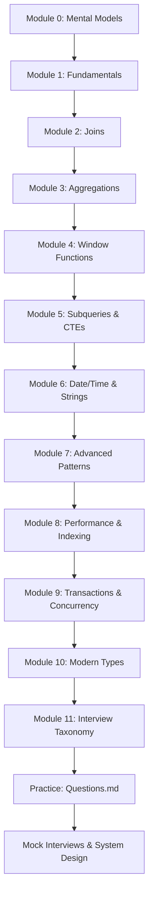

---
tags:
  - SQL
  - Database
  - Interview-Preparation
  - GATE-DA
  - DSA
  - SQL-Interview
  - 20-LPA
aliases:
  - SQL Cheatsheet
  - SQL Interview Prep
  - Database Query Language
---

# 📊 SQL Mastery Guide — From Basics to 20 LPA Interviews

> **Goal:** Master SQL end-to-end — from basic `SELECT` to advanced window functions, query optimization, and system-design-level SQL — so you can crack **20+ LPA interviews** at top tech companies (Google, Amazon, Microsoft, Flipkart, Uber, etc.).
>
> **Target Audience:** SDE-1/2, Data Engineer, ML Engineer, Data Scientist, Backend Engineer interviews.
>
> **Prerequisites:** Basic programming logic, understanding of relational data.
>
> **Time Investment:** 2–3 weeks (1–2 hrs/day) for thorough mastery.

---

## 📚 Table of Contents

```dataviewjs
// Auto-generated TOC from headings
const pages = dv.pages('"database"').where(p => p.file.name === "SQL");
if (pages.length) {
  const content = await dv.io.load(pages[0].file.path);
  const headings = content.match(/^#{2,4}\s+(.+)$/gm) || [];
  for (const h of headings) {
    const level = h.match(/^#+/)[0].length;
    const text = h.replace(/^#+\s+/, '').replace(/[📊📚🎯🔑💡⚡🔥💎🚀📝📌⚠️✅❌🔗🔍📖💡]/g, '').trim();
    const anchor = text.toLowerCase().replace(/[^\w]+/g, '-').replace(/-+/g, '-').replace(/^-|-$/g, '');
    dv.paragraph(`${'  '.repeat(level-2)}- [[SQL#${anchor}|${text}]]`);
  }
}
```

---

## 🗂️ MODULE 0: MENTAL MODEL & DATABASE FUNDAMENTALS

> [!abstract] **Mental Model: How SQL Actually Works**
> 
> ```
> ┌───────────────────────────────────────────────────────────────────┐
> │                        SQL EXECUTION PIPELINE                     │
> ├───────────────────────────────────────────────────────────────────┤
> │                                                                   │
> │  ┌──────────┐    ┌──────────┐    ┌──────────┐    ┌──────────┐     │
> │  │  PARSER  │───▶│  RESOLVER│───▶│ OPTIMIZER│───▶│ EXECUTOR │     │
> │  └──────────┘    └──────────┘    └──────────┘    └──────────┘     │
> │       │               │               │               │           │
> │       ▼               ▼               ▼               ▼           │
> │  Check syntax   Resolve tables   Generate query   Execute plan,   │
> │  & semantics    & columns,       plans, pick       stream rows    │
> │  (AST)          check perms      optimal via      to client       │
> │                 (catalog)        cost model                       │
> │                                                                   │
> └───────────────────────────────────────────────────────────────────┘
> ```

### 🎯 Key Mental Models

| Concept | Mental Model | Why It Matters |
|---------|--------------|----------------|
| **Set-based thinking** | SQL operates on **sets**, not rows | Avoid row-by-row (RBAR) thinking |
| **Declarative ≠ Imperative** | You say **WHAT**, not **HOW** | Optimizer chooses execution plan |
| **Three-valued logic** | `TRUE`, `FALSE`, `UNKNOWN` (NULL) | `NULL = NULL` is `UNKNOWN`, not `TRUE` |
| **Relational Algebra** | Selection (σ), Projection (π), Join (⋈), Union (∪), Difference (−) | Foundation of query optimization |

### 🔗 Relational Algebra → SQL Mapping

| Relational Algebra | SQL Keyword | Example |
|---|---|---|
| Selection (σ) | `WHERE` | `σ_{salary>50000}(Employee)` → `SELECT * FROM Employee WHERE salary > 50000` |
| Projection (π) | `SELECT` | `π_{name,salary}(Employee)` → `SELECT name, salary FROM Employee` |
| Natural Join (⋈) | `JOIN` | `Employee ⋈ Department` → `SELECT * FROM Employee JOIN Department USING(dept_id)` |
| Union (∪) | `UNION` | `R ∪ S` → `(SELECT * FROM R) UNION (SELECT * FROM S)` |
| Difference (−) | `EXCEPT` | `R − S` → `(SELECT * FROM R) EXCEPT (SELECT * FROM S)` |
| Rename (ρ) | `AS` / Alias | `ρ_{E}(Employee)` → `FROM Employee AS E` |

---

## 📚 MODULE 1: SQL FUNDAMENTALS (CRUD + FILTERING)

> [!tip] **Interview Reality Check**
> Every interview starts here. 90% of candidates fail basic filtering/ordering questions under pressure. Master these until they're muscle memory.

### 1.1 SELECT — The Projection Operator

```sql
-- Basic syntax
SELECT column1, column2, ...        -- Projection (π)
FROM table_name                     -- Source relation
WHERE condition                     -- Selection (σ)
GROUP BY column1, column2, ...      -- Aggregation groups
HAVING aggregate_condition          -- Filter groups
ORDER BY column1 [ASC|DESC], ...    -- Sort output
LIMIT n OFFSET m;                   -- Pagination
```

> [!note] **Execution Order (Logical)**
> ```text
> FROM → WHERE → GROUP BY → HAVING → SELECT → ORDER BY → LIMIT/OFFSET
> ```
> *This is NOT the physical execution order (optimizer reorders), but the logical semantics.*

### 1.2 Filtering — WHERE Clause

```sql
-- Comparison operators
WHERE salary > 50000
WHERE salary >= 50000 AND salary <= 80000
WHERE salary BETWEEN 50000 AND 80000          -- Inclusive range
WHERE department IN ('IT', 'Sales', 'HR')     -- Set membership
WHERE name LIKE 'A%'                          -- Pattern: starts with A
WHERE name LIKE '%son%'                       -- Pattern: contains 'son'
WHERE name LIKE '_a%'                         -- Pattern: 2nd char is 'a'
WHERE email IS NULL                           -- NULL check
WHERE email IS NOT NULL                       -- Non-NULL check

-- Boolean logic (3-valued: TRUE, FALSE, UNKNOWN)
WHERE dept = 'IT' AND (salary > 70000 OR bonus > 5000)
WHERE NOT (status = 'terminated')
```

> [!warning] **NULL Traps**
> - `NULL = NULL` → `UNKNOWN` (not TRUE!)
> - `NULL != NULL` → `UNKNOWN`
> - Use `IS NULL` / `IS NOT NULL`
> - `NOT IN (..., NULL)` returns **empty set** — avoid `NOT IN` with nullable columns

### 1.3 Sorting & Pagination

```sql
-- Multi-column sort
SELECT name, salary, dept_id
FROM employees
ORDER BY dept_id ASC, salary DESC, name ASC;

-- Pagination (standard SQL)
SELECT * FROM employees
ORDER BY hire_date DESC
LIMIT 20 OFFSET 40;           -- Page 3, 20 per page

-- PostgreSQL / MySQL: LIMIT n OFFSET m
-- SQL Server: OFFSET m ROWS FETCH NEXT n ROWS ONLY
-- Oracle 12c+: OFFSET m ROWS FETCH NEXT n ROWS ONLY
```

### 1.4 DML — Data Manipulation Language

```sql
-- INSERT
INSERT INTO employees (name, salary, dept_id, hire_date)
VALUES ('Rahul', 75000, 1, '2024-01-15');

-- Multi-row insert (single round-trip)
INSERT INTO employees (name, salary, dept_id)
VALUES 
  ('Amit', 60000, 2),
  ('Priya', 85000, 1),
  ('Sneha', 72000, 3);

-- UPDATE (⚠️ ALWAYS use WHERE!)
UPDATE employees
SET salary = salary * 1.10, updated_at = CURRENT_TIMESTAMP
WHERE dept_id = 1 AND performance_rating >= 4;

-- DELETE (⚠️ ALWAYS use WHERE!)
DELETE FROM employees
WHERE hire_date < '2020-01-01' AND status = 'inactive';

-- MERGE / UPSERT (standard SQL: MERGE; PG: ON CONFLICT; MySQL: ON DUPLICATE KEY)
-- PostgreSQL
INSERT INTO employees (id, name, salary)
VALUES (100, 'New Hire', 50000)
ON CONFLICT (id) DO UPDATE SET salary = EXCLUDED.salary;
```

---

## 🔗 MODULE 2: JOINS — THE HEART OF RELATIONAL QUERIES

> [!danger] **Interview Killer**
> Join questions appear in **100%** of SQL interviews. Self-joins, NULL handling, and join-type selection are the top differentiators between junior and senior candidates.

### 2.1 Join Types Visualized

```mermaid
graph LR
    subgraph "INNER JOIN"
    A1[A ∩ B] --> A2[Only matching rows]
    end
    
    subgraph "LEFT JOIN"
    B1[A ∪ (A ⋈ B)] --> B2[All A + matching B]
    end
    
    subgraph "RIGHT JOIN"
    C1[B ∪ (A ⋈ B)] --> C2[All B + matching A]
    end
    
    subgraph "FULL OUTER JOIN"
    D1[A ∪ B] --> D2[All rows from both]
    end
    
    subgraph "CROSS JOIN"
    E1[A × B] --> E2[Cartesian product]
    end
    
    style A1 fill:#e1f5fe
    style B1 fill:#fff3e0
    style C1 fill:#fce4ec
    style D1 fill:#f3e5f5
    style E1 fill:#e8f5e9
```

### 2.2 Join Syntax & Patterns

```sql
-- ============================================================
-- INNER JOIN: Only matching rows (intersection)
-- ============================================================
SELECT e.name, d.dept_name
FROM employees e
INNER JOIN departments d ON e.dept_id = d.id;

-- ============================================================
-- LEFT JOIN: All left rows + matching right (preserve left)
-- ============================================================
SELECT e.name, d.dept_name
FROM employees e
LEFT JOIN departments d ON e.dept_id = d.id;
-- Employees without dept → dept_name = NULL

-- ============================================================
-- RIGHT JOIN: All right rows + matching left (preserve right)
-- ============================================================
SELECT e.name, d.dept_name
FROM employees e
RIGHT JOIN departments d ON e.dept_id = d.id;
-- Departments without employees → name = NULL

-- ============================================================
-- FULL OUTER JOIN: All rows from both (union)
-- ============================================================
SELECT e.name, d.dept_name
FROM employees e
FULL OUTER JOIN departments d ON e.dept_id = d.id;

-- ============================================================
-- CROSS JOIN: Cartesian product (use with caution!)
-- ============================================================
SELECT e.name, d.dept_name
FROM employees e
CROSS JOIN departments d;  -- 10 emps × 4 depts = 40 rows

-- ============================================================
-- SELF JOIN: Table joins with itself (hierarchies, comparisons)
-- ============================================================
-- Employee → Manager
SELECT e.name AS employee, m.name AS manager
FROM employees e
LEFT JOIN employees m ON e.manager_id = m.id;
-- Use LEFT to include top-level managers (manager_id IS NULL)
```

### 2.3 Join Decision Matrix

| Scenario | Join Type | Why |
|---|---|---|
| Employees + their departments (every emp has dept) | `INNER JOIN` | Referential integrity guarantees match |
| All employees + dept name (some emps have no dept) | `LEFT JOIN` | Preserve all employees |
| All departments + employee count (empty depts too) | `LEFT JOIN` (dept left) | Preserve all departments |
| Employee-manager hierarchy | `LEFT JOIN` (self) | Top managers have no manager |
| Find departments with NO employees | `LEFT JOIN` + `WHERE e.id IS NULL` | Anti-join pattern |
| Generate all combinations (date × product) | `CROSS JOIN` | Calendar tables, reporting grids |

### 2.4 Advanced Join Patterns

```sql
-- ANTI-JOIN: Rows in A with NO match in B
-- Pattern 1: LEFT JOIN + IS NULL (standard, optimizer-friendly)
SELECT d.dept_name
FROM departments d
LEFT JOIN employees e ON d.id = e.dept_id
WHERE e.id IS NULL;

-- Pattern 2: NOT EXISTS (correlated subquery, often same plan)
SELECT d.dept_name
FROM departments d
WHERE NOT EXISTS (
    SELECT 1 FROM employees e WHERE e.dept_id = d.id
);

-- Pattern 3: EXCEPT (set difference)
SELECT dept_name FROM departments
EXCEPT
SELECT d.dept_name FROM departments d JOIN employees e ON d.id = e.dept_id;

-- SEMI-JOIN: Rows in A that HAVE a match in B (no duplication)
-- Use EXISTS (preferred over IN for nullable columns)
SELECT e.name
FROM employees e
WHERE EXISTS (
    SELECT 1 FROM departments d 
    WHERE d.id = e.dept_id AND d.budget > 1000000
);

-- LATERAL JOIN / CROSS APPLY: Row-dependent subqueries (PG, SQL Server)
SELECT e.name, latest_project.project_name
FROM employees e
CROSS JOIN LATERAL (
    SELECT project_name 
    FROM projects p 
    WHERE p.emp_id = e.id 
    ORDER BY p.start_date DESC 
    LIMIT 1
) latest_project;
```

---

## 📊 MODULE 3: AGGREGATIONS, GROUP BY & HAVING

### 3.1 Aggregate Functions

```sql
-- Basic aggregates
SELECT 
    COUNT(*)           AS total_rows,        -- Counts ALL rows (including NULLs)
    COUNT(salary)      AS non_null_salaries, -- Counts non-NULL only
    COUNT(DISTINCT dept_id) AS unique_depts, -- Distinct count
    SUM(salary)        AS total_payroll,
    AVG(salary)        AS avg_salary,
    MIN(salary)        AS min_salary,
    MAX(salary)        AS max_salary,
    STDDEV(salary)     AS stddev_salary,
    VARIANCE(salary)   AS variance_salary
FROM employees;

-- String aggregation (DB-specific)
-- PostgreSQL: STRING_AGG(name, ', ' ORDER BY salary DESC)
-- MySQL: GROUP_CONCAT(name ORDER BY salary DESC SEPARATOR ', ')
-- SQL Server: STRING_AGG(name, ', ') WITHIN GROUP (ORDER BY salary DESC)
```

### 3.2 GROUP BY Mechanics

```sql
-- Single column grouping
SELECT dept_id, COUNT(*) AS emp_count, AVG(salary) AS avg_sal
FROM employees
GROUP BY dept_id;

-- Multi-column grouping (composite groups)
SELECT dept_id, job_title, COUNT(*), AVG(salary)
FROM employees
GROUP BY dept_id, job_title;

-- Grouping sets / ROLLUP / CUBE (advanced analytics)
SELECT dept_id, job_title, COUNT(*), SUM(salary)
FROM employees
GROUP BY ROLLUP (dept_id, job_title);
-- Produces: (dept, job), (dept, NULL), (NULL, NULL) — subtotals + grand total

SELECT dept_id, job_title, COUNT(*)
FROM employees
GROUP BY CUBE (dept_id, job_title);
-- All combinations: (dept, job), (dept, NULL), (NULL, job), (NULL, NULL)
```

### 3.3 HAVING vs WHERE — The Critical Distinction

```sql
-- WHERE: Filters ROWS before grouping
-- HAVING: Filters GROUPS after aggregation

SELECT dept_id, COUNT(*) AS cnt, AVG(salary) AS avg_sal
FROM employees
WHERE hire_date >= '2020-01-01'      -- Filter rows FIRST (recent hires only)
GROUP BY dept_id
HAVING COUNT(*) >= 3                 -- Filter groups AFTER (depts with 3+ recent hires)
   AND AVG(salary) > 60000;          -- And high average salary
```

> [!tip] **Rule of Thumb**
> - Use `WHERE` for column conditions on raw rows
> - Use `HAVING` for conditions involving aggregates (`COUNT`, `SUM`, `AVG`, etc.)
> - `WHERE` can use indexes; `HAVING` cannot (post-aggregation)

---

## 🪟 MODULE 4: WINDOW FUNCTIONS — THE GAME CHANGER

> [!important] **Why Window Functions Matter for 20 LPA**
> - Solve "top-N per group", running totals, rankings, gaps-and-islands
> - Replace slow self-joins and correlated subqueries
> - Standard in PostgreSQL, MySQL 8+, SQL Server, Oracle, BigQuery, Snowflake, Redshift
> - **Interview frequency:** 80%+ of senior interviews

### 4.1 Syntax & Concepts

```sql
FUNCTION_NAME ( [args] ) OVER (
    [PARTITION BY column1, column2, ...]  -- Divides rows into partitions
    [ORDER BY column1 [ASC|DESC], ...]    -- Orders rows WITHIN each partition
    [FRAME_CLAUSE]                        -- Optional: defines window frame
)
```

| Clause | Purpose | Default |
|---|---|---|
| `PARTITION BY` | Reset calculation per group | Single partition (all rows) |
| `ORDER BY` | Define row order for running/ranking | No order (non-deterministic for some funcs) |
| `FRAME` (`ROWS/RANGE BETWEEN`) | Subset of partition for aggregate | `RANGE UNBOUNDED PRECEDING AND CURRENT ROW` |

### 4.2 Ranking Functions

```sql
SELECT 
    name,
    dept_id,
    salary,
    -- Row number: 1, 2, 3, 4... (unique, no ties)
    ROW_NUMBER() OVER (PARTITION BY dept_id ORDER BY salary DESC) AS rn,
    -- Rank: 1, 2, 2, 4... (ties get same rank, skip next)
    RANK() OVER (PARTITION BY dept_id ORDER BY salary DESC) AS rk,
    -- Dense rank: 1, 2, 2, 3... (ties same rank, no skip)
    DENSE_RANK() OVER (PARTITION BY dept_id ORDER BY salary DESC) AS drk,
    -- Percentile rank (0 to 1)
    PERCENT_RANK() OVER (PARTITION BY dept_id ORDER BY salary) AS pct_rank,
    -- N-tile buckets (e.g., quartiles)
    NTILE(4) OVER (PARTITION BY dept_id ORDER BY salary) AS quartile
FROM employees;
```

| Salary | ROW_NUMBER | RANK | DENSE_RANK |
|--------|------------|------|------------|
| 100k   | 1          | 1    | 1          |
| 90k    | 2          | 2    | 2          |
| 90k    | 3          | 2    | 2          |
| 80k    | 4          | 4    | 3          |

### 4.3 Analytic / Value Functions

```sql
SELECT
    name,
    salary,
    -- Access previous/next row
    LAG(salary, 1) OVER (PARTITION BY dept_id ORDER BY salary) AS prev_sal,
    LEAD(salary, 1) OVER (PARTITION BY dept_id ORDER BY salary) AS next_sal,
    -- First/last in partition
    FIRST_VALUE(salary) OVER (PARTITION BY dept_id ORDER BY salary) AS min_sal,
    LAST_VALUE(salary) OVER (
        PARTITION BY dept_id ORDER BY salary
        ROWS BETWEEN UNBOUNDED PRECEDING AND UNBOUNDED FOLLOWING
    ) AS max_sal,
    -- Nth value
    NTH_VALUE(salary, 2) OVER (PARTITION BY dept_id ORDER BY salary) AS second_sal,
    -- Percentile (continuous / discrete)
    PERCENTILE_CONT(0.5) WITHIN GROUP (ORDER BY salary) OVER (PARTITION BY dept_id) AS median_sal,
    PERCENTILE_DISC(0.5) WITHIN GROUP (ORDER BY salary) OVER (PARTITION BY dept_id) AS median_sal_disc
FROM employees;
```

### 4.4 Frame Clauses (Advanced)

```sql
-- Running total (cumulative sum)
SUM(salary) OVER (
    PARTITION BY dept_id 
    ORDER BY hire_date
    ROWS UNBOUNDED PRECEDING
) AS running_total

-- Moving average (3-row window: current + 1 preceding + 1 following)
AVG(salary) OVER (
    PARTITION BY dept_id 
    ORDER BY hire_date
    ROWS BETWEEN 1 PRECEDING AND 1 FOLLOWING
) AS moving_avg_3

-- Year-to-date (RANGE uses logical ordering, good for dates)
SUM(sales) OVER (
    PARTITION BY year
    ORDER BY sale_date
    RANGE BETWEEN UNBOUNDED PRECEDING AND CURRENT ROW
) AS ytd_sales
```

### 4.5 Window Function Interview Patterns

> [!note] **Question Types (No Solutions — Practice These!)**
> 
> 1. **Top-N per Group**: "Find top 3 highest-paid employees in each department"
> 2. **Running Totals**: "Calculate cumulative salary by hire date per department"
> 3. **Gaps & Islands**: "Find consecutive login streaks / attendance streaks"
> 4. **Ranking with Ties**: "Rank employees by salary; handle ties with DENSE_RANK"
> 5. **Percentiles**: "Find employees in top 10% salary per department"
> 6. **Previous/Next Comparison**: "Find employees earning more than their predecessor in hire order"
> 7. **Sessionization**: "Group user events into 30-min inactive sessions"
> 8. **First/Last per Group**: "Most recent order per customer; first hire per department"
> 9. **Delta Analysis**: "Month-over-month revenue growth per product"
> 10. **Pagination with Window**: "Page 3 of employees ordered by salary using ROW_NUMBER"

---

## 🔍 MODULE 5: SUBQUERIES & CTEs

### 5.1 Subquery Types

```sql
-- ============================================================
-- SCALAR SUBQUERY: Returns single value (1 row, 1 col)
-- Use in SELECT, WHERE, HAVING
-- ============================================================
SELECT name, salary,
       (SELECT AVG(salary) FROM employees) AS company_avg
FROM employees
WHERE salary > (SELECT AVG(salary) FROM employees);

-- ============================================================
-- CORRELATED SUBQUERY: References outer query (executes per row)
-- ============================================================
SELECT e.name, e.salary
FROM employees e
WHERE e.salary > (
    SELECT AVG(salary) 
    FROM employees 
    WHERE dept_id = e.dept_id  -- Correlation!
);

-- ============================================================
-- ROW SUBQUERY: Returns one row, multiple columns
-- ============================================================
SELECT *
FROM employees
WHERE (dept_id, salary) IN (
    SELECT dept_id, MAX(salary)
    FROM employees
    GROUP BY dept_id
);

-- ============================================================
-- TABLE SUBQUERY (Derived Table): Returns result set
-- Used in FROM clause
-- ============================================================
SELECT d.dept_name, sub.emp_count
FROM departments d
JOIN (
    SELECT dept_id, COUNT(*) AS emp_count
    FROM employees
    GROUP BY dept_id
) sub ON d.id = sub.dept_id;
```

### 5.2 CTEs (Common Table Expressions) — `WITH` Clause

```sql
-- Basic CTE (replaces derived tables, more readable)
WITH dept_stats AS (
    SELECT dept_id, COUNT(*) AS cnt, AVG(salary) AS avg_sal
    FROM employees
    GROUP BY dept_id
)
SELECT d.dept_name, ds.cnt, ds.avg_sal
FROM departments d
JOIN dept_stats ds ON d.id = ds.dept_id
WHERE ds.cnt > 5;

-- Multiple CTEs (chained)
WITH 
recent_hires AS (
    SELECT * FROM employees WHERE hire_date >= '2023-01-01'
),
dept_aggregates AS (
    SELECT dept_id, COUNT(*) AS cnt FROM recent_hires GROUP BY dept_id
)
SELECT d.dept_name, da.cnt
FROM departments d
JOIN dept_aggregates da ON d.id = da.dept_id;

-- RECURSIVE CTE (hierarchies, graphs, sequences)
WITH RECURSIVE org_chart AS (
    -- Anchor: top-level managers
    SELECT id, name, manager_id, 1 AS level, name::text AS path
    FROM employees
    WHERE manager_id IS NULL
    
    UNION ALL
    
    -- Recursive step: direct reports
    SELECT e.id, e.name, e.manager_id, oc.level + 1, 
           oc.path || ' > ' || e.name
    FROM employees e
    JOIN org_chart oc ON e.manager_id = oc.id
)
SELECT * FROM org_chart ORDER BY level, path;

-- Generate series (PostgreSQL)
WITH RECURSIVE dates AS (
    SELECT DATE '2024-01-01' AS dt
    UNION ALL
    SELECT dt + INTERVAL '1 day' FROM dates WHERE dt < DATE '2024-12-31'
)
SELECT * FROM dates;
```

### 5.3 Subquery vs CTE vs Temp Table — Decision Guide

| Approach | Use When | Performance |
|---|---|---|
| **Subquery (inline)** | Simple, single-use, optimizer can flatten | Good (often merged) |
| **CTE** | Reused >1 time, complex logic, readability | PG: materialized (12+ can inline); SQL Server: inline |
| **Temp Table / Table Variable** | Large intermediate result, multiple passes, indexing needed | Best for large ETL |
| **Materialized View** | Pre-computed, infrequently refreshed, read-heavy | Best for reporting |

---

## 📅 MODULE 6: DATE/TIME, STRINGS & DATA TYPE HANDLING

### 6.1 Date/Time Functions (Dialect Variations)

```sql
-- Current date/time
CURRENT_DATE              -- Date only (PG, MySQL, Std)
CURRENT_TIMESTAMP         -- Timestamp with TZ (PG)
NOW()                     -- PG, MySQL
GETDATE()                 -- SQL Server
SYSDATE                   -- Oracle

-- Extraction
EXTRACT(YEAR FROM hire_date)           -- Standard SQL
YEAR(hire_date)                        -- MySQL, SQL Server
DATE_PART('year', hire_date)           -- PG

-- Date arithmetic
hire_date + INTERVAL '6 months'        -- PG, Std
DATE_ADD(hire_date, INTERVAL 6 MONTH)  -- MySQL
DATEADD(month, 6, hire_date)           -- SQL Server
ADD_MONTHS(hire_date, 6)               -- Oracle

-- Truncation / bucketing
DATE_TRUNC('month', sale_date)         -- PG
DATE_FORMAT(sale_date, '%Y-%m')        -- MySQL
DATETRUNC(month, sale_date)            -- SQL Server 2022+

-- Difference
sale_date - hire_date                  -- PG (returns interval)
DATEDIFF(day, hire_date, sale_date)    -- SQL Server, MySQL
(sale_date - hire_date) DAY TO SECOND  -- Oracle
```

### 6.2 String Manipulation

```sql
-- Concatenation
first_name || ' ' || last_name         -- PG, Oracle, Std
CONCAT(first_name, ' ', last_name)     -- MySQL, SQL Server (2+ args)

-- Substring
SUBSTRING(name FROM 1 FOR 3)           -- PG, Std
SUBSTR(name, 1, 3)                     -- Oracle, MySQL
SUBSTRING(name, 1, 3)                  -- SQL Server

-- Case
UPPER(name), LOWER(name), INITCAP(name) -- PG, Oracle
UPPER(name), LOWER(name)                -- MySQL, SQL Server

-- Trim
TRIM(BOTH ' ' FROM name)               -- Std
TRIM(name)                             -- MySQL, PG
LTRIM(name), RTRIM(name)               -- SQL Server

-- Replace / Regexp
REPLACE(email, '@old.com', '@new.com') -- All
REGEXP_REPLACE(phone, '\D', '', 'g')   -- PG (remove non-digits)
```

---

## ⚡ MODULE 7: ADVANCED SQL PATTERNS (INTERVIEW GOLD)

> [!warning] **These Patterns Separate Mid from Senior Engineers**
> Master these 10 patterns — they appear in system design discussions, data engineering interviews, and staff-level coding rounds.

### 7.1 Pivot / Crosstab (Rows → Columns)

```sql
-- Standard SQL (CASE aggregation)
SELECT 
    dept_id,
    SUM(CASE WHEN year = 2022 THEN revenue END) AS rev_2022,
    SUM(CASE WHEN year = 2023 THEN revenue END) AS rev_2023,
    SUM(CASE WHEN year = 2024 THEN revenue END) AS rev_2024
FROM dept_revenue
GROUP BY dept_id;

-- PostgreSQL crosstab (tablefunc extension)
-- Requires: CREATE EXTENSION tablefunc;
SELECT * FROM crosstab(
    'SELECT dept_id, year, revenue FROM dept_revenue ORDER BY 1,2',
    'SELECT DISTINCT year FROM dept_revenue ORDER BY 1'
) AS ct(dept_id int, rev_2022 numeric, rev_2023 numeric, rev_2024 numeric);
```

### 7.2 Unpivot (Columns → Rows)

```sql
-- Standard: UNION ALL
SELECT dept_id, '2022' AS year, rev_2022 AS revenue FROM dept_revenue_pivot
UNION ALL
SELECT dept_id, '2023', rev_2023 FROM dept_revenue_pivot
UNION ALL
SELECT dept_id, '2024', rev_2024 FROM dept_revenue_pivot;

-- PostgreSQL: UNPIVOT (not native, use jsonb or lateral)
SELECT dept_id, year, revenue
FROM dept_revenue_pivot
CROSS JOIN LATERAL (
    VALUES 
        ('2022', rev_2022),
        ('2023', rev_2023),
        ('2024', rev_2024)
) AS v(year, revenue);
```

### 7.3 Gaps and Islands (Consecutive Sequences)

```sql
-- Problem: Find consecutive login days per user
-- Island technique: row_number() - row_number() over partition
WITH numbered AS (
    SELECT 
        user_id,
        login_date,
        ROW_NUMBER() OVER (PARTITION BY user_id ORDER BY login_date) AS rn
    FROM user_logins
)
SELECT 
    user_id,
    MIN(login_date) AS streak_start,
    MAX(login_date) AS streak_end,
    COUNT(*) AS streak_length
FROM (
    SELECT *,
        login_date - INTERVAL '1 day' * rn AS grp  -- Same grp = consecutive
    FROM numbered
) t
GROUP BY user_id, grp
HAVING COUNT(*) >= 3;  -- Streaks of 3+ days
```

### 7.4 Running Totals with Reset (Conditional Accumulation)

```sql
-- Running balance with reset on negative
WITH txns AS (
    SELECT *, 
        SUM(amount) OVER (PARTITION BY account_id ORDER BY txn_date 
                          ROWS UNBOUNDED PRECEDING) AS running_bal
    FROM transactions
)
SELECT *,
    CASE 
        WHEN running_bal < 0 THEN 0  -- Reset logic
        ELSE running_bal 
    END AS adjusted_balance
FROM txns;
```

### 7.5 Median / Percentiles per Group

```sql
-- PostgreSQL: percentile_cont (continuous) / percentile_disc (discrete)
SELECT dept_id,
    PERCENTILE_CONT(0.5) WITHIN GROUP (ORDER BY salary) AS median_salary,
    PERCENTILE_CONT(0.9) WITHIN GROUP (ORDER BY salary) AS p90_salary
FROM employees
GROUP BY dept_id;

-- MySQL 8+ / SQL Server: PERCENTILE_CONT / PERCENTILE_DISC as window functions
SELECT DISTINCT dept_id,
    PERCENTILE_CONT(0.5) WITHIN GROUP (ORDER BY salary) OVER (PARTITION BY dept_id) AS median_salary
FROM employees;
```

### 7.6 Top-N Per Group (Multiple Approaches)

```sql
-- Approach 1: ROW_NUMBER (standard, portable)
WITH ranked AS (
    SELECT *, ROW_NUMBER() OVER (PARTITION BY dept_id ORDER BY salary DESC) AS rn
    FROM employees
)
SELECT * FROM ranked WHERE rn <= 3;

-- Approach 2: LATERAL JOIN (PostgreSQL, efficient for large groups)
SELECT e.*
FROM departments d
CROSS JOIN LATERAL (
    SELECT * FROM employees e 
    WHERE e.dept_id = d.id 
    ORDER BY e.salary DESC 
    LIMIT 3
) e;

-- Approach 3: Correlated subquery (older MySQL)
SELECT e1.*
FROM employees e1
WHERE 3 > (
    SELECT COUNT(*) 
    FROM employees e2 
    WHERE e2.dept_id = e1.dept_id AND e2.salary > e1.salary
);
```

### 7.7 Relational Division (Superset Queries)

```sql
-- "Find employees who have ALL required skills"
-- Division: Employees ⋉ Skills
SELECT e.emp_id, e.name
FROM employees e
WHERE NOT EXISTS (
    SELECT skill_id FROM required_skills rs
    WHERE NOT EXISTS (
        SELECT 1 FROM employee_skills es
        WHERE es.emp_id = e.emp_id AND es.skill_id = rs.skill_id
    )
);

-- Alternative: GROUP BY + HAVING COUNT = total required
SELECT e.emp_id, e.name
FROM employees e
JOIN employee_skills es ON e.emp_id = es.emp_id
WHERE es.skill_id IN (SELECT skill_id FROM required_skills)
GROUP BY e.emp_id, e.name
HAVING COUNT(DISTINCT es.skill_id) = (SELECT COUNT(*) FROM required_skills);
```

### 7.8 Slowly Changing Dimensions (SCD Type 2 Pattern)

```sql
-- Maintain history with effective dates
CREATE TABLE dim_customer (
    customer_key SERIAL PRIMARY KEY,
    customer_id INT NOT NULL,
    name VARCHAR(100),
    email VARCHAR(100),
    effective_from DATE NOT NULL,
    effective_to DATE,           -- NULL = current
    is_current BOOLEAN DEFAULT TRUE,
    UNIQUE (customer_id, effective_from)
);

-- Upsert new version (close old, insert new)
WITH new_data AS (SELECT * FROM staging_customers),
     current_recs AS (
         SELECT * FROM dim_customer WHERE is_current
     ),
     changed AS (
         SELECT n.customer_id, n.name, n.email
         FROM new_data n
         JOIN current_recs c ON n.customer_id = c.customer_id
         WHERE n.name <> c.name OR n.email <> c.email
     )
UPDATE dim_customer SET 
    effective_to = CURRENT_DATE - 1,
    is_current = FALSE
FROM changed ch
WHERE dim_customer.customer_id = ch.customer_id AND dim_customer.is_current;

INSERT INTO dim_customer (customer_id, name, email, effective_from, is_current)
SELECT customer_id, name, email, CURRENT_DATE, TRUE
FROM changed;
```

### 7.9 Time-Series Gap Filling (Calendar Table Join)

```sql
-- Generate complete date series, left join data
WITH calendar AS (
    SELECT generate_series(
        DATE '2024-01-01', 
        DATE '2024-12-31', 
        INTERVAL '1 day'
    )::date AS dt
)
SELECT c.dt, COALESCE(SUM(s.amount), 0) AS daily_revenue
FROM calendar c
LEFT JOIN sales s ON s.sale_date = c.dt
GROUP BY c.dt
ORDER BY c.dt;
```

### 7.10 Recursive Path Finding (Graph Traversal)

```sql
-- Find all paths from A to B (avoid cycles)
WITH RECURSIVE paths AS (
    SELECT 
        source, target, 
        ARRAY[source] AS path, 
        1 AS depth
    FROM edges
    WHERE source = 'A'
    
    UNION ALL
    
    SELECT 
        p.source, e.target,
        p.path || e.target,
        p.depth + 1
    FROM paths p
    JOIN edges e ON p.target = e.source
    WHERE e.target <> ALL(p.path)  -- Cycle prevention
      AND p.depth < 10             -- Depth limit
)
SELECT * FROM paths WHERE target = 'B' ORDER BY depth;
```

---

## 🏗️ MODULE 8: SCHEMA DESIGN, INDEXING & PERFORMANCE

### 8.1 Normalization Quick Reference

| Normal Form | Rule | Violation Example |
|---|---|---|
| **1NF** | Atomic values, no repeating groups | `phones: '555-1234,555-5678'` |
| **2NF** | 1NF + no partial dependency (on part of PK) | `(student_id, course_id) → instructor_name` (instructor depends only on course) |
| **3NF** | 2NF + no transitive dependency (non-key → non-key) | `emp_id → dept_id → dept_name` |
| **BCNF** | 3NF + every determinant is a candidate key | `(student, subject) → teacher; teacher → subject` |
| **4NF** | BCNF + no multi-valued dependencies | `person →→ skills, person →→ hobbies` (independent) |

> [!tip] **Practical Rule**: Normalize to 3NF/BCNF for OLTP; denormalize (star schema) for OLAP.

### 8.2 Indexing Fundamentals

```sql
-- B-Tree (default): equality, range, ORDER BY, JOIN
CREATE INDEX idx_emp_dept_salary ON employees (dept_id, salary DESC);

-- Composite index: order matters! (equality first, then range)
-- WHERE dept_id = 1 AND salary > 50000 → (dept_id, salary) ✓
-- WHERE salary > 50000 AND dept_id = 1 → (dept_id, salary) ✓ (optimizer reorders)
-- WHERE salary > 50000 → (dept_id, salary) ✗ (leading column not used)

-- Covering index (include columns for index-only scan)
CREATE INDEX idx_emp_covering ON employees (dept_id, salary) INCLUDE (name, email);

-- Partial index (filter)
CREATE INDEX idx_active_emps ON employees (dept_id) WHERE status = 'active';

-- Expression index
CREATE INDEX idx_lower_email ON employees (LOWER(email));

-- PostgreSQL: BRIN (block range) for time-series / append-only
CREATE INDEX idx_events_ts_brin ON events USING BRIN (created_at);

-- PostgreSQL: GIN for JSONB / arrays / full-text
CREATE INDEX idx_data_gin ON events USING GIN (payload jsonb_path_ops);
```

### 8.3 Query Plan Analysis (EXPLAIN)

```sql
-- PostgreSQL
EXPLAIN (ANALYZE, BUFFERS, FORMAT TEXT)
SELECT * FROM employees WHERE dept_id = 1 AND salary > 50000;

-- MySQL
EXPLAIN ANALYZE SELECT * FROM employees WHERE dept_id = 1 AND salary > 50000;

-- Key things to look for:
-- Seq Scan            → Full table scan (bad for large tables)
-- Index Scan          → Index used (good)
-- Index Only Scan     → Covering index, no heap fetch (best)
-- Bitmap Heap Scan    → Multiple index conditions combined
-- Nested Loop         → Small outer, indexed inner (good for small)
-- Hash Join           → Large equi-joins (good)
-- Merge Join          → Pre-sorted large joins (good)
-- Sort                → Expensive if spilling to disk
-- HashAggregate       → Group by hash (vs Sort + GroupAggregate)
```

### 8.4 Common Performance Anti-Patterns

| Anti-Pattern | Problem | Fix |
|---|---|---|
| `SELECT *` | Unnecessary I/O, breaks covering indexes | Explicit columns |
| `WHERE UPPER(name) = 'JOHN'` | Can't use index on `name` | Expression index or `WHERE name ILIKE 'john'` |
| `WHERE created_at >= NOW() - INTERVAL '30 days'` | Non-sargable if function on column | `WHERE created_at >= '2024-01-01'` (computed in app) |
| `OFFSET 1000000 LIMIT 10` | Skips 1M rows (slow) | Keyset pagination: `WHERE id > last_seen_id ORDER BY id LIMIT 10` |
| `NOT IN (subquery)` with NULLs | Returns empty if subquery has NULL | Use `NOT EXISTS` |
| Correlated subquery in SELECT | Executes per row | Join or window function |

---

## 🔐 MODULE 9: TRANSACTIONS, LOCKING & CONCURRENCY

### 9.1 ACID & Isolation Levels

```sql
-- Isolation levels (increasing isolation, decreasing concurrency)
SET TRANSACTION ISOLATION LEVEL READ UNCOMMITTED;   -- Dirty reads OK
SET TRANSACTION ISOLATION LEVEL READ COMMITTED;     -- Default (PG, MySQL, SQL Server)
SET TRANSACTION ISOLATION LEVEL REPEATABLE READ;    -- Snapshot (PG, MySQL)
SET TRANSACTION ISOLATION LEVEL SERIALIZABLE;       -- Full isolation

-- Phenomena prevented:
-- | Level              | Dirty Read | Non-Repeatable Read | Phantom Read | Serialization Anomaly |
-- |--------------------|------------|---------------------|--------------|----------------------|
-- | READ UNCOMMITTED   | ✓          | ✓                   | ✓            | ✓                    |
-- | READ COMMITTED     | ✗          | ✓                   | ✓            | ✓                    |
-- | REPEATABLE READ    | ✗          | ✗                   | ✓*           | ✓*                   |
-- | SERIALIZABLE       | ✗          | ✗                   | ✗            | ✗                    |
-- * PG prevents phantoms in REPEATABLE READ via snapshot
```

### 9.2 Explicit Locking

```sql
-- Row-level locks
SELECT * FROM accounts WHERE id = 1 FOR UPDATE;           -- Exclusive lock
SELECT * FROM accounts WHERE id = 1 FOR SHARE;            -- Shared lock
SELECT * FROM accounts WHERE id = 1 FOR UPDATE SKIP LOCKED; -- Skip locked (queue pattern)

-- Advisory locks (application-level coordination)
SELECT pg_advisory_lock(12345);      -- Blocking
SELECT pg_try_advisory_lock(12345);  -- Non-blocking (returns bool)
SELECT pg_advisory_unlock(12345);

-- Deadlock prevention: always acquire locks in consistent order (e.g., by PK)
```

### 9.3 Optimistic Concurrency Control

```sql
-- Add version column
ALTER TABLE accounts ADD COLUMN version INT DEFAULT 1;

-- Update with version check
UPDATE accounts 
SET balance = balance - 100, version = version + 1
WHERE id = 1 AND version = 5;  -- Fails if version changed

-- Check affected rows in application: 0 = conflict, retry
```

---

## 📦 MODULE 10: ADVANCED DATA TYPES & MODERN SQL

### 10.1 JSON / JSONB (PostgreSQL, MySQL 5.7+, SQL Server 2016+)

```sql
-- Storage
CREATE TABLE events (
    id BIGSERIAL PRIMARY KEY,
    payload JSONB NOT NULL,
    created_at TIMESTAMPTZ DEFAULT NOW()
);

-- Querying
SELECT payload->>'user_id' AS user_id           -- Text extraction
FROM events 
WHERE payload->>'event_type' = 'purchase';      -- ->> returns text

SELECT payload->'metadata'->>'source'           -- Nested extraction
FROM events;

-- Indexing
CREATE INDEX idx_events_user ON events ((payload->>'user_id'));
CREATE INDEX idx_events_payload_gin ON events USING GIN (payload jsonb_path_ops);

-- Aggregation
SELECT 
    payload->>'event_type' AS event_type,
    COUNT(*) AS cnt,
    AVG((payload->>'amount')::numeric) AS avg_amount
FROM events
GROUP BY payload->>'event_type';

-- JSON construction
SELECT jsonb_build_object(
    'name', name,
    'salary', salary,
    'skills', (SELECT jsonb_agg(skill) FROM employee_skills WHERE emp_id = e.id)
)
)
FROM employees e;
```

### 10.2 Arrays (PostgreSQL)

```sql
CREATE TABLE articles (
    id SERIAL PRIMARY KEY,
    tags TEXT[]  -- Array of strings
);

-- Insert
INSERT INTO articles (tags) VALUES (ARRAY['sql', 'postgres', 'advanced']);

-- Query
SELECT * FROM articles WHERE 'sql' = ANY(tags);           -- Contains element
SELECT * FROM articles WHERE tags @> ARRAY['sql', 'pg'];  -- Contains all
SELECT * FROM articles WHERE tags && ARRAY['sql', 'nosql']; -- Overlaps

-- Unnest (array to rows)
SELECT id, unnest(tags) AS tag FROM articles;

-- Aggregate to array
SELECT dept_id, ARRAY_AGG(name ORDER BY salary DESC) AS top_earners
FROM employees
GROUP BY dept_id;
```

### 10.3 Window Functions in Modern Dialects

| Feature | PostgreSQL | MySQL 8.0+ | SQL Server | BigQuery | Snowflake |
|---|---|---|---|---|---|
| `ROW_NUMBER`, `RANK`, `DENSE_RANK` | ✅ | ✅ | ✅ | ✅ | ✅ |
| `LAG`, `LEAD`, `FIRST_VALUE`, `LAST_VALUE` | ✅ | ✅ | ✅ | ✅ | ✅ |
| `NTILE` | ✅ | ✅ | ✅ | ✅ | ✅ |
| `PERCENTILE_CONT` / `PERCENTILE_DISC` | ✅ (agg) | ✅ (window) | ✅ (window) | ✅ | ✅ |
| `FRAME` clauses (`ROWS/RANGE`) | ✅ | ✅ | ✅ | ✅ | ✅ |
| `IGNORE NULLS` / `RESPECT NULLS` | ✅ | ✅ | ❌ | ✅ | ✅ |
| `QUALIFY` clause | ❌ | ✅ | ❌ | ✅ | ✅ |

---

## 🎯 MODULE 11: INTERVIEW QUESTION TAXONOMY (20 LPA FOCUS)

> [!important] **No Solutions Here — Question Types Only**
> 
> These are the **exact question categories** asked at top companies. Practice writing solutions for each pattern. Link to `[[Questions]]` for schema and sample data.

### 🟢 Category 1: Fundamentals (Warm-up / Phone Screen)

1. **Basic Filtering & Sorting**
   - "Find all employees hired in 2023 with salary > 75k, ordered by hire date desc"
   - "Get distinct job titles from employees table"

2. **Aggregation Basics**
   - "Count employees per department"
   - "Average salary by department, only show depts with avg > 80k"
   - "Department with highest total payroll"

3. **Simple Joins**
   - "List employees with their department names"
   - "Find employees without a department assigned"
   - "Departments with zero employees"

### 🟡 Category 2: Core Patterns (On-site Standard)

4. **Self-Join / Hierarchy**
   - "Employee-manager pairs (include top-level managers)"
   - "Find employees earning more than their manager"
   - "Org depth: levels from CEO to each employee"

5. **Group By + Having Combinations**
   - "Departments with >5 employees AND avg salary > 70k"
   - "Job titles held by 3+ people across different departments"

6. **Subqueries & Correlated Subqueries**
   - "Employees earning above their department average"
   - "Departments where max salary > 2x company average"

7. **Window Functions — Ranking**
   - "Top 3 earners per department (handle ties)"
   - "Rank employees by salary within department"
   - "Nth highest salary per department (N=2,3)"

8. **Window Functions — Analytics**
   - "Running total of salary by hire date per department"
   - "Salary difference from previous hire in same department"
   - "Moving average of last 3 hires' salaries per department"

9. **Date/Time Analysis**
   - "Monthly hiring trend for last 24 months"
   - "Employees hired in same month as their manager"
   - "Tenure buckets: <1yr, 1-3yr, 3-5yr, 5+yr counts"

### 🔴 Category 3: Advanced / Differentiators (Staff / Senior)

10. **Gaps & Islands**
    - "Longest consecutive login streak per user"
    - "Find gaps in sequential invoice numbers"
    - "Detect session boundaries (30-min inactivity)"

11. **Relational Division**
    - "Employees who have ALL required certifications"
    - "Products sold in EVERY region"

12. **Pivot / Unpivot**
    - "Revenue by department, years as columns"
    - "Transform wide monthly-sales table to long format"

13. **Recursive CTEs**
    - "Full org chart path for each employee"
    - "Bill of materials explosion (component tree)"
    - "Shortest path in graph (flights, dependencies)"

14. **Time-Series & Gap Filling**
    - "Daily revenue for last 90 days (show 0 for no-sales days)"
    - "Fill missing hourly sensor readings with linear interpolation"

15. **Advanced Window Frames**
    - "Year-to-date sales per product"
    - "Percent of total salary per department (running %)"
    - "Top 2 products by revenue per month"

16. **Query Optimization / Plan Analysis**
    - "Given this query and EXPLAIN output, identify the bottleneck"
    - "Rewrite this correlated subquery as a join"
    - "Design indexes for this workload"

17. **Concurrency & Locking**
    - "Implement a distributed lock using advisory locks"
    - "Design a queue table with SKIP LOCKED for worker pool"
    - "Handle lost update in balance transfer"

18. **Schema Design**
    - "Design schema for: users, roles, permissions (RBAC)"
    - "Model: e-commerce orders with variable attributes (EAV vs JSONB)"
    - "Audit log table for all changes (trigger-based vs CDC)"

19. **Data Quality / Cleansing**
    - "Find duplicate emails (case-insensitive)"
    - "Standardize phone numbers to E.164 format"
    - "Detect referential integrity orphans"

20. **System Design SQL**
    - "Design schema for: Uber ride matching / Instagram feed / Rate limiter"
    - "Write query for: leaderboard with real-time rank"
    - "Sharding strategy for multi-tenant SaaS"

---

## 🔗 MODULE 12: CROSS-REFERENCES & LEARNING PATH

### 📖 Related Notes in This Vault

```dataview
LIST
FROM "database"
WHERE file.name != "SQL"
SORT file.name ASC
```

> [!info] **Companion Files**
> - `[[Questions]]` — Schema, sample data, and **solutions** for all practice problems
> - `[[README]]` — Database directory overview
> - `[[System Design/Database Sharding]]` — Scaling SQL horizontally
> - `[[System Design/Database Indexing Deep Dive]]` — B-Tree, Hash, BRIN, GIN internals

### 🗺️ Recommended Learning Sequence



### 📅 3-Week Mastery Plan

| Week | Focus | Daily Target | Practice |
|---|---|---|---|
| **1** | Modules 0-5 | 2 hrs theory + 1 hr coding | 10 easy + 5 medium from `[[Questions]]` |
| **2** | Modules 6-10 | 1.5 hrs theory + 1.5 hrs coding | 10 medium + 5 hard (window, recursive, gaps) |
| **3** | Module 11 + Mock | 1 hr review + 2 hrs timed practice | 3 full mock interviews (45 min each) |

---

## ✅ QUICK REFERENCE CARD (Print & Pin)

```sql
-- ============================================================
-- ESSENTIAL SNIPPETS FOR INTERVIEWS
-- ============================================================

-- Top N per group
WITH rn AS (SELECT *, ROW_NUMBER() OVER (PARTITION BY g ORDER BY v DESC) rn FROM t)
SELECT * FROM rn WHERE rn <= N;

-- Running total
SUM(v) OVER (PARTITION BY g ORDER BY dt ROWS UNBOUNDED PRECEDING)

-- Moving average (3 rows)
AVG(v) OVER (PARTITION BY g ORDER BY dt ROWS BETWEEN 1 PRECEDING AND 1 FOLLOWING)

-- Gap fill (calendar left join)
WITH cal AS (SELECT generate_series(start, stop, '1 day')::date dt)
SELECT c.dt, COALESCE(SUM(t.val), 0) FROM cal c LEFT JOIN t ON t.dt = c.dt GROUP BY c.dt;

-- Anti-join (A without B)
SELECT * FROM a LEFT JOIN b ON a.id = b.a_id WHERE b.id IS NULL;
-- OR: SELECT * FROM a WHERE NOT EXISTS (SELECT 1 FROM b WHERE b.a_id = a.id);

-- Pivot (rows to cols)
SELECT g, SUM(CASE WHEN yr=2022 THEN v END) y2022, SUM(CASE WHEN yr=2023 THEN v END) y2023
FROM t GROUP BY g;

-- Median per group
PERCENTILE_CONT(0.5) WITHIN GROUP (ORDER BY v) OVER (PARTITION BY g)

-- Recursive hierarchy
WITH RECURSIVE cte AS (
    SELECT *, 1 lvl FROM t WHERE parent IS NULL
    UNION ALL
    SELECT t.*, cte.lvl+1 FROM t JOIN cte ON t.parent = cte.id
)
SELECT * FROM cte;

-- Upsert (PG)
INSERT INTO t (id, v) VALUES (1, 'x') ON CONFLICT (id) DO UPDATE SET v = EXCLUDED.v;

-- Pagination (keyset)
SELECT * FROM t WHERE id > :last_id ORDER BY id LIMIT 20;
```

---

## 🏷️ Tags & Metadata

```yaml
tags:
  - SQL
  - Database
  - Interview-Preparation
  - GATE-DA
  - DSA
  - SQL-Interview
  - 20-LPA
  - Window-Functions
  - Query-Optimization
  - Data-Engineering
  - Backend-Engineering
```

---

> [!quote] **Final Thought**
> 
> > "SQL is not just a query language — it's a **declarative specification of data transformations**. The best engineers don't memorize syntax; they think in **relational algebra**, understand **execution plans**, and design for **correctness under concurrency**."
> 
> — Master the mental models, practice the patterns, and you'll handle any SQL challenge at any level.

---

*Last Updated: `= dateformat(date(now()), "yyyy-MM-dd")`*  
*Vault: `[[DSA]]` → `[[database]]` → `SQL`*  
*Companion: `[[Questions]]` (schema + solutions)*